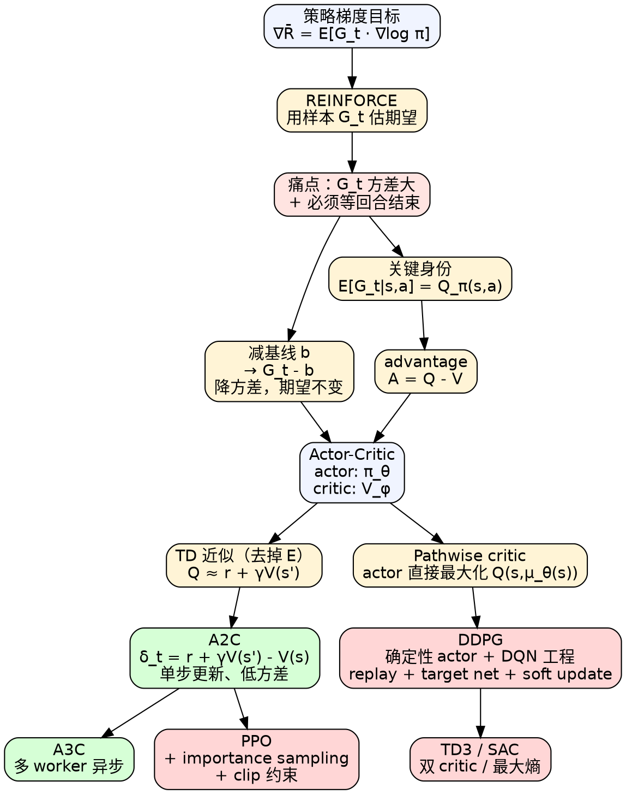

# 演员-评论员（Actor-Critic）

> [!abstract] 一句话
> **Actor-Critic** = **策略梯度**（actor 学策略 $\pi_\theta$）+ **时序差分自举**（critic 学价值 $V_\phi$/$Q_\phi$ 替代回报）。它把 [[策略梯度教程|REINFORCE]] 中方差极大的随机回报 $G_t$ 换成"价值网络估出的期望或 TD 残差"，从而**单步更新、低方差**，是连接 [[策略梯度教程|PG]] 和 [[DQN教程|value-based]] 两大流派的桥梁。

---

## 1. 背景：从 REINFORCE 出发的两个痛点

REINFORCE（[[策略梯度教程|策略梯度]]）的更新式：

$$
\nabla \bar R_\theta \approx \frac{1}{N}\sum_{n=1}^{N}\sum_{t=1}^{T_n}
\Big(\underbrace{\sum_{t'=t}^{T_n}\gamma^{t'-t}r_{t'}^{n}}_{G_t^{n}}\;-\;b\Big)\,
\nabla\log p_\theta(a_t^n\mid s_t^n)\tag{9.1}
$$

> [!warning] REINFORCE 的两个致命问题
> 1. **必须等回合结束**：$G_t^n=\sum_{t'\ge t}\gamma^{t'-t}r_{t'}^n$ 要把后面所有奖励加起来才能算，不能单步更新；
> 2. **方差大**：$G_t$ 是把许多随机奖励加在一起的随机变量。即使同一 $(s,a)$，因转移和后续策略采样的随机性，$G$ 的样本方差会随着 $T$ 几乎线性放大。少量采样下"偶尔抽到 $+100$、偶尔抽到 $-10$"，梯度信号噪声极大。

### 1.1 与同类方法横向对比

| 维度 | REINFORCE | DQN | **Actor-Critic** |
|---|---|---|---|
| 学什么 | 仅 $\pi_\theta$ | 仅 $Q_\phi$ | **$\pi_\theta$ + $V_\phi$（双头）** |
| 更新粒度 | 回合结束 | 单步 TD | **单步 TD** |
| advantage | $G_t-b$（高方差 MC） | 通常无（Dueling DQN 例外） | $r_t+\gamma V(s_{t+1})-V(s_t)$（低方差 TD） |
| on/off-policy | on | off（replay 可复用） | **on**（A2C/A3C） |
| 探索 | 采样自带 | $\varepsilon$-greedy | 采样自带 + entropy bonus |
| 动作空间 | 离散/连续 | 离散友好 | 离散/连续 |

### 1.2 思路：用 Q-期望 / V-自举 替代 $G_t$

REINFORCE 用 **MC 单样本** $G_t$ 近似 $\mathbb E[G_t]$。如果我们直接训练一个网络去**估 $G_t$ 的期望**，就能用一个低方差的"期望"代替高方差的"采样" —— 这正是引入 critic 的根本动机。

---

## 2. 形式化：从 $G_t$ 到 advantage

### 2.1 关键身份

随机回报 $G_t$ 在策略 $\pi_\theta$ 下的条件期望恰好是 Q 函数：

$$
\boxed{\;\mathbb E\!\left[G_t^n\;\big|\;s_t^n,a_t^n\right] \;=\; Q_{\pi_\theta}(s_t^n,a_t^n)\;}\tag{9.2}
$$

把 $G_t^n$ 替换成 $Q_{\pi_\theta}(s_t^n,a_t^n)$，原 REINFORCE 中的"采样估计"就变成"网络估计的期望"，方差立刻降下来。

### 2.2 基线选 $V_\pi$：得到 advantage

$\sum_{t'\ge t}\gamma^{t'-t}r_{t'}^n - b$ 中减基线 $b$ 是为了让括号项**有正有负**（[[策略梯度教程|策略梯度]] §6 已证：减任意状态相关基线不改变期望，但能降方差）。最自然的基线是状态价值 $V_{\pi_\theta}(s_t^n)$ —— 因为根据全期望公式

$$
V_\pi(s) = \mathbb E_{a\sim\pi(\cdot|s)}[Q_\pi(s,a)]
$$

所以 $V_\pi(s)$ 恰是 $Q_\pi(s,a)$ 在 $a\sim\pi$ 下的均值，$Q-V$ 自然有正有负。**优势函数（advantage function）**：

$$
\boxed{\;
A^{\pi_\theta}(s_t^n,a_t^n) \;\triangleq\; Q_{\pi_\theta}(s_t^n,a_t^n) \;-\; V_{\pi_\theta}(s_t^n)
\;}\tag{9.3}
$$

物理意义：在 $s_t^n$ 选择 $a_t^n$ 比"按 $\pi$ 平均水平做"好多少 —— **正则定向信号**，比 $G$ 的绝对值更纯粹。

> [!note] 为什么 advantage 比裸 $Q$ 更好用
> 假如某状态所有动作 $Q$ 值都是 $+100$，裸 $Q$ 会把所有动作的 log-prob 都往上推；用 advantage 后，由于 $V$ 是 $Q$ 的均值，"全部 $+100$" 的状态下 $A\equiv 0$ —— 不更新。这与 baseline 的目标完全一致：**只有相对优势才是教学信号**。

---

## 3. 推导：从两网络到一网络（A2C 的诞生）

直接按 (9.3) 实现要训两个网络（$Q_\phi$ 和 $V_\psi$），估计误差风险翻倍。能不能只学一个？

### Step 1 · 用 $V$ 表达 $Q$

由贝尔曼期望方程：

$$
Q_\pi(s_t,a_t) = \mathbb E\!\big[\,r_t + \gamma V_\pi(s_{t+1})\,\big|\,s_t,a_t\big]\tag{9.4}
$$

期望对环境的随机转移和奖励而言。

### Step 2 · 一刀去掉外层期望（A3C 论文的工程选择）

把 (9.4) 中的期望去掉，用单样本近似：

$$
Q_\pi(s_t,a_t)\;\approx\;r_t + \gamma V_\pi(s_{t+1})\tag{9.5}
$$

> [!warning] 这一步**仍无偏**，但方差变高；真正的偏差来自后面把 $V_\pi$ 换成 $V_\phi$
> 当 $V$ 还是真值 $V_\pi$ 时，$r_t+\gamma V_\pi(s_{t+1})$ 是 $Q_\pi(s_t,a_t)$ 的**无偏单样本估计**（取期望恰等于 $Q$），"去掉期望"本身只增加方差、不引入偏差。**真正的偏差**来自后续把 $V_\pi$ 替换为学到的 $V_\phi$（函数近似 + bootstrap）。但 $r_t$ 只是**单步**随机量，方差远小于 $G_t$（$T-t$ 步累加），所以工程上 TD-style 估计有利。原 A3C 论文实测了 MC、$n$-step、纯 TD 等多种方案，结论是 **bootstrap 类（n-step）综合优于 MC**；A3C/A2C 默认采用 $n$-step rollout（Atari 标配 $t_{\max}=5$），TD(0) 是其 $n=1$ 的特例。

### Step 3 · 代入 advantage，得到 TD-residual 形式

把 (9.5) 代入 (9.3)：

$$
\boxed{\;
A_t \;\approx\; \delta_t \;\triangleq\; r_t + \gamma V_\phi(s_{t+1}) - V_\phi(s_t)
\;}\tag{9.6}
$$

这就是大名鼎鼎的 **TD-error / TD-residual**，同时充当：
- **actor 的 advantage 信号**
- **critic 自身的训练误差**（critic 学 $V$ 的目标就是让 $\delta$ 平均为 0）

> [!success] 一石二鸟
> 引入 $V_\phi$ 一个网络，既给 actor 提供低方差的 advantage，又能用同样的 $\delta_t$ 自我训练 critic。这是 A2C 工程上"只估一个网络"的精妙之处。

### Step 4 · A2C 的策略梯度

把 (9.6) 代入 REINFORCE：

$$
\boxed{\;
\nabla \bar R_\theta \approx \frac{1}{N}\sum_{n=1}^{N}\sum_{t=1}^{T_n}
\big(r_t^{n} + \gamma V_\phi(s_{t+1}^{n}) - V_\phi(s_t^{n})\big)
\,\nabla\log p_\theta(a_t^n\mid s_t^n)
\;}\tag{9.7}
$$

> [!danger] advantage 必须 detach
> $\delta_t$ 里出现了 $V_\phi$，但这一项**只是用作 actor 的"系数"**，不能让 actor 的梯度顺着它流回到 critic（否则 actor 被迫去优化 $V$，目标错位）。代码里必须 `advantage.detach()`。详见 §7。

---

## 4. 直观解读

### 4.1 类比："教练（critic）+ 选手（actor）"

| 角色 | 强化学习 | 现实类比 |
|---|---|---|
| Actor | $\pi_\theta(a\mid s)$，输出动作 | 选手做出动作 |
| Critic | $V_\phi(s)$，给状态打分 | 教练评估"刚才那一拍打得比你平均水平高/低" |
| Advantage | $\delta_t$ | "这一拍比平均水平高 +0.3" 的具体差值 |
| Critic 自训 | 让 $V_\phi(s_t)\to r_t+\gamma V_\phi(s_{t+1})$ | 教练根据"这一拍后实际局势"修正自己之前的预判 |

> [!info] 与监督学习的对应
> Critic 像回归头：标签是 bootstrap 后的 TD target；actor 像分类头：损失权重是 advantage（负值=希望降低概率，正值=希望提高）。两者共享 backbone 是非常自然的多任务学习。

### 4.2 与 [[DQN教程|DQN]] 的根本区别

| 维度 | DQN（pure value） | Actor-Critic |
|---|---|---|
| 决策 | $\pi(s)=\arg\max_a Q$ → 离散且确定 | 直接采样 $a\sim\pi_\theta$ → 离散 / 连续 / 随机 |
| critic 角色 | **代替策略**（决策者） | **辅助策略**（教练） |
| 探索 | 外加 $\varepsilon$-greedy | 自带（采样）+ entropy bonus |

---

## 5. 工程实现技巧

### 技巧 1 · actor / critic 共享前 backbone

> [!warning] naive 做法的痛点
> 如果两个网络完全独立，对于 Atari 这种像素输入，两份 CNN 各自学一遍特征，参数量翻倍且数据效率低。

**做法**：演员和评论员**共享前几层卷积**，最后接两个独立的 head：

```
        ┌→ V_head (1 标量)        → critic loss
CNN(s) ─┤
        └→ π_head (动作分布)       → actor loss (× advantage.detach())
```

总损失：

$$
\mathcal L = \mathcal L_{\text{actor}} + c_v\,\mathcal L_{\text{critic}} - c_e\,\mathcal H[\pi(\cdot|s)]
$$

典型超参：$c_v=0.5$，$c_e=0.01$。

### 技巧 2 · entropy bonus 防止策略过早确定

> [!warning] naive 做法的痛点
> 没有 entropy 约束时，$\pi_\theta$ 容易很快坍缩到一个动作（log-prob 梯度自我强化），失去探索能力，陷入次优。

加入熵正则项（**最大化**熵 → 损失里**减去** $c_e\mathcal H$）：

$$
\mathcal H[\pi(\cdot|s)] = -\sum_a \pi_\theta(a|s)\log\pi_\theta(a|s)
$$

熵越大 → 分布越均匀 → 探索越多。$c_e$ 通常从 $0.01$ 开始，训练后期可衰减。

### 技巧 3 · advantage detach（最易写错）

> [!danger] 必修陷阱
> ```python
> # ❌ 错：advantage 没 detach，actor 的梯度会通过 V 流到 critic
> advantage = r + gamma * V(s_next) - V(s)
> actor_loss = -(log_prob * advantage).mean()
> ```
> 这样训练时 actor 会"诱导 critic 把 V 调成对自己有利的值"，破坏 critic 的预测无偏性。
>
> ```python
> # ✅ 对：actor 的 advantage 只当系数
> advantage = (r + gamma * V(s_next) - V(s)).detach()
> actor_loss = -(log_prob * advantage).mean()
> # critic 单独有 loss
> critic_loss = (V(s) - (r + gamma * V(s_next).detach())).pow(2).mean()
> ```

### 技巧 4 · TD target 也要 detach

> [!danger] critic 的另一陷阱
> critic 的回归目标 $y_t = r_t + \gamma V_\phi(s_{t+1})$ 里的 $V_\phi(s_{t+1})$ **不能**让梯度回流，否则相当于让 critic"调整未来的预测来匹配现在的预测"，自举循环失稳。代码：`y = r + gamma * V(s_next).detach()`。

### 技巧 5 · MC vs TD advantage 的取舍

| 形式 | 公式 | 偏差 | 方差 |
|---|---|---|---|
| MC | $G_t - V_\phi(s_t)$ | 无偏 | 大（$T-t$ 步累加） |
| TD(0) | $r_t + \gamma V_\phi(s_{t+1}) - V_\phi(s_t)$ | 有偏（$V_\phi$ 不准时） | 小 |
| **n-step / [[GAE]]** | $\sum_{k=0}^{n-1}\gamma^k r_{t+k} + \gamma^n V(s_{t+n}) - V(s_t)$ | 折中 | 折中 |

实战常用 [[GAE|Generalized Advantage Estimation]] 在偏差-方差间权衡。

---

## 6. 具体算法

### 6.1 A2C（Advantage Actor-Critic）

> [!example] A2C 伪代码（同步版）
> ```
> 初始化：actor π_θ、critic V_φ（可共享 backbone）
> repeat:
>   # 1. rollout：用当前 π_θ 跑 N 个并行环境，每个跑 T 步
>   收集 {(s_t, a_t, r_t, s_{t+1}, done_t)}
>
>   # 2. 计算 returns 和 advantages（n-step 或 TD(0)）
>   for t = T-1 downto 0:
>     R_t = r_t + γ * R_{t+1} * (1 - done_t)        # n-step return
>     A_t = R_t - V_φ(s_t)                          # advantage（detach 形式）
>
>   # 3. 计算损失
>   L_actor   = -mean(log π_θ(a_t|s_t) * A_t.detach())
>   L_critic  = mean((R_t.detach() - V_φ(s_t))^2)
>   L_entropy = mean(H[π_θ(·|s_t)])                # 正熵（待最大化）
>   L = L_actor + 0.5 * L_critic - 0.01 * L_entropy
>
>   # 4. 反向传播 + Adam
>   θ, φ ← θ, φ - α * ∇L
> until 收敛
> ```

### 6.2 A3C（Asynchronous Advantage Actor-Critic）

A3C = A2C + **异步多 worker**。Easy-RL 教材用《火影忍者》"鸣人影分身"做类比——多个分身各自修行、把经验汇回本体：

1. 全局参数 $\theta$ 放中央服务器；
2. $K$ 个 worker（每个一颗 CPU 核），各自把全局 $\theta$ **拷贝**到本地，跑自己的 rollout，算梯度 $g_k$；
3. 每个 worker 算完梯度就异步推回中央，**不等其他 worker**：用 $g_k$ 直接 in-place 更新 $\theta$。

> [!warning] 异步带来的"过期梯度"
> worker 拿走时是 $\theta_1$，推回梯度时全局可能已经更新到 $\theta_2$ —— 梯度方向是基于"过时的策略"算的。论文的核心收益其实来自**多 worker 并行采样带来的样本去相关化**（每个 worker 在不同环境/不同起点采，样本天然独立，类似 [[DQN教程|DQN]] 经验回放的去相关效果）；异步带来的 stale gradient 是工程取舍，论文实测对收敛影响有限——但"有用"的功劳主要在"并行去相关"，不在"过期"本身。
>
> 现代框架（PyTorch 1.x+, GPU 普及）下，**同步的 A2C** 通过向量化环境（`SubprocVecEnv`）配合一颗 GPU 通常更快也更稳，A3C 已不是首选。"A2C is to A3C what synchronous SGD is to ASGD"（OpenAI 博客）。

---

## 7. 路径衍生策略梯度（Pathwise Derivative）：通往 [[DDPG]]

### 7.1 普通 critic 的局限

A2C 里 critic 只告诉 actor "刚才那个动作好/不好"（一个标量 advantage）。但它**没说清楚什么动作更好**——actor 只能靠采样和 log-prob 梯度慢慢摸。

> [!info] 棋魂类比（原文）
> 普通 critic 像佐为说"小马步飞不行"——只评判，不指路。**Pathwise critic** 进一步告诉 actor"这时应该下大马步飞"——直接给方向。

### 7.2 视角一：DQN 的 argmax 困难

[[DQN教程|DQN]] 在连续动作下没法做 $\arg\max_a Q(s,a)$（无法枚举），也没有解析解。**思路**：再训一个网络 $\mu_\theta$ 去近似 $\arg\max$，让

$$
\mu_\theta(s) \;\approx\; \underset{a}{\arg\max}\;Q_\phi(s,a)\tag{9.8}
$$

训练目标：让 $Q_\phi(s,\mu_\theta(s))$ 尽可能大（梯度上升）。

### 7.3 视角二：actor-critic 的"指路 critic"

Pathwise actor 的损失：

$$
\mathcal L_{\text{actor}}^{\text{DDPG}} = -\mathbb E_{s\sim\mathcal D}\!\big[Q_\phi(s,\mu_\theta(s))\big]
$$

注意：actor 是**确定性策略** $a=\mu_\theta(s)$（不是分布），$Q_\phi$ 关于 $a$ 可微，链式法则：

$$
\boxed{\;
\nabla_\theta J = \mathbb E_{s\sim\mathcal D}\!\Big[\;
\underbrace{\nabla_a Q_\phi(s,a)\big|_{a=\mu_\theta(s)}}_{\text{critic 对 a 的梯度（指路）}}
\cdot
\underbrace{\nabla_\theta \mu_\theta(s)}_{\text{actor 雅可比}}
\;\Big]
\;}\tag{9.9}
$$

这就是**确定性策略梯度定理**（Silver et al. 2014）。两段梯度按链式法则相乘 —— "critic 告诉你哪个方向 $Q$ 增大；actor 学会朝那个方向输出动作"。

### 7.4 与 GAN 的对偶

| 强化学习 | GAN |
|---|---|
| Actor $\mu_\theta$ | Generator $G$ |
| Critic $Q_\phi$（条件于 $s$） | Discriminator $D$ |
| 训练：固定 $Q$，最大化 $Q(s,\mu_\theta(s))$ | 训练 $G$ 时固定 $D$，最大化 $D(G(z))$ |

两者都是"内层 max, 外层学一个 solver 来逼近"。

### 7.5 [[DDPG]] = pathwise actor-critic + DQN 工程 trick

从 [[DQN教程|DQN]] 改成 DDPG，需要 4 处替换（原文图 9.11）：

| # | DQN | DDPG | 含义 |
|---|---|---|---|
| 1 | 用 $Q$ 决定 $a_t$（$\arg\max$） | 用 actor $\mu_\theta(s_t)$ 决定 $a_t$ | actor 取代 argmax |
| 2 | TD target 用 $\max_a \hat Q(s_{i+1},a)$ | 用 $\hat Q(s_{i+1},\hat\mu_{\hat\theta}(s_{i+1}))$ | actor 在 target 端也取代 argmax |
| 3 | 只学 $Q_\phi$ | 多学 $\mu_\theta$，目标是 $\max Q_\phi(s,\mu_\theta(s))$ | 新增 actor 训练 |
| 4 | 只有 target $\hat Q$ | **同时**有 target $\hat Q$ 和 target $\hat\mu$ | 双 target，软更新 $\tau$-Polyak |

DDPG 几乎照搬 DQN 工程：经验回放、target network（区别：用 **soft update** $\hat\theta\leftarrow\tau\theta+(1-\tau)\hat\theta$，原始 Lillicrap 2015 论文 $\tau=0.001$，现代实现（SpinningUp / TD3 / SAC）常用 $\tau=0.005$，而非 DQN 的硬 C 步同步）、外加 OU/Gaussian 噪声做探索。

> [!note] 与 A2C/A3C 的本质区别
> | 维度 | A2C/A3C | DDPG（pathwise） |
> |---|---|---|
> | 策略 | 随机 $\pi_\theta(a\mid s)$ | **确定性** $a=\mu_\theta(s)$ |
> | actor 梯度 | log-prob × advantage | $\nabla_a Q\cdot\nabla_\theta\mu$（链式法则） |
> | on/off policy | on-policy | **off-policy（带 replay）** |
> | 适用动作 | 离散/连续 | **仅连续**（依赖 $\nabla_a Q$） |

DDPG 的两条**独立**改进路线（同年 ICML 2018 几乎同期提出，并非串联演进）：
- [[TD3]]（Fujimoto et al. 2018）：双 critic 取最小、actor 延迟更新、target policy smoothing —— 解决 DDPG 的 Q 值高估和不稳定问题，仍走"确定性 actor"路线。
- [[SAC]]（Haarnoja et al. 2018）：换回**随机** squashed Gaussian actor + 最大熵目标 + 自动调温度 $\alpha$ —— 把"探索"内化进目标函数，不再依赖外部噪声。

---

## 8. 与 GAN 的统一视角

如原论文 ["Connecting Generative Adversarial Networks and Actor-Critic Methods"](https://arxiv.org/abs/1610.01945)（Pfau & Vinyals, 2016）所指，二者都是双网络博弈：

| 维度 | GAN | Actor-Critic |
|---|---|---|
| 网络 A | Generator $G$ | Actor $\pi_\theta/\mu_\theta$ |
| 网络 B | Discriminator $D$ | Critic $V_\phi/Q_\phi$ |
| 训 A 时 | 固定 $D$，让 $G$ 骗 $D$ | 固定 critic，让 actor 提升 advantage / Q |
| 训 B 时 | 固定 $G$，让 $D$ 区分真假 | 固定 actor，让 critic 拟合真实 V/Q |
| 训练难点 | 两者必须同步进步 | 同上：critic 不准则 advantage 误导 actor |

工程上 GAN 的稳训技巧（spectral norm、谱归一、双时间尺度更新 TTUR）也常迁移到 actor-critic。

---

## 9. Cheat Sheet

### 9.1 A2C 最小可跑代码（PyTorch）

```python
import torch, torch.nn as nn, torch.nn.functional as F
from torch.distributions import Categorical

class ActorCritic(nn.Module):
    def __init__(self, obs_dim, n_act, hidden=128):
        super().__init__()
        self.shared = nn.Sequential(nn.Linear(obs_dim, hidden), nn.ReLU())
        self.pi    = nn.Linear(hidden, n_act)   # actor head
        self.v     = nn.Linear(hidden, 1)       # critic head

    def forward(self, s):                       # s: [B, obs_dim] float32
        h = self.shared(s)
        return self.pi(h), self.v(h).squeeze(-1)   # logits[B,n_act], V[B]

# --- 一个 update step ---
logits, V       = net(s)                        # s,s_next: float32
_, V_next       = net(s_next)
target          = (r + gamma * V_next * (1.0 - done)).detach()   # ❶ TD target detach
advantage       = (target - V).detach()                          # ❷ advantage detach

dist            = Categorical(logits=logits)
log_prob        = dist.log_prob(a)              # a: long
entropy         = dist.entropy()

actor_loss      = -(log_prob * advantage).mean()                 # ❸ 注意负号
critic_loss     = F.mse_loss(V, target)
entropy_bonus   = entropy.mean()

loss = actor_loss + 0.5 * critic_loss - 0.01 * entropy_bonus
optim.zero_grad(); loss.backward()
nn.utils.clip_grad_norm_(net.parameters(), 0.5)                  # ❹ 梯度裁剪
optim.step()
```

> [!summary] 常见坑（按踩坑频率排序）
> - **advantage 没 detach** → actor 梯度污染 critic，训练发散。 **必修**。
> - **TD target 没 detach** → critic 自举循环失稳。`V_next.detach()`。
> - **actor loss 漏负号**：策略梯度是**最大化** $\log\pi\cdot A$，loss 要 `-(...)`。
> - **action dtype**：`Categorical.log_prob(a)` 要求 `a` 是 `long`；状态用 `float32`。
> - **done mask 漏乘**：terminal 后没有 $V(s_{t+1})$，必须 `target = r + γ V_next * (1-done)`。
> - **熵系数过大**：策略一直均匀，学不到东西；过小则过早确定。$c_e\in[0.001, 0.05]$。
> - **value loss 系数 $c_v$**：通常 $0.5$。共享 backbone 时，$c_v$ 太大会让 backbone 偏向"学 V"，actor 受拖累。
> - **A2C 是 on-policy**：rollout 数据用一次就丢，不能塞 replay buffer 反复用。要复用必须做重要性采样 → 直接上 [[PPO教程|PPO]]。
> - **共享 backbone 时**：actor/critic 头的学习率可以分开调；很多实现给 critic head 更大 lr。
> - **DDPG 的 replay**：DDPG 是 off-policy，必须用 replay buffer + target network，否则发散。
> - **DDPG 探索**：`a = μ(s) + noise`（OU 或 Gaussian），test 时 `noise=0`。

### 9.2 典型超参（CartPole / Atari 量级）

| 超参 | 典型值 |
|---|---|
| $\gamma$ | 0.99 |
| 学习率 | 7e-4（A2C） / 1e-4 actor & 1e-3 critic（DDPG） |
| n-step rollout | 5（A2C）/ 单步（DDPG） |
| 并行环境数 | 16（A2C） |
| $c_v$（value loss 系数） | 0.5 |
| $c_e$（entropy 系数） | 0.01 |
| grad clip | 0.5 |
| Polyak $\tau$（DDPG） | 0.005 |

---

## 10. 一图总览



**配色约定**：浅蓝=起点/概念；浅黄=关键 trick；浅红=痛点；浅绿=本章核心算法；红=下游 SOTA。

---

## 11. 关联笔记

- 上游：[[策略梯度教程|策略梯度]]（REINFORCE / log-derivative trick / baseline）、[[DQN教程|DQN]]（critic 的工程稳定术：target net、replay）
- 平行：[[GAE]]（n-step 的偏差-方差权衡，A2C/PPO 实战必备）
- 下游：
  - [[PPO教程|PPO]] —— A2C + 重要性采样 + clip，工业默认
  - [[DDPG]] —— 路径导数 actor-critic + DQN 工程
  - [[TD3]] —— DDPG + 双 critic / 延迟更新 / 目标平滑
  - [[SAC]] —— DDPG 思路 + 最大熵框架，连续控制 SOTA
- 相关：[[GAN]]（与 actor-critic 的双网络对偶）、[[Bellman 方程]]、[[价值函数]]
- 原文：[Easy-RL 第 9 章 · 演员-评论员算法](https://datawhalechina.github.io/easy-rl/#/chapter9/chapter9)
