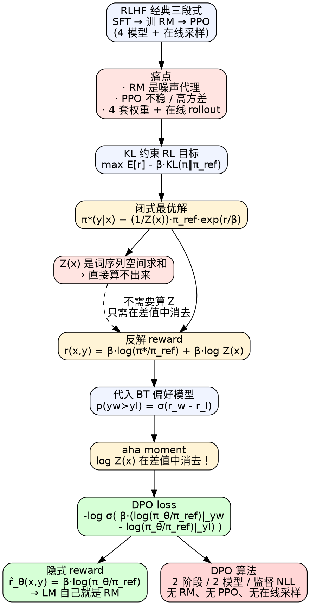

# DPO（Direct Preference Optimization）

> [!abstract] 一句话
> DPO = **把 RLHF 的"训 reward model + PPO 强化学习"两阶段合成一阶段** —— 通过对 KL 约束 RL 目标的闭式解做反代换，把"奖励差值"重写成"策略对 reference 的 log-ratio 差值"，partition function 在差值中天然消去，最终训练目标退化为一个**类似二分类的 sigmoid 极大似然损失**，无需采样、无需 reward model、无需 RL，依然在优化原 RLHF 目标。

---

## 1. 背景：RLHF 三段式有多痛

### 1.1 经典 RLHF 流水线（Ziegler/Stiennon/Ouyang 系列）

```
SFT  →  Reward Model（用偏好数据训 BT 二分类）  →  PPO（KL 约束下最大化 RM 给的奖励）
```

| 阶段 | 输入 | 输出 | 优化对象 |
|---|---|---|---|
| 1. SFT | 高质量示范 $(x,y)$ | $\pi^{\text{SFT}}$ | next-token CE |
| 2. 奖励建模 | 人工偏好 $(x,y_w,y_l)$ | $r_\phi$ 标量打分 | BT 极大似然 |
| 3. RL 微调 | $\pi^{\text{SFT}}$、$r_\phi$ | 对齐策略 $\pi_\theta$ | $\max\mathbb E[r_\phi]-\beta\mathrm{KL}$，PPO 求解 |

### 1.2 这套管线的痛点

> [!danger] RLHF 的工程负担
> 1. **要训两个独立模型**：$r_\phi$（reward）+ $\pi_\theta$（policy），同时还要 reference $\pi_{\text{ref}}$ 和 critic value head，4 份模型权重在内存里互相竞争（工程上 reward/critic 常**共享底座**、ref 也可与 policy **共享 LoRA base**，所以"4 份独立模型"是逻辑上的角色数，实际显存占用未必真等于 4 份完整模型）
> 2. **PPO 阶段不稳定**：on-policy 采样 + 高方差 + reward hacking + 过大 KL 走偏，超参敏感（学习率/clip $\varepsilon$/KL 系数/熵奖励/value coef）
> 3. **要在线采样**：训练循环里每步都要让 $\pi_\theta$ 生成、过 RM 打分，文本生成本身就是慢操作
> 4. **reward model 是个有偏代理**：$r_\phi$ 在 OOD 上往往误判，导致 PPO 优化"刷 reward 而非真的对齐"

### 1.3 DPO 的核心动机

> [!success] aha moment
> 既然 PPO 阶段在解的是"KL 约束下最大化 reward"这个有**闭式最优解**的凸问题，那为何不**直接用闭式解反代换 reward**，把整个三段式压缩成一个监督式分类损失？
> 数学上，DPO 证明：BT 偏好模型 + KL 约束 RL 目标 → 二者一组合，partition function 消失，留下一个完全用 $\pi_\theta/\pi_{\text{ref}}$ 表达的 sigmoid loss。

### 1.4 路线图

```
KL 约束 RL 目标  →（闭式解）→  π* ∝ π_ref · exp(r/β)
                                ↓ 反解 r
                          r = β log(π*/π_ref) + β log Z(x)
                                ↓ 代入 BT 偏好模型
                          σ(r_w - r_l)  ← log Z(x) 在差值中消失！
                                ↓ 用 πθ 替代 π*，写成 NLL
                          DPO loss
```

---

## 2. 形式化定义

### 2.1 偏好数据集

$$
\mathcal D = \bigl\{\,(x^{(i)},\,y_w^{(i)},\,y_l^{(i)})\,\bigr\}_{i=1}^N,\quad y_w \succ y_l \mid x
$$

每条数据：同一 prompt $x$ 下，人类标注员选出"更好的" $y_w$（chosen）与"更差的" $y_l$（rejected）。

### 2.2 Bradley-Terry 偏好模型

人类偏好概率被假设由一个**潜在 reward** $r^*(x,y)$ 通过 logistic 函数生成：

$$
\boxed{\;
p^*(y_1\succ y_2\mid x)
= \frac{\exp(r^*(x,y_1))}{\exp(r^*(x,y_1))+\exp(r^*(x,y_2))}
= \sigma\bigl(r^*(x,y_1)-r^*(x,y_2)\bigr)
\;}\tag{1}
$$

> [!note] BT 模型的关键性质：只看差值
> $\sigma(r_1-r_2)$ 中的 reward 只以**差值**形式出现 → 任何只在 $x$ 上加常数的 reward $r'(x,y)=r(x,y)+f(x)$ 都给出**同一个偏好分布**。这种**等价类的 under-specification** 正是 DPO 推导能 work 的几何根源（详见 §6.1 Theorem 1）。

### 2.3 RLHF 第三阶段的 RL 目标（KL 约束最大化）

$$
\boxed{\;
\max_{\pi_\theta}\ \mathbb E_{x\sim\mathcal D,\,y\sim\pi_\theta(\cdot\mid x)}\bigl[r(x,y)\bigr]
\;-\;\beta\,\mathbb D_{\mathrm{KL}}\bigl(\pi_\theta(y\mid x)\,\|\,\pi_{\text{ref}}(y\mid x)\bigr)
\;}\tag{3}
$$

- $\beta$：KL 强度系数（论文默认 $\beta=0.1$；TL;DR 实验用 $\beta=0.5$）
- $\pi_{\text{ref}}$：通常就是 $\pi^{\text{SFT}}$
- KL 项的作用：防止策略偏离 ref 太远（避免 mode collapse + 让 reward 在 ref 附近的分布上保持准确）

> [!warning] PPO 在解什么问题，要看清
> PPO 阶段不是在"自由地最大化 reward"，是在解式 (3) 这个**带 KL 约束**的凸优化。这个问题事实上有**闭式解** —— DPO 的全部魔法都基于这一点。

---

## 3. 推导：从 KL 约束 RL 到 DPO loss

### Step 1 · 求 KL 约束目标的闭式最优解

把式 (3) 改写为 KL 形式（注意符号方向）。对任意 $r$：

$$
\begin{aligned}
\max_\pi \mathbb E_y[r] - \beta\mathrm{KL}(\pi\|\pi_{\text{ref}})
&= \max_\pi \mathbb E_y\!\left[r(x,y)-\beta\log\frac{\pi(y\mid x)}{\pi_{\text{ref}}(y\mid x)}\right] \\
&= \min_\pi \mathbb E_y\!\left[\log\frac{\pi(y\mid x)}{\pi_{\text{ref}}(y\mid x)}-\frac1\beta r(x,y)\right]
\end{aligned}
$$

把 $\frac1\beta r$ 凑进 log 里：

$$
= \min_\pi \mathbb E_y\!\left[\log\frac{\pi(y\mid x)}{\frac1{Z(x)}\pi_{\text{ref}}(y\mid x)\exp(\frac1\beta r(x,y))} - \log Z(x)\right]
$$

其中**配分函数（partition function）**

$$
Z(x) \;\triangleq\; \sum_{y}\pi_{\text{ref}}(y\mid x)\exp\!\Bigl(\tfrac1\beta r(x,y)\Bigr)
$$

仅依赖 $x$，与 $\pi$ 无关。定义

$$
\pi^*(y\mid x) \;\triangleq\; \frac{1}{Z(x)}\,\pi_{\text{ref}}(y\mid x)\,\exp\!\Bigl(\tfrac1\beta r(x,y)\Bigr) \tag{4}
$$

可验证 $\pi^*$ 是合法概率分布（非负且对 $y$ 求和为 1）。则

$$
\min_\pi \mathbb E_x\bigl[\,\mathrm{KL}(\pi\,\|\,\pi^*) - \log Z(x)\,\bigr]
$$

$\log Z(x)$ 与 $\pi$ 无关，由 Gibbs 不等式 $\mathrm{KL}\ge 0$（取等当且仅当两分布相同），最优解就是

$$
\boxed{\;
\pi^*(y\mid x) = \frac{1}{Z(x)}\,\pi_{\text{ref}}(y\mid x)\,\exp\!\Bigl(\tfrac1\beta r(x,y)\Bigr)
\;}\tag{4}
$$

> [!note] 闭式解的物理含义
> 最优策略 = ref 策略**再加一层 reward exponential tilt**。$\beta$ 越大→ tilt 越温和（更靠近 ref）；$\beta$ 越小→ tilt 越激进（更追求高 reward）。
> 这一结论本身在 RLHF 里早就众所周知（见 Peters & Schaal 的 reward-weighted regression、Levine 的 control-as-inference 综述），但**之前从未被用作训练目标的反代换工具**。

> [!warning] 但闭式解直接用不了
> $Z(x)=\sum_y \pi_{\text{ref}}\exp(r/\beta)$ 是对**整个词序列空间**求和（指数级），LM 场景下根本算不出来。这就是为什么之前必须走 PPO 这种**采样近似**的路线。
> DPO 的关键不是"算出 $Z(x)$"，而是"**让 $Z(x)$ 在最终 loss 里消失**"。

---

### Step 2 · 反解 reward：把 $r$ 写成 $\pi^*$ 的函数

对式 (4) 两边取 $\log$，整理：

$$
\log\pi^*(y\mid x) = \log\pi_{\text{ref}}(y\mid x) + \tfrac1\beta r(x,y) - \log Z(x)
$$

移项：

$$
\boxed{\;
r(x,y) \;=\; \beta\log\frac{\pi^*(y\mid x)}{\pi_{\text{ref}}(y\mid x)} \;+\; \beta\log Z(x)
\;}\tag{5}
$$

> [!success] 这是整个 DPO 的支点
> 式 (5) 说："**任何**与该 reward 相容的最优策略 $\pi^*$，都可以反过来表达 reward"。换言之：**reward 函数和最优策略一一对应（在等价类意义上）**。
> 既然如此，我们就别再去"训练 reward model"了 —— 直接把"训练策略"等价为"训练 reward"。

---

### Step 3 · 代入 BT 模型 → partition function 自动消失

把式 (5) 的 $r^*(x,y)$ 代入式 (1) 的 BT 偏好概率：

$$
\begin{aligned}
p^*(y_w\succ y_l\mid x)
&= \sigma\bigl(r^*(x,y_w)-r^*(x,y_l)\bigr) \\[4pt]
&= \sigma\Bigl(
   \beta\log\tfrac{\pi^*(y_w\mid x)}{\pi_{\text{ref}}(y_w\mid x)}+\beta\log Z(x)
   - \beta\log\tfrac{\pi^*(y_l\mid x)}{\pi_{\text{ref}}(y_l\mid x)} - \beta\log Z(x)
   \Bigr) \\[4pt]
&= \sigma\Bigl(
   \beta\log\tfrac{\pi^*(y_w\mid x)}{\pi_{\text{ref}}(y_w\mid x)}
   - \beta\log\tfrac{\pi^*(y_l\mid x)}{\pi_{\text{ref}}(y_l\mid x)}
   \Bigr)
\end{aligned}\tag{6}
$$

> [!success] 关键 aha moment：$\log Z(x)$ 在差值中消去！
> $Z(x)$ 只依赖 $x$，对同一 prompt 下的 $y_w$ 与 $y_l$ 是**同一个常数**。BT 模型只看 reward 的差值，于是 $\beta\log Z(x)$ 在 $r_w-r_l$ 中互相抵消 —— 整个表达式**只剩下 $\pi^*$ 与 $\pi_{\text{ref}}$**，再不需要那个算不出来的 $Z(x)$。
> 这正是 §2.2 我们提到的"BT 等价类 under-specification"在数学上的回报：因为 BT 只能识别 reward 的差值（等价类），所以"加一项 $\log Z(x)$"在 BT 视角下就是无意义的，自然被吸收掉。

---

### Step 4 · 写成极大似然损失（DPO loss）

把 $\pi^*$ 替换成可学习的 $\pi_\theta$，对偏好数据集 $\mathcal D$ 做负对数似然：

$$
\boxed{\;
\mathcal L_{\text{DPO}}(\pi_\theta;\pi_{\text{ref}})
=
-\mathbb E_{(x,y_w,y_l)\sim\mathcal D}
\!\left[\,
\log\sigma\!\left(
\beta\log\frac{\pi_\theta(y_w\mid x)}{\pi_{\text{ref}}(y_w\mid x)}
-
\beta\log\frac{\pi_\theta(y_l\mid x)}{\pi_{\text{ref}}(y_l\mid x)}
\right)
\,\right]
\;}\tag{7}
$$

形式上完全等同于一个**带温度的二分类 logistic 回归**：

| 类别 | 监督信号 | "logit" |
|---|---|---|
| $y_w$ 优于 $y_l$ | label = 1 | $\beta\bigl[\log\tfrac{\pi_\theta(y_w\mid x)}{\pi_{\text{ref}}(y_w\mid x)}-\log\tfrac{\pi_\theta(y_l\mid x)}{\pi_{\text{ref}}(y_l\mid x)}\bigr]$ |

> [!summary] 隐式 reward
> 训练完成后，DPO 把策略反过来当 reward 用：
> $$\boxed{\;\hat r_\theta(x,y) = \beta\log\frac{\pi_\theta(y\mid x)}{\pi_{\text{ref}}(y\mid x)}\;}$$
> 论文的核心金句"**Your Language Model Is Secretly a Reward Model**"由此而来：你训练的就是一个 LM，但它**同时**就是它对应的最优 reward function（在 reward 等价类意义上）。

---

## 4. 梯度的直观解读

对式 (7) 求梯度（推导见原文 Appendix A.4，链式求导 + $\sigma'(x)=\sigma(x)\sigma(-x)$）：

$$
\nabla_\theta\mathcal L_{\text{DPO}} = -\beta\,\mathbb E_{(x,y_w,y_l)\sim\mathcal D}\!
\Bigl[
\underbrace{\sigma\!\bigl(\hat r_\theta(x,y_l)-\hat r_\theta(x,y_w)\bigr)}_{\text{(A) 错得越离谱权重越大}}
\cdot
\bigl(\,
\underbrace{\nabla_\theta\log\pi_\theta(y_w\mid x)}_{\text{(B) 推 chosen 概率上}}
-
\underbrace{\nabla_\theta\log\pi_\theta(y_l\mid x)}_{\text{(C) 推 rejected 概率下}}
\,\bigr)
\Bigr]
$$

逐项解读：

| 项 | 含义 | 自动机制 |
|---|---|---|
| (A) $\sigma(\hat r_l-\hat r_w)$ | 隐式 reward 把"差的"排在"好的"前面的概率 | 模型已经排对时 ≈ 0（不更新），排错时 ≈ 1（大梯度）—— **天然难例加权** |
| (B) $\nabla\log\pi_\theta(y_w)$ | chosen 的 score function | 推 $y_w$ 概率 ↑ |
| (C) $-\nabla\log\pi_\theta(y_l)$ | rejected 的负 score | 推 $y_l$ 概率 ↓ |

> [!info] 与"naive 偏好学习"（Unlikelihood）的对比
> 最朴素的偏好学习直接最大化 $\log\pi(y_w)$ + 最小化 $\log\pi(y_l)$，**没有 (A) 项的加权**——这其实就是 [[Unlikelihood Training]] (Welleck et al. 2019) 的思路。论文 §4 末尾点出：去掉 (A) 这种动态加权后模型容易**退化（degenerate）**，并在 Appendix Table 3 给出 Unlikelihood 在 TL;DR 上的失败样本（"when when when when..." 之类的复读塌陷）作为佐证（**注意 Table 3 是 Unlikelihood baseline 的 qualitative 退化样本，不是 DPO 自身去掉 (A) 项的对照消融**）。
> (A) 项的本质是：当模型已经做对、隐式 reward 已分明时，**别再硬推**；只在还排错时才用力。这是 DPO 不会"过拟合 push 方向"的关键。

> [!warning] 社区共识：DPO 倾向于"打压 rejected"而非"提拔 chosen"
> 大量后续工作（IPO/SimPO 论文等）观察到：训练后 DPO 主要是**把 $y_l$ 的概率压低**，而不是真的把 $y_w$ 推高。一种简化解释：(B)/(C) 在 sigmoid 接近 1 时数值上对称，但 LM 的概率空间是 simplex，**降一个比抬一个容易**；不过 IPO/SimPO 给出的更精细诊断是 reward gap 无 bound + 长度偏置。这是 DPO 的实操坑，催生了 IPO/SimPO 等改进。

---

## 5. 与 RLHF-PPO 的全方位对比

| 维度 | RLHF + PPO | DPO |
|---|---|---|
| 阶段数 | 3 阶段（SFT → RM → PPO） | 2 阶段（SFT → DPO） |
| 训练时存活的模型 | 4 个网络（policy / ref / reward / critic value head；工程常共享底座） | 2 个网络（policy + frozen ref） |
| 是否需要 reward model | ✅ 显式训练 | ❌ 隐式从 $\pi_\theta/\pi_{\text{ref}}$ 读出 |
| 是否需要 RL 采样 | ✅ on-policy 采样 | ❌ 离线偏好对，纯监督 |
| 损失函数 | clip surrogate + value MSE + entropy + 自适应 KL | 单个 sigmoid NLL |
| 主要超参 | lr、$\varepsilon_{\text{clip}}$、KL coef、value coef、entropy coef、GAE λ、target KL | $\beta$、lr |
| 训练稳定性 | 中（reward hacking、KL 失控、value drift） | 高（凸 / log-sigmoid，无方差爆炸） |
| 与原 RLHF 目标的关系 | 用 surrogate 近似 | 在 BT 假设下与式 (3) 最优策略**理论一致**（论文 §4 推导 + Theorem 1：参数化无表达力损失） |
| 推理时是否需要 ref | ❌（推理就是 $\pi_\theta$ forward） | ❌（同左，ref 只在训练时 forward） |
| 相对计算开销 | 高（要采样 + 4 网络） | 低（仅 2 网络 forward，1 次 BP） |

> [!tip] 工程上 DPO 不止"省事"，还更稳
> 论文 §6.1 Figure 2 显示：在 IMDb 情感生成上，DPO 在**整条 reward-KL 边界**上都严格碾压 PPO，甚至 PPO-GT（用 ground truth reward 的 PPO 上界）也输给 DPO。原因：PPO 的 advantage 估计带方差、KL 估计也带方差，DPO 直接闭式吃掉了这两块噪声。

---

## 6. 理论性质：DPO 不是"近似"，是等价

### 6.1 reward 等价类

> [!note] Definition 1（reward 等价）
> 两个 reward $r,r'$ 等价当且仅当 $r(x,y)-r'(x,y)=f(x)$（差一个仅依赖于 prompt 的偏置）。

**Lemma 1**：BT/Plackett-Luce 框架下，等价类中所有 reward 给出**同一个偏好分布**（差值不变）。

**Lemma 2**：式 (3) 的 KL 约束 RL 问题下，等价类中所有 reward 给出**同一个最优策略**（$f(x)$ 在归一化时被吸收）。

**Theorem 1**（论文 §5.1）：在温和假设下，**任何**与 BT/PL 模型相容的 reward 等价类，都能被 DPO 的参数化 $r(x,y)=\beta\log\frac{\pi(y\mid x)}{\pi_{\text{ref}}(y\mid x)}$ 表示。

> [!success] 这意味着什么
> 1. DPO 这种参数化**不损失任何表达力** —— 它能表示 BT 框架能识别的所有 reward
> 2. DPO 的参数化恰好选了让 $\sum_y\pi_{\text{ref}}\exp(r/\beta)=1$（$Z(x)=1$）的代表元 —— 于是 reparameterization 中的 $\pi$ 直接就是该 reward 等价类下式 (3) 的最优策略，**不需要额外的 RL 步骤求最优**

### 6.2 DPO 视角下 PPO 不稳定的根源（§5.2）

PPO 优化的是

$$
\mathbb E\bigl[r_\phi(x,y)\bigr] - \beta\mathrm{KL}(\pi\|\pi_{\text{ref}})
$$

把 ref-anchored 形式展开后等价于

$$
\max_\pi\, \mathbb E\bigl[\,\underbrace{r_\phi(x,y) - \beta\log Z(x)}_{f(r_\phi,\pi_{\text{ref}},\beta)\text{：投影后的归一化 reward}}\bigr] - \beta\mathbb E\bigl[\log\tfrac{\pi}{\pi_{\text{ref}}}\bigr]
$$

> [!warning] PPO 必须 baseline 减偏
> 上式中减掉的 $\beta\log Z(x)$ 是 $\pi_{\text{ref}}$ 的 **soft value function**（原文 §5.2 把 $\log Z$ 解读为 partition function 取对数后的归一化项，等价于 ref 策略下的 soft value），理论上不影响最优解，但**实际计算策略梯度时它直接进方差**。PPO 之所以普遍要"用人类完成基线做单样本 MC 估计 $Z(x)$"，本质上就是在**手动减掉这一项**。
> DPO 直接把 $Z(x)$ 写进 reparameterization 里，自带 baseline，**根本不需要 critic**。

---

## 7. 算法流程

> [!example] DPO 训练管线
> **输入**：偏好数据集 $\mathcal D=\{(x,y_w,y_l)\}$、$\pi^{\text{SFT}}$、超参 $\beta$
>
> 1. **初始化**：$\pi_\theta \leftarrow \pi^{\text{SFT}}$，$\pi_{\text{ref}}\leftarrow\pi^{\text{SFT}}$（$\pi_{\text{ref}}$ 冻结）
>    - 若没有 SFT model：先用 $y_w$ 做 NLL 微调（preferred-FT）作为 $\pi_{\text{ref}}$
> 2. **For** each batch $\{(x,y_w,y_l)\}$ **do**：
>    1. 把 $(x+y_w)$ 与 $(x+y_l)$ 拼到同一 batch，做**一次** policy forward，再切片得 $\log\pi_\theta(y_w\mid x),\,\log\pi_\theta(y_l\mid x)$（response token 求和、prompt 部分 mask 掉）
>    2. 同样的 batch 在 ref 上做**一次** forward（**no_grad**），切片得 $\log\pi_{\text{ref}}(y_w\mid x),\,\log\pi_{\text{ref}}(y_l\mid x)$
>    3. 算 logits：$u = \beta\bigl[(\log\pi_\theta(y_w)-\log\pi_{\text{ref}}(y_w))-(\log\pi_\theta(y_l)-\log\pi_{\text{ref}}(y_l))\bigr]$
>    4. 损失：$\mathcal L = -\log\sigma(u)$
>    5. 反传 + 更新 $\theta$
> 3. **End**

> [!tip] log-prob 是 sequence-level
> 这里 $\log\pi(y\mid x) = \sum_t\log\pi(y_t\mid x,y_{<t})$ —— 整条回复的所有 token log-prob **求和**（不是平均、不是末 token），因为 BT 模型识别的是**整条回复**的偏好，不是 token 级偏好。
> （后续 SimPO 改用"长度归一化的 log-prob"，正是要修复这一点带来的长度偏置。）

---

## 8. 常见变体（一句话扫盲）

| 变体 | 改了什么 | 动机 |
|---|---|---|
| [[IPO]] (Identity-PO, Azar 2023) | 把 $\log\sigma$ 换成 squared margin loss $(h_\theta - \frac1{2\beta})^2$ | BT+sigmoid 在 hard label ($p=1$) 上不饱和、无正则，DPO 易把 reject 概率推向 0；IPO 给隐式 reward 差一个显式上限 |
| [[KTO]] (Kahneman-Tversky **Optimization**, Ethayarajh 2024) | 不需要成对 $(y_w,y_l)$，单条 $(x,y,\text{good/bad})$ 即可 | 偏好对难标注，KTO 用前景理论建模 |
| [[ORPO]] (Hong 2024) | 在 SFT loss 里加一个 odds-ratio 罚项，**不需要 ref model** | 一阶段、零 ref，节省显存 |
| [[SimPO]] (Meng 2024) | 长度归一化 + reference-free margin，不再需要 $\pi_{\text{ref}}$ | DPO 的"打压 rejected" + 长度偏置问题 |
| RPO/cDPO | 偏好标签可能含噪，BCE → label-smoothing | 数据噪声鲁棒性 |

DPO 之后的工程演化几乎全围绕**"去掉 ref model"** + **"修长度/规模偏置"** + **"放宽偏好对要求"**这三条主线。

---

## 9. Cheat Sheet

### 9.1 最小可跑 DPO loss（基于论文 Appendix B 的实现）

```python
import torch
import torch.nn.functional as F

def dpo_loss(pi_logps, ref_logps, yw_idxs, yl_idxs, beta):
    """
    pi_logps:  (B,) 当前策略对每条样本的 sequence log-prob（已对 token 求和）
    ref_logps: (B,) reference 模型对同样样本的 sequence log-prob，requires_grad=False（教程注，非原版 docstring）
    yw_idxs / yl_idxs: 长度 T 的索引张量，配对偏好对 (chosen, rejected)
    beta: 温度，越大约束越强（论文常用 0.1，TL;DR 实验用 0.5）
    """
    pi_yw,  pi_yl  = pi_logps[yw_idxs],  pi_logps[yl_idxs]
    ref_yw, ref_yl = ref_logps[yw_idxs], ref_logps[yl_idxs]

    pi_logratios  = pi_yw  - pi_yl                  # log π_θ(yw)/π_θ(yl)
    ref_logratios = ref_yw - ref_yl                 # log π_ref(yw)/π_ref(yl)

    losses  = -F.logsigmoid(beta * (pi_logratios - ref_logratios))
    rewards = beta * (pi_logps - ref_logps).detach()  # 隐式 reward，监控用

    # 论文 Appendix B 原版返回 per-sample 的 losses 张量，由外层 .mean()；这里教程便利起见直接 .mean()
    return losses.mean(), rewards
```

### 9.2 训练循环骨架

```python
ref_model.eval()                                      # ref 永远 frozen
for batch in loader:
    # batch: prompt + chosen + rejected, 已 tokenize 拼好
    with torch.no_grad():
        ref_logps = compute_seq_logp(ref_model, batch)
    pi_logps = compute_seq_logp(policy, batch)        # 带 grad
    loss, _  = dpo_loss(pi_logps, ref_logps,
                        batch.yw_idx, batch.yl_idx, beta=0.1)
    loss.backward()
    optim.step(); optim.zero_grad()
```

`compute_seq_logp` 关键：

```python
# logits: (B, L, V); labels: (B, L), pad 处置 -100
logp_token = F.log_softmax(logits, dim=-1).gather(-1, labels.unsqueeze(-1)).squeeze(-1)
mask = (labels != -100).float()                       # 只对 response 部分求和
logp_seq  = (logp_token * mask).sum(dim=-1)           # (B,)
```

### 9.3 典型超参（论文）

| 参数 | 值 |
|---|---|
| $\beta$ | 0.1（默认）/ 0.5（TL;DR 摘要） |
| optimizer | RMSprop |
| lr | 1e-6 |
| warmup | 0 → 1e-6 over 150 steps |
| batch size | 64（偏好对计） |
| epochs | 通常 1（论文未显式给出，社区常用值） |

### 9.4 常见坑

> [!summary] DPO 实操踩坑清单
> - **$\beta$ 的两面**：太大（如 5）→ 几乎不偏离 ref，学不到东西；太小（如 0.01）→ 自由度过大、ref 锚失效，模型可能崩成只会复读 chosen。论文扫了 $\{0.05, 0.1, 1, 5\}$，0.1 是甜点
> - **必须保留 ref model**：训练时 ref 要 forward 一次（占 ≈ 1 倍策略显存），常见做法：用 LoRA 训练时 ref = base 模型，policy = base + LoRA，**共享同一份 base 权重，关掉 adapter 就是 ref**，省一份显存
> - **log-prob 是 sequence-level（按 token 求和），不是末 token、不是平均**。写错 → ratio 量纲错、$\beta$ 失效
> - **chosen 与 rejected 必须共享同一个 prompt $x$**：BT 模型的差值消去 $\log Z(x)$ 的前提就是同 prompt。混 prompt 的 pair 损坏整个推导
> - **mask response-only**：prompt 部分的 log-prob 不应进入 loss（prompt 是条件，不是被预测的目标），否则 ratio 包含 prompt 项，$Z(x)$ 不再消失
> - **rejected 易塌陷而非 chosen 提升**：训练曲线常见 `reward_chosen` 缓升、`reward_rejected` 急跌。社区诊断：用 IPO 或 SimPO 替代；或加 SFT 正则 $-\alpha\log\pi_\theta(y_w\mid x)$（即 [[ORPO]] 思路）防 chosen 塌陷
> - **数值稳定**：用 `F.logsigmoid` 而不是 `log(sigmoid(...))`，否则 $u$ 大时下溢。对应在监控 `reward_margin = β(logratio_w - logratio_l)` 时也别 exp
> - **偏好数据要 in-distribution**：BT 假设偏好由 $\pi^{\text{SFT}}$ 采样的回复打上，若直接拿别人模型的 $(y_w,y_l)$ 训自己的 ref，分布偏移会让 (A) 项加权失真
> - **ref 不要用未微调的 base**：必须先 SFT（或 preferred-FT）。直接用 base + DPO 等价于"在大噪声起点附近做凸化"，效果差

---

## 10. 一图总览



---

## 11. 关联笔记

> [!info] 笔记状态说明
> ✅ 已存在的本地教程；🆕 = 待补的笔记（双链先挂着，等后续单独整理）。

- ✅ [[PPO教程|PPO]] —— DPO 想替代的对象；DPO 的 §5.2 用闭式视角解释了 PPO 不稳的来源
- 🆕 [[RLHF]] —— 包含 SFT / RM / PPO 三段的整体框架；DPO 是其第 2+3 阶段的**等价合并**
- 🆕 [[Bradley-Terry模型]] —— DPO 偏好建模的根；BT 只识别"reward 差值"，正是 $\log Z$ 能消失的几何原因
- 🆕 [[KL散度]] —— RLHF 目标的核心约束；KL 软约束的闭式解 = DPO 反代的支点
- ✅ [[策略梯度教程|策略梯度]] —— PPO 的根，DPO 的对照面：DPO 用监督 NLL 替代了"采样 + 策略梯度"
- 🆕 [[IPO]] —— DPO 的近似修正：把 $\log\sigma$ 换成 MSE 防止偏好饱和过拟合
- 🆕 [[KTO]] —— 用前景理论摆脱"必须成对偏好"的限制，单 sample 即可
- 🆕 [[ORPO]] —— SFT loss 中加 odds-ratio 罚项，**不再需要 ref model**
- 🆕 [[SimPO]] —— 长度归一化 + reference-free，缓解 DPO "打压 rejected + 长度偏置"
- 🆕 [[Plackett-Luce模型]] —— BT 的 $K$ 路推广，DPO 在 Appendix A.3 给出对应损失
- 🆕 [[Unlikelihood Training]] —— Welleck 2019，naive "压低 rejected" 的代表方法；DPO 的 (A) 加权项就是为了防止退化成它
- 原文：[Direct Preference Optimization: Your Language Model is Secretly a Reward Model (arXiv:2305.18290)](https://arxiv.org/abs/2305.18290)
