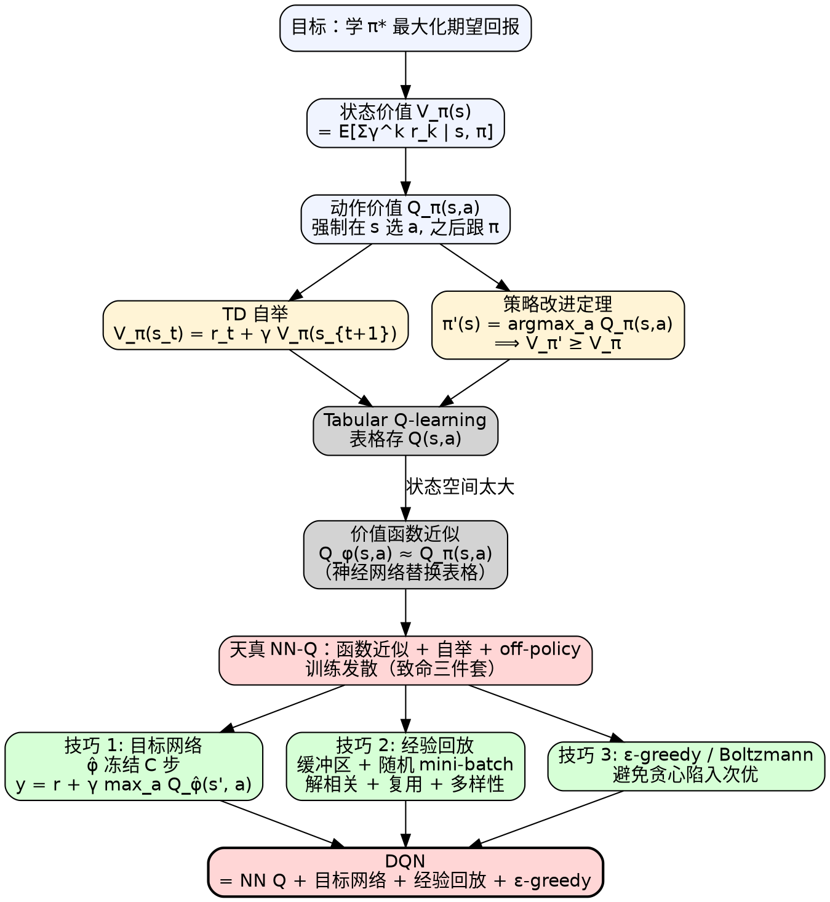

# 深度 Q 网络（Deep Q-Network, DQN）

> [!abstract] 一句话
> **DQN** 用神经网络 $Q_\phi(s,a)$ 近似动作价值函数 $Q_\pi(s,a)$，配合 **目标网络（target network）** 稳定回归目标、**经验回放（experience replay）** 打破样本相关性并复用数据，把 tabular Q-learning 推广到高维/连续状态空间。本质：**TD 回归 + 自举（bootstrapping）+ 两个工程稳定性 trick**。

---

## 1. 背景：基于价值 vs 基于策略

DQN 不学策略，学**评论员（critic）**。评论员的输出和策略 $\pi$ 绑定——它评的是"在策略 $\pi$ 下，这个状态/动作有多好"。

| 维度 | 基于价值（DQN） | 基于策略（[[策略梯度教程|策略梯度]]） |
|---|---|---|
| 学什么 | $Q_\phi(s,a)$，间接得策略 $\pi(s)=\arg\max_a Q$ | 直接学 $\pi_\theta(a\mid s)$ |
| 策略形式 | **确定性**（贪心） | **天然随机** |
| 探索 | 需要外加机制（$\varepsilon$-greedy / Boltzmann） | 采样自带 |
| 数据效率 | **off-policy**，回放缓冲可复用旧数据 | on-policy，采样数据用一次就丢 |
| 动作空间 | 离散友好；连续要变形（DDPG） | 离散 / 连续都行 |
| 收敛性 | 函数近似 + 自举 + off-policy = "致命三件套"，需技巧稳定 | 局部最优、方差大 |

> [!info] 为什么需要 DQN
> Tabular Q-learning 用表存 $Q(s,a)$，状态空间一旦大或连续（如雅达利游戏的像素画面）就无法枚举。**价值函数近似（value function approximation）** $Q_\phi(s,a)\approx Q_\pi(s,a)$ 用神经网络替换表格，但天真替换会让训练发散——这就是 DQN 那两个 trick 要解决的。

---

## 2. 形式化：状态价值与动作价值

### 2.1 状态价值函数 $V_\pi(s)$

$$
V_\pi(s) = \mathbb{E}\left[\sum_{k=0}^{\infty} \gamma^k r_{t+k}\,\Big|\, s_t = s, \pi\right]
$$

含义：在状态 $s$ 下，依策略 $\pi$ 一直交互到结束的**期望累积奖励**。

> [!warning] 价值绑定演员
> $V_\pi$ 是 $\pi$ 的函数。同一个状态，换个策略，值就变。评论员**不能**离开演员单独评价"状态好坏"。

### 2.2 动作价值函数 $Q_\pi(s,a)$

$$
Q_\pi(s,a) = \mathbb{E}\left[\sum_{k=0}^{\infty} \gamma^k r_{t+k}\,\Big|\, s_t = s, a_t = a, \pi\right]
$$

**强制**在 $s$ 采取动作 $a$（不管 $\pi$ 本来要选啥），之后才回到 $\pi$。两种网络结构：

| 结构 | 输入 | 输出 | 适用 |
|---|---|---|---|
| (a) | $(s, a)$ | 标量 | 离散 + **连续动作** |
| (b) | $s$ | 每个动作一个 Q 值（向量） | **仅离散**；DQN 标准用法 |

> [!tip] DQN 用的是 (b)
> 一次前向给所有动作的 Q 值，$\arg\max$ 直接在输出向量上做，省下对每个动作分别 forward 的开销。**连续动作下不能枚举，反向只能用 (a)** —— 但 (a) 也无法解析 $\arg\max_a Q$，所以连续控制走 [[DDPG]] 那条"actor 近似 argmax"的路。

---

## 3. 估值方法：MC vs TD（DQN 选 TD）

怎么训练 $V_\pi$ / $Q_\pi$？两种思路：

### 3.1 蒙特卡洛（Monte Carlo, MC）

玩到回合结束，记下 $G_t = \sum_{k=t}^{T} r_k$，回归：

$$
\mathcal L_{\text{MC}} = \big(V_\phi(s_t) - G_t\big)^2
$$

### 3.2 时序差分（Temporal Difference, TD）

只需一步 $(s_t, a_t, r_t, s_{t+1})$，用**自举**：

$$
\boxed{\;V_\pi(s_t) \;=\; r_t + \gamma\, V_\pi(s_{t+1})\;} \tag{6.1*}
$$

回归损失：

$$
\mathcal L_{\text{TD}} = \big(V_\phi(s_t) - (r_t + \gamma V_\phi(s_{t+1}))\big)^2
$$

> [!info] 与原文的细微差异
> Easy-RL 原文式 (6.1) 写作 $V_\pi(s_t)=V_\pi(s_{t+1})+r_t$（**省去了折扣 $\gamma$**，整章没出现 $\gamma$）。本教程按 Sutton & Barto 标准，统一加上 $\gamma\in(0,1]$ 以反映"未来奖励要打折"的事实——故标 (6.1*)。后文 $V_\pi/Q_\pi$ 定义、策略改进证明都做了同样处理。

### 3.3 对比

| 维度 | MC | TD |
|---|---|---|
| 是否需打完整回合 | ✅ 必须 | ❌ 一步即可 |
| 偏差 | 无偏 | 有偏（依赖当前 $V$ 估计） |
| 方差 | **大**（$T$ 步奖励之和，方差随回合长度线性以上增长） | **小**（仅一步 $r$ 的随机性） |
| 长回合 | 不可行 | 可行 |
| 实践 | 较少用 | **DQN 用此** |

> [!note] 为什么 TD 能"一步学"
> 自举：把"未来无限步求和"折叠成"一步奖励 + 下一状态价值"。代价是"下一状态价值"还是估计的——如果它不准，TD 也不准。

> [!example] MC 与 TD 给出不同答案的经典例子
> 8 条轨迹：$s_a$ 出现 1 次（之后接 $s_b$，$r=0$，最终回报 0）；$s_b$ 出现 8 次（6 次得 1，2 次得 0）。
> - MC：$V(s_a)=0$（$s_a$ 唯一一次的 return 就是 0）
> - TD：$V(s_a)=V(s_b)+r=3/4+0=3/4$
>
> **两者都对，差别在「是否做马尔可夫假设」**：
> - **MC 不做马尔可夫假设**——它只看实际轨迹的回报，所以忠实保留"$s_a$ 出现那次后续就是 0"这条事实，把它当作 $s_a$ 的特殊属性。
> - **TD 强制马尔可夫性**——它假设 $s_b$ 的价值只取决于 $s_b$ 本身、与如何到达 $s_b$ 无关，所以把通用估计 $V(s_b)=3/4$ 直接接上，得到 $V(s_a)=3/4$。
>
> 这是 MC vs TD 最根本的方法论分歧，不是某一方更对。

---

## 4. 策略改进定理：有 Q 就能改策略

只要有 $Q_\pi$，就能造出一个**至少和 $\pi$ 一样好**（且通常更好，除非 $\pi$ 已最优）的新策略：

$$
\boxed{\;\pi'(s) = \arg\max_a Q_\pi(s,a)\;} \tag{6.4}
$$

> [!success] 关键性质
> 对所有状态 $s$，$V_{\pi'}(s) \geq V_\pi(s)$（**非严格** ≥；当 $\pi$ 已是最优策略时取等——这正是最优策略的不动点性质）。这给了一个 **policy iteration** 闭环：估 $Q_\pi$ → 贪心得到 $\pi'$ → 用 $\pi'$ 重新估 $Q_{\pi'}$ → 再贪心 → ...

### Step 1 · 单步改进

$$
V_\pi(s) = Q_\pi(s, \pi(s)) \le \max_a Q_\pi(s,a) = Q_\pi(s, \pi'(s))
$$

第一个等号是 $V$ 的定义；中间不等号是因为 $\pi'$ 选的就是 $\arg\max$。

> [!note] 这一步在说什么
> "在状态 $s$ 偏一步用 $\pi'$，之后回到 $\pi$"——这样比从头到尾用 $\pi$ 不会更差。

### Step 2 · 递归展开（用 Bellman + 重复 Step 1）

把 $Q_\pi(s,\pi'(s))$ 用 Bellman 展开成 $\mathbb E[r_t + \gamma V_\pi(s_{t+1})\mid \cdot]$，对 $V_\pi(s_{t+1})$ 再用 Step 1 不等式，无限展开下去：

$$
\begin{aligned}
V_\pi(s)
&\le \mathbb E[r_t + \gamma V_\pi(s_{t+1})\mid \pi'] \\
&\le \mathbb E[r_t + \gamma r_{t+1} + \gamma^2 V_\pi(s_{t+2})\mid \pi'] \\
&\le \cdots \\
&\le \mathbb E\!\left[\sum_{k=0}^{\infty}\gamma^k r_{t+k}\,\Big|\,\pi'\right] = V_{\pi'}(s)
\end{aligned}
$$

所以 $\boxed{V_\pi(s) \le V_{\pi'}(s)}$。$\square$

> [!info] 与原文的差异
> Easy-RL 原文证明链未带 $\gamma$，本教程补全以保持折扣回报定义的一致性。

> [!warning] 离散 vs 连续动作
> $\arg\max_a$ 在离散动作下直接遍历就行；连续动作下 $\arg\max$ 不可解析——这就是 DQN 不能直接用于连续控制（需要 [[DDPG]] 这类带 actor 的变体）的根因。

---

## 5. 直观解读

### 5.1 Q 函数 = "试一下这步"的预期分

乒乓球例子：第 2 帧球已经接近边缘，"向上"的 Q 值会显著高于"原地不动"或"向下"——因为只有"向上"能接到球。**Q 值差异在"关键时刻"才显著**，在大多数无关紧要的帧上各动作 Q 值差不多。

### 5.2 自举的"先有鸡先有蛋"

TD 目标 $r + \gamma Q(s', a')$ 用的是**自己估计的 Q**——估计还没准就拿来作目标，听起来要崩。它能 work 是因为：
- 真实奖励 $r$ 是**锚点**（数据中的真值）
- 多步迭代下，$r$ 信号沿时间反向传播，逐渐校准 Q

但这个"自我引用"也是 DQN 不稳定的根源——见下一节的 target network。

---

## 6. 实现技巧（DQN 的三大支柱）

### 技巧 1 · 目标网络（Target Network）

> [!warning] naive 做法的痛点
> 直接用单网络回归：损失 $\big(Q_\phi(s,a) - (r + \gamma\max_{a'} Q_\phi(s',a'))\big)^2$。问题：**目标里也含 $\phi$**，反向传播一次，输出和目标同时动——拟合一个会动的目标，训练极易发散。

**解法**：复制一份网络作为**目标网络** $Q_{\hat\phi}$，每 $C$ 步（典型 $C=100\sim10000$）才同步参数 $\hat\phi \leftarrow \phi$。回归目标变成：

$$
\boxed{\; y = r_t + \gamma\, \max_{a'} Q_{\hat\phi}(s_{t+1}, a')\;}
$$

$\hat\phi$ 在 $C$ 步内**冻结**，目标值不动，回归问题良定义。

> [!info] 猫追老鼠类比
> 猫 = $Q_\phi$（在更新），老鼠 = 目标。如果老鼠也跟着每步动，两者会在优化空间里乱跑。固定老鼠 $C$ 步，让猫追上一段距离再让老鼠动，最终拟合。
>
> 注意：每 $C$ 步的同步是 **硬拷贝**（$\hat\phi\leftarrow\phi$，老鼠**瞬移**到猫的位置），**不是**软更新（Polyak averaging $\hat\phi\leftarrow\tau\phi+(1-\tau)\hat\phi$，那是 [[DDPG]] / [[SAC]] 的做法）。

### 技巧 2 · 经验回放（Experience Replay）

每步把 $(s_t, a_t, r_t, s_{t+1})$ 存入**回放缓冲区** $\mathcal D$（玩具任务 $10^4\sim 5\times 10^4$，Atari 经典 $10^6$），训练时从中**均匀随机采样** mini-batch。

> [!warning] naive 做法的痛点
> 用最新轨迹连续训练：
> 1. 相邻样本时间相关，违反 SGD 的 i.i.d. 假设
> 2. 与环境交互比训练慢得多——一笔数据用一次就扔太奢侈
> 3. 一个 batch 全是相似数据，训练不稳定

**解法**带来三个好处：

| 好处 | 解释 |
|---|---|
| **解相关** | 随机采样打破时间相关性 |
| **数据复用** | 一笔经验可被多次采样训练，缓解"环境交互瓶颈" |
| **多样性** | 缓冲区里混着多个旧策略产生的数据，batch 更 diverse |

> [!note] 副作用：DQN 是 **off-policy**
> 缓冲区里的数据不是来自当前 $\pi$ 的，是过去多个策略的混合。Q-learning 本身就是 off-policy（更新只用 $\max_{a'} Q$，与采样策略无关），所以这个混杂没问题。

### 技巧 3 · 探索（$\varepsilon$-greedy / Boltzmann）

> [!warning] naive 做法的痛点
> 纯贪心 $a=\arg\max_a Q(s,a)$ 一旦某个动作早期偶然得正奖励，Q 值就最大，之后只选它，**其他动作永远没机会被试**——错把局部最优当全局最优。"以后每次去餐厅只点椒麻鸡"问题。

#### $\varepsilon$-greedy

$$
a = \begin{cases} \arg\max_a Q(s,a), & \text{w.p. } 1-\varepsilon \\ \text{均匀随机}, & \text{w.p. } \varepsilon \end{cases}
$$

> [!tip] $\varepsilon$ 退火
> 训练初期 $\varepsilon\approx 1$（多探索），按线性或指数退火到 $0.05\sim 0.1$（多利用）。Atari 经典设置：100 万步从 1.0 退到 0.1。

#### Boltzmann 探索（softmax）

$$
\pi(a\mid s) = \frac{e^{Q(s,a)/T}}{\sum_{a'} e^{Q(s,a')/T}}
$$

温度 $T$：大 → 接近均匀（探索）；小 → 接近 $\arg\max$（利用）；$T\to 0$ → 纯贪心。

> [!info] 关于 $Q\ge 0$ 假设
> Easy-RL 原文额外假设 $Q(s,a)\ge 0$。其实 softmax 对负数也有定义（指数函数定义在整个实数轴上），实践中**不需要**这个约束。

| 维度 | $\varepsilon$-greedy | Boltzmann |
|---|---|---|
| 实现 | 极简 | 要算 softmax |
| 利用信息 | 探索时**完全均匀**（忽略 Q 值差异） | 探索概率与 Q 值挂钩，更"聪明" |
| 实际使用 | DQN 主流 | Atari 上不如前者，soft Q-learning 用之 |

---

## 7. 完整 DQN 算法

> [!example] DQN 伪代码
> ```
> 初始化 Q 网络参数 φ；目标网络 φ̂ ← φ
> 初始化回放缓冲区 D（容量 N）
>
> for episode = 1, M do
>   s ← env.reset()
>   for t = 1, T do
>     # —— 与环境交互 ——
>     根据 ε-greedy 选 a：
>       概率 ε：随机；否则 a = argmax_a Q_φ(s, a)
>     执行 a，得 (r, s')
>     存 (s, a, r, s') 入 D；若 D 满则丢最旧
>
>     # —— 更新 Q 网络 ——
>     从 D 采样 batch (s_i, a_i, r_i, s'_i)
>     y_i = r_i + γ · max_{a'} Q_φ̂(s'_i, a')          # 用目标网络算 y
>     loss = (1/B) Σ (Q_φ(s_i, a_i) - y_i)²            # MSE
>     φ ← φ - η · ∇_φ loss
>
>     # —— 同步目标网络 ——
>     每 C 步：φ̂ ← φ
>
>     s ← s'
>   end
> end
> ```

> [!success] 与 Q-learning 的区别
> | 维度 | Q-learning | DQN |
> |---|---|---|
> | 价值表示 | 表格 $Q(s,a)$ | 神经网络 $Q_\phi(s,a)$ |
> | 数据 | 用最新转移直接更新（stream learning） | **回放缓冲 + 随机批 SGD** |
> | 目标稳定 | 不需要（tabular Q-learning 是 Bellman 算子的 $\gamma$-收缩不动点迭代，理论保证收敛） | **目标网络冻结 $C$ 步**（NN 近似破坏了收缩性） |
> | 适用状态 | 小且离散 | 高维/连续 |

---

## 8. Cheat Sheet

### 8.1 最小可跑伪代码（PyTorch）

```python
import torch, torch.nn as nn, random, numpy as np
from collections import deque

class QNet(nn.Module):
    def __init__(self, state_dim, n_actions):
        super().__init__()
        self.net = nn.Sequential(
            nn.Linear(state_dim, 128), nn.ReLU(),
            nn.Linear(128, n_actions))
    def forward(self, s): return self.net(s)

q, q_target = QNet(s_dim, n_a), QNet(s_dim, n_a)
q_target.load_state_dict(q.state_dict())
opt = torch.optim.Adam(q.parameters(), lr=1e-3)
buf = deque(maxlen=50_000)

for step in range(total_steps):
    # ε-greedy
    s_t = torch.tensor(s, dtype=torch.float32)
    a = env.action_space.sample() if random.random() < eps \
        else q(s_t).argmax().item()
    s2, r, done, _ = env.step(a)
    buf.append((s, a, r, s2, done))
    s = env.reset() if done else s2

    # 学习
    if len(buf) >= 1000:
        batch = random.sample(buf, 64)
        s_b, a_b, r_b, s2_b, d_b = zip(*batch)
        # —— dtype 必须显式指定，否则 gather 会报错 ——
        S  = torch.tensor(np.array(s_b),  dtype=torch.float32)
        S2 = torch.tensor(np.array(s2_b), dtype=torch.float32)
        A  = torch.tensor(a_b, dtype=torch.long)      # gather 的 index 必须是 long
        R  = torch.tensor(r_b, dtype=torch.float32)
        D  = torch.tensor(d_b, dtype=torch.float32)

        with torch.no_grad():
            # .max(1).values 等价于 .max(1)[0]，老版 PyTorch 用后者
            y = R + 0.99 * q_target(S2).max(1).values * (1 - D)  # 终止状态不加未来奖励
        q_sa = q(S).gather(1, A.unsqueeze(1)).squeeze(1)         # (B, n_a) → (B,)
        loss = ((q_sa - y) ** 2).mean()
        opt.zero_grad(); loss.backward(); opt.step()

    # 同步目标网络（硬拷贝）
    if step % 100 == 0:
        q_target.load_state_dict(q.state_dict())
```

### 8.2 常见坑

> [!summary] 提交前自查
> - **目标网络忘记 detach / no_grad**：梯度会流回目标网，等于没固定目标 → 发散
> - **同 Q 网络当目标**：忘了拷一份网络，训练崩
> - **`done=True` 时仍加 $\gamma\max Q(s')$**：终止状态后没未来奖励，必须乘 $(1-d)$
> - **gather 维度错**：`q(S).gather(1, A.unsqueeze(1))`——A 要 unsqueeze 成 $(B,1)$，否则 shape 错位
> - **dtype 没指定**：状态要 `float32`、动作索引要 `long`，否则 `gather` 直接报错
> - **回放缓冲容量分层**：玩具任务（CartPole）$10^4\sim 5\times 10^4$；Atari 经典 $10^6$
> - **更新频率失衡**：每步交互→每步训练，Atari 经典是每 4 步训一次
> - **ε 退火太快**：还没探索充分就纯贪心，卡在次优策略；评估时 ε 通常设 0.05（避免训练 ε 影响 evaluation）
> - **学习率过大**：DQN 对 lr 敏感，Adam 1e-4 ~ 1e-3 是安全区
> - **奖励未裁剪**：Atari 经典做法是 $r\in[-1,1]$ 裁剪，避免不同游戏分数尺度差异
> - **状态归一化**：图像除 255、向量做 mean/std 标准化
> - **过估计偏差**：$\max_{a'}$ 让 Q 系统性偏高 → [[Double DQN]] 解决
> - **致命三件套**：函数近似 + 自举 + off-policy（Sutton & Barto 第 11 章）。**target network + replay 缓解前两件**；ε-greedy 解决探索-利用问题，**与三件套无关**——三个 trick 各管各的事。

---

## 9. 一图总览



---

## 10. 关联笔记

- [[策略梯度教程|策略梯度]]：基于策略的对偶路线（actor 而非 critic）
- [[Q-learning]]：DQN 的 tabular 前身
- [[Double DQN]]：用 $\arg\max$ 来自在线网，$\max$ 值来自目标网，缓解过估计
- [[Dueling DQN]]：Q 网络拆成 $V(s) + A(s,a)$ 两支，提升对状态价值的学习效率
- [[Prioritized Experience Replay]]：按 TD-error 优先采样
- [[Rainbow]]：Double + Dueling + PER + n-step + Noisy + Distributional 六合一
- [[DDPG]]：把 DQN 思想搬到连续动作（学一个确定性 actor $\mu_\theta(s)$ **近似** $\arg\max_a Q$，而非解析求解）
- [[Actor-Critic教程|Actor-Critic]]：value-based 和 policy-based 的融合

**原文**：[Easy-RL · Chapter 6 深度Q网络](https://datawhalechina.github.io/easy-rl/#/chapter6/chapter6)
