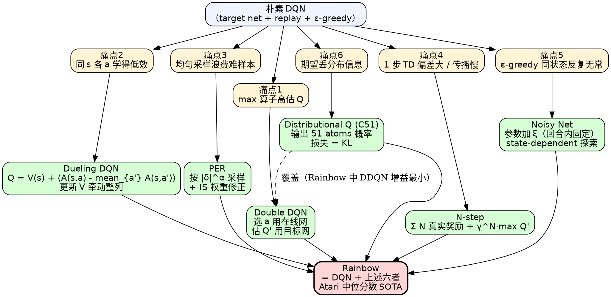

# DQN 进阶技巧（Double / Dueling / PER / N-step / Noisy / Distributional / Rainbow）

> [!abstract] 一句话
> 朴素 [[DQN教程|DQN]] 在工程上有 **过估计、估值效率低、回放采样均匀、单步 bootstrap 偏差大、$\varepsilon$-greedy 探索粗糙、用期望丢分布信息** 六个痛点。本章六个技巧——**Double / Dueling / PER / N-step / Noisy Net / Distributional Q**——各打一枪；**Rainbow** 把它们全部叠加，性能在 Atari 中位分数上显著超过任一单技巧。

---

## 1. 总览：六痛点 → 六技巧 → Rainbow

| 痛点（朴素 DQN 的问题） | 对应技巧 | 一句话改动 |
|---|---|---|
| $\max_a Q$ 系统性 **高估** Q 值 | [[Double DQN]] | **选动作**用在线网、**取值**用目标网 |
| 同状态下不同动作 Q 值差异小，单独学每个 $(s,a)$ 浪费样本 | [[Dueling DQN]] | 网络拆成 $V(s)+A(s,a)$，更新 $V$ 牵动整列 |
| 回放缓冲均匀采样 → "训得好的"被反复看，"难学的"被忽略 | [[Prioritized Experience Replay\|PER]] | 按 \|TD-error\| 优先采样 + IS 修正 |
| 单步 TD bootstrap 偏差大、信息传播慢 | N-step / Multi-step | 累 $N$ 步真实奖励再 bootstrap |
| $\varepsilon$-greedy 同状态下随机切换动作，**反复无常** | [[Noisy Net]] | 给**网络参数**加噪声，回合内固定 → state-dependent exploration |
| 只学期望 Q，丢失奖励**分布**信息 | [[Distributional Q]]（C51） | 输出 return 在离散区间上的分布 |
| 单一技巧增益有限 | [[Rainbow]] | 六合一（+原 DQN）综合效果最好 |

> [!info] 阅读顺序
> 推荐按"DDQN → Dueling → PER → N-step → Noisy → Distributional → Rainbow"读，前置依赖最少；本教程也按此顺序展开。

---

## 2. Double DQN：解决 Q 值过估计

### 2.1 痛点：$\max$ 算子放大噪声 → 系统性高估

朴素 DQN 的 TD 目标：

$$
Q(s_t, a_t) \;\longleftarrow\; r_t + \gamma\,\max_a Q(s_{t+1}, a) \tag{7.1*}
$$

> [!info] 与原文的折扣因子
> Easy-RL 原文式 (7.1) 与本节式 (7.2) 都省略了 $\gamma$。本教程统一按 Sutton & Barto 标准补全 $\gamma\in(0,1]$，故标 (7.1*) / (7.2*)。代码与后续 N-step 推广也都默认含 $\gamma$。

> [!warning] $\max$ 是噪声放大器
> 假设 4 个动作的真实 Q 值都相同，但网络估计有零均值噪声。$\max$ 总会挑出**被高估最多**的那个动作的 Q 值——结果目标值系统性偏大，回归过去 → Q 网络估值越训越离谱。
>
> 直觉：$\mathbb E[\max_i X_i] \ge \max_i \mathbb E[X_i]$（Jensen 不等式，凸函数 $\max$）；噪声越大、动作数越多，鸿沟越大。

原文图 7.1 验证了这个高估：朴素 DQN 估出的 Q 值（红色锯齿线）远高于策略实际玩出来的真实回报；蓝色 DDQN 估值与真实回报接近，且策略本身的真实回报也更高。


*图 7.1 · 朴素 DQN 的 Q 估值（红锯齿）远超真实回报（红平滑），DDQN 缩小了这个鸿沟（[Easy-RL 第 7 章](https://datawhalechina.github.io/easy-rl/#/chapter7/chapter7)）*

### 2.2 核心思路：解耦"选动作"与"估值"

DDQN 的关键观察：高估来自**同一个 Q 网络**既选动作又给值——只要这两件事用不同网络，单独被高估的动作就不会自动得到被高估的值。

$$
\boxed{\;Q(s_t, a_t) \;\longleftarrow\; r_t + \gamma\,Q'\!\Big(s_{t+1},\; \arg\max_a Q(s_{t+1}, a)\Big)\;} \tag{7.2*}
$$

- **选动作**：用在线 Q 网络（即将更新的那个）的 $\arg\max$
- **估值**：把选出的动作代入目标网 $Q'$（参数冻结）

> [!success] 代价几乎为零
> 朴素 DQN 本来就有目标网 $Q'$（用于计算 TD target）和在线网 $Q$（被训练）。DDQN 只是**换了一行代码**：原来 $r_t + \gamma\,\max_a Q'(s', a)$ 改成 $r_t + \gamma\,Q'(s', \arg\max_a Q(s', a))$。零额外参数、零额外网络、几乎零额外算力。

### 2.3 为什么有效

- 若 $Q$ 高估了某动作 $a^*$ → 选了 $a^*$ → $Q'$ **未必**高估 $a^*$（参数延迟拷贝、噪声不完全相关），目标值正常
- 若 $Q'$ 高估了某动作 $a^\dagger$ → 但 $Q$ 不会去选 $a^\dagger$（除非 $Q$ 也高估它）
- 必须**两个网络同时高估同一个动作**才会出错——概率小很多

> [!info] 缓解≠消除
> $Q$ 与 $Q'$ 在 DDQN 里**并非完全独立**（$Q'$ 是 $Q$ 的延迟拷贝），它们的高估有正相关，所以 DDQN 只是缓解、不是消除。残余高估正是后面 [[Distributional Q]] 进一步压制的目标——这也是 Rainbow 消融里 DDQN 增益最小的原因（见 §8.1）。

| 维度 | 朴素 DQN | DDQN |
|---|---|---|
| 选 + 估 是否同一网络 | ✅ 同一个 $Q'$ | ❌ 选 $Q$、估 $Q'$ |
| 是否系统性高估 | **是** | 大幅缓解 |
| 实现复杂度 | — | +1 行 |
| 推荐度 | baseline | **若只选一个技巧，就选它** |

---

## 3. Dueling DQN：拆 Q = V + A，提升数据效率

### 3.1 痛点：单独学每个 $(s,a)$ 太浪费

原始 DQN：网络输入 $s$，直接输出 $|\mathcal A|$ 个 Q 值，每个 $(s,a)$ 像一个独立条目，更新一个不会牵动同 $s$ 下其他动作。

但 RL 中**同一个状态下不同动作的 Q 值差异往往很小**——大部分价值由"这个状态本身好不好"决定，动作间只差一个微调。如果能把"状态值"和"动作差异"拆开，更新一次"状态值"就能同时影响所有动作。

### 3.2 网络结构：双分支输出

$$
\boxed{\;Q(s, a) \;=\; V(s) \;+\; A(s, a)\;}
$$

- $V(s)$：标量，**状态价值**——这个状态本身有多好（与动作无关）
- $A(s, a)$：向量，**优势函数（advantage）**——在状态 $s$ 下，动作 $a$ 相对平均水平好多少

网络共享前面几层 conv/fc 提特征，最后分两个 head：一个输出标量 $V$，一个输出 $|\mathcal A|$ 维向量 $A$，再相加得 $Q$。

### 3.3 直观：更新 $V(s)$ 牵动整列

把 $Q$ 想成一张表（行=动作，列=状态；本节示例对原文 Easy-RL 7.4 的数据做了等价简化，逻辑一致）：

| 状态 → | $s_1$ | $s_2$ | $s_3$ | $s_4$ |
|---|---|---|---|---|
| $V(s)$ | 2 | 0 | 1 | -1 |
| $A(s, a_1)$ | 1 | 2 | -1 | 0 |
| $A(s, a_2)$ | -1 | 0 | 2 | 3 |
| $A(s, a_3)$ | 0 | -2 | 0 | -1 |
| **$Q(s,a_1)$** | **3** | **2** | **0** | **-1** |
| **$Q(s,a_2)$** | **1** | **0** | **3** | **2** |
| **$Q(s,a_3)$** | **2** | **-2** | **1** | **-2** |

假设训练时只采样到 $(s_1, a_1)$ 和 $(s_1, a_2)$，要把它们的 Q 各加 1（变成 4、2）。

- **朴素 DQN**：只能改 $Q(s_1, a_1)$ 和 $Q(s_1, a_2)$；$Q(s_1, a_3)$ 保持 2
- **Dueling**：网络可以选择把 $V(s_1)$ 从 2 改成 3，**整列一起 +1** → $Q(s_1, a_3)$ 也变成 3

> [!success] 这就是 Dueling 的数据效率
> 没采样到的 $(s_1, a_3)$ 也获得了更新——前提是网络判定"是状态 $s_1$ 整体变好"，而不是"只有 $a_1, a_2$ 变好"。

### 3.4 退化陷阱与零均值化约束

> [!warning] 没有约束的话，模型会退化成朴素 DQN
> 如果不约束，网络可以学到 $V(s)\equiv 0$、$A(s,a)\equiv Q(s,a)$，Dueling 就**白拆**了。

解决：给 $A$ 加约束，让网络**不愿意**全靠 $A$ 表达 Q。常见两种：

| 约束方式 | 公式 | 说明 |
|---|---|---|
| **零均值化（mean）** | $Q(s,a) = V(s) + A(s,a) - \frac{1}{\|\mathcal A\|}\sum_{a'} A(s,a')$ | Easy-RL 介绍的；列均值强制为 0，更新一列只能改 $V$。**Wang et al. 2016 论文实际选用的版本**——出于训练稳定性考量，全部 Atari 实验都用它 |
| max 归一化 | $Q(s,a) = V(s) + A(s,a) - \max_{a'} A(s,a')$ | 论文同时提出的另一种形式，理论上更好地保留 $V/A$ 语义（最优动作处 $A=0$），但实测优化稳定性不如 mean 版，所以仅作为备选 |

实现上把零均值化嵌入网络作为一个无参操作，反向传播照常进行。

> [!example] 零均值化数值示例
> 网络两支输出 $V(s)=1$、$A(s)=[7, 3, 2]^\top$。
> 1. 计算均值 $(7+3+2)/3 = 4$
> 2. 减均值得 $[3, -1, -2]^\top$（Easy-RL 原文此处印为 $[3,-1,2]^\top$，$2-4$ 漏写负号，本教程已订正）
> 3. 加上 $V$：$Q = [1+3, 1-1, 1-2]^\top = [4, 0, -1]^\top$

> [!note] 为什么这样能强制 $V$ 学习
> 零均值化后，更新 $A$ 的一列会被"减去自己的均值"抵消大部分；想整体抬升一列只能动 $V$。梯度路径上，$V$ 是更顺畅的方向，网络自然倾向走它。

---

## 4. Prioritized Experience Replay (PER)：按 TD-error 优先采样

### 4.1 痛点：均匀采样浪费"难学"的样本

朴素 DQN 的回放缓冲采样是**均匀**的——一条经验进缓冲后，每次被抽到的概率都一样。但训练中显然有些样本"已经学好了"（TD-error 接近 0），有些样本"还没学会"（TD-error 大）。

> [!warning] 均匀采样的代价
> 已学好的样本反复被采，浪费算力；难学的样本被淹没。学习曲线慢、易陷入局部。

### 4.2 优先级定义

定义经验 $i$ 的优先级 $p_i \propto |\delta_i|$，其中 $\delta_i$ 是该样本上次被用时计算的 TD-error：

$$
p_i = |\delta_i| + \epsilon, \qquad P(i) = \frac{p_i^\alpha}{\sum_k p_k^\alpha}
$$

- $\alpha\in[0,1]$：优先级强度。$\alpha=0$ → 退化为均匀采样；$\alpha=1$ → 完全按优先级
- $\epsilon$：小常数，防止 $|\delta|=0$ 的样本永远不被采

### 4.3 重要性采样修正（不可省）

> [!danger] PER 改了采样分布，必须修偏
> Q-learning 的更新假定样本来自缓冲区的某个分布；改成按 $P(i)$ 抽就**引入了偏差**。直接训会让 Q 值估计偏掉。

修正：给每条样本的损失乘上重要性采样（IS）权重：

$$
w_i = \left(\frac{1}{N \cdot P(i)}\right)^\beta, \qquad \mathcal L_i = w_i \cdot \delta_i^2
$$

- $\beta\in[0,1]$：训练初期 $\beta$ 小（部分修正即可——网络远未收敛、梯度本身就嘈杂，过早严格修偏没意义），训练末期 $\beta\to 1$（完全修正，保证收敛到无偏估计）。Schaul 2016 论文中 $\beta$ 从 0.4 线性退火到 1.0
- 实现上常对 $w$ 做 $\max$ 归一化（除以 batch 中最大 $w$）以稳定数值

> [!tip] PER 同时改两件事
> 不仅改了**采样分布**，还改了**参数更新方式**（损失乘 IS 权重）。只改一件就会有偏。

### 4.4 实现要点

- **存储结构**：用 SumTree（一种求和型 segment tree）支持 $O(\log N)$ 抽样和优先级更新；普通数组会退化到 $O(N)$
- **新经验的优先级**：刚进缓冲的样本没有 TD-error，给它**当前最大优先级**（保证至少被抽一次）
- **优先级更新**：每个样本被抽中并训练后，用新算的 $|\delta|$ 更新它的 $p_i$

| 维度 | 均匀回放 | PER |
|---|---|---|
| 采样分布 | $1/N$ 均匀 | $\propto p^\alpha$ |
| 参数更新 | $\sum_i \delta_i^2$ | $\sum_i w_i \delta_i^2$（IS 修正） |
| 数据结构 | 双端队列 | SumTree |
| Atari 性能 | baseline | 中位 human-normalized 分数较 DQN 翻倍（Schaul 2016） |

---

## 5. N-step / Multi-step：在 MC 与 TD 之间取平衡

### 5.1 痛点：单步 TD 偏差大、信息传播慢

朴素 DQN 用 1 步 TD：

$$
y_t^{(1)} = r_t + \gamma \max_a Q'(s_{t+1}, a)
$$

只有 1 个真实奖励 $r_t$，剩下全是 $Q'$ 的 bootstrap 估计 → 估计有偏，且需要很多步迭代才能把回报信息从远处传回来。

另一极端是 [[蒙特卡洛|MC]]：累全集 $G_t = \sum_{k=0}^{T-t} \gamma^k r_{t+k}$，无偏但方差爆炸（$T$ 项随机奖励之和）。

### 5.2 N-step 折中

累 $N$ 步真实奖励，再 bootstrap：

$$
\boxed{\;y_t^{(N)} \;=\; \sum_{k=0}^{N-1} \gamma^k r_{t+k} \;+\; \gamma^N \max_a Q'(s_{t+N}, a)\;}
$$

> [!info] 与原文的求和上限
> Easy-RL 原文将求和上限写成 $t+N$（$N+1$ 项）、bootstrap 在 $s_{t+N+1}$ 上，与 Sutton-Barto / Rainbow 标准 N-step 写法（$N$ 项 + $s_{t+N}$ bootstrap）不一致。本教程按标准订正。

> [!note] 为什么把 bootstrap 推到 $N$ 步以后
> $N$ 个真实奖励是确定的（已采样到），bootstrap 项前面有 $\gamma^N$ 衰减，估计误差被压小。代价是这 $N$ 项奖励之和方差更大——需要在两端之间挑 $N$。

### 5.3 折中权衡表

| 维度 | 1-step TD（朴素 DQN） | N-step | MC |
|---|---|---|---|
| 真实奖励项数 | 1 | $N$ | 整回合 |
| Bootstrap 项 | $\gamma\,Q'$ | $\gamma^N Q'$ | 无 |
| 偏差 | **大**（依赖 $Q'$） | 中 | 0 |
| 方差 | **小** | 中 | **大** |
| 信息传播速度 | 慢 | 快 $N$ 倍 | 一步到位 |
| 超参 | — | $N$（典型 3 ~ 5） | — |

> [!warning] N-step 与 off-policy 的注意
> 经验回放里的旧轨迹**未必**是当前策略产生的；严格来说 N-step return 在 off-policy 下需要重要性采样修正（参考 Munos 2016 Retrace(λ) 或 Q(λ) 系列）。Rainbow 论文里直接忽略了这件事——经验上仍能涨点，工程上的折中。

---

## 6. Noisy Net：参数空间噪声 → state-dependent exploration

### 6.1 痛点：$\varepsilon$-greedy 在同状态下"反复无常"

$\varepsilon$-greedy 探索：每步以 $\varepsilon$ 概率随机选动作。问题在于：

> [!warning] 同状态、不同行为
> 给定**同一个**状态 $s$，$\varepsilon$-greedy 这一次随机选了 $a_1$、下一次随机选了 $a_2$——动作完全不一致。这不像一个"策略"，更像一个有 bug 的策略。真实环境里没有任何理性策略会同状态下乱抖。

### 6.2 核心思路：在网络**参数**上加噪声

对 Q 网络的所有参数加高斯噪声：

$$
\tilde Q(s, a; \theta + \xi),\qquad \xi \sim \mathcal N(0, \Sigma)
$$

行为策略：$a = \arg\max_a \tilde Q(s, a)$，**没有任何 $\varepsilon$ 随机**。

> [!danger] 噪声采样的时机：两种做法对应不同方法
> 这里有一个**容易踩**的差别：
> - **DeepMind NoisyNet for DQN/Rainbow**（Fortunato et al. 2018）：online 网与 target 网**每次前向都各自重采一次** $\xi$。这是 Rainbow、Dopamine、Tianshou 等开源实现的标准做法
> - **OpenAI Parameter Space Noise**（Plappert et al. 2018）：**回合开始采一次**，回合内固定（更适合 actor-critic 类算法的连续探索）
>
> Easy-RL 原文的"回合内固定"对应的是后者。如果你跟着 Rainbow 走，**就是 per-step 重采**。state-dependent exploration 的本质是"参数空间扰动 + 网络对状态的非线性映射"——给定 $s$ 时输出依赖于当前 $\xi$ 与 $s$ 联合，并不依赖"回合内不动"。

### 6.3 为什么叫 state-dependent exploration

加在参数上的噪声经过网络的非线性映射后，**作用强度依赖于当前状态**——同样的 $\xi$，不同的 $s$ 引发的动作偏移幅度不同。这与 $\varepsilon$-greedy 的"无视状态、纯随机抛硬币"形成本质对比：网络可以学会"在关键决策状态下放大探索、在 routine 状态下减小探索"。

| 维度 | $\varepsilon$-greedy | Noisy Net |
|---|---|---|
| 噪声加在哪 | 动作选择层面 | **参数层面** |
| 探索是否依赖状态 | ❌（与 $s$ 无关） | ✅（噪声经网络映射后强度随 $s$ 变化） |
| 探索方式 | 随机乱试 | **系统性**——同一 $\xi$ 下策略一致，跨 $\xi$ 之间策略平滑变化 |
| 是否需调 $\varepsilon$ | ✅ 退火超参 | ❌ 噪声幅度可学 |

### 6.4 两种实现

| 方法 | 噪声形式 | 是否可学 | 重采时机 |
|---|---|---|---|
| OpenAI（Plappert et al. 2018，Parameter Space Noise） | 直接对每个权重加固定方差的高斯噪声 | 简单、噪声大小固定（自适应调整全局尺度） | 每回合一次 |
| DeepMind（Fortunato et al. 2018，NoisyNet for DQN） | 每个权重 $w = \mu_w + \sigma_w \cdot \epsilon$，$\sigma_w$ **作为可学参数**；Rainbow 用 **factorized Gaussian**（$\epsilon_{ij}=f(\epsilon_i^{\text{in}})f(\epsilon_j^{\text{out}})$）将噪声参数从 $O(\text{in}\cdot\text{out})$ 降到 $O(\text{in}+\text{out})$ | 网络自决定每个权重需要多少噪声 | 每次前向重采 |

两篇论文同时投到 ICLR 2018，思路一致但实现细节有差。Rainbow 用的是 DeepMind 版（factorized + per-step 重采）。

---

## 7. Distributional Q（C51）：建模回报的整体分布

### 7.1 痛点：期望丢分布信息

Q 函数定义：

$$
Q(s,a) = \mathbb E\!\left[\sum_{k=0}^{\infty} \gamma^k r_{t+k}\;\Big|\;s_t=s, a_t=a\right]
$$

环境与策略的随机性使得**累积回报本身是一个随机变量** $Z(s,a)$；$Q$ 只是它的期望 $\mathbb E[Z]$。

> [!warning] 同 Q 不同分布
> 回报分布 A：50% 概率得 $+10$，50% 概率得 $-10$（期望 0，方差大）
> 回报分布 B：100% 概率得 0（期望 0，方差 0）
>
> 两者 Q 完全相同，但行为意义天差地别。期望 Q 抹掉了"风险"信息。

### 7.2 离散分布建模（C51）

把可能的回报值域 $[V_{\min}, V_{\max}]$ 切成 $N$ 个等距 atoms（C51 用 $N=51$、$[V_{\min},V_{\max}]=[-10, 10]$，atom 间距 $\Delta z = 20/50 = 0.4$）：

$$
z_i = V_{\min} + i \cdot \Delta z,\qquad \Delta z = \frac{V_{\max} - V_{\min}}{N-1},\qquad i=0,1,\dots,N-1
$$

网络输出：对每个动作 $a$，输出 $N$ 维概率向量 $p(s,a) = (p_1, \dots, p_N)$（softmax 保证和为 1），表示 $Z(s,a)$ 落在每个 atom 的概率。

$$
\hat Q(s,a) = \sum_{i=0}^{N-1} z_i \cdot p_i(s,a)
$$

动作选择仍按 $\arg\max_a \hat Q$（取期望最大）。但**训练目标**不再是回归 Q 标量，而是回归整个分布——把目标分布 $r + \gamma^N Z(s_{t+N}, a^*)$ 投影回 atom 网格后，与预测分布做**交叉熵**（categorical loss，等价于 KL 散度的优化）。

### 7.3 直觉好处与隐藏副作用

> [!success] 副作用：天然不高估
> 输出范围被 $[V_{\min}, V_{\max}]$ 截断 → 真实回报超过 $V_{\max}$ 时被"clip"到 $V_{\max}$ → **倾向于低估**而非高估。这也是为什么 Rainbow 中"DDQN 对最终性能贡献最小"——分布式 Q 已经从根上消除了高估。

> [!info] 进一步的好处
> 拿到完整分布后，可以做风险敏感策略（避开方差大的动作）、动作选择不仅看期望、可视化分析等。Easy-RL 原文 7.6 节列出了这些扩展。

---

## 8. Rainbow：六合一

把以上六个技巧（Double / Dueling / PER / N-step / Noisy / Distributional）**全部叠到 DQN 上**，得到 Rainbow。

> [!example] 实证结果
> Atari 中位 human-normalized 分数（57 游戏，Hessel et al. 2018）：朴素 DQN ≈ **79%**（人类基线 100%）、DDQN ≈ 117%、PER-DDQN ≈ 140%、Dueling-DDQN ≈ 151%、Distributional ≈ 178%、**Rainbow ≈ 223%**。Rainbow 显著超过任何单一技巧。


*图 7.10 · Rainbow 各成员在 57 个 Atari 游戏上的中位 human-normalized score（数据来自 Hessel et al. AAAI 2018，转引自 [Easy-RL 第 7 章](https://datawhalechina.github.io/easy-rl/#/chapter7/chapter7)）*

> [!note] 为什么取中位数不取平均
> 不同 Atari 游戏分数尺度差异极大（有的几十分、有的上万分）。取平均会被高分游戏主导；取中位数更能反映"对大多数游戏都有效"。

### 8.1 消融分析（去掉某一种）


*图 7.11 · 去掉单一技巧后 Rainbow 的性能下降（[Easy-RL 第 7 章](https://datawhalechina.github.io/easy-rl/#/chapter7/chapter7)）*

| 去掉的技巧 | 性能下降 | 备注 |
|---|---|---|
| Multi-step | **大** | 信息传播变慢 |
| PER | **大** | 难学样本被淹没 |
| Distributional | 大（后期收敛差） | 损失分布信息 + 高估回归 |
| Noisy | 中 | 探索退化 |
| Dueling | 中 | 数据效率下降 |
| **Double** | **几乎无差**（汇总中位上） | Distributional 已经压住高估，两者功能重叠；单游戏层面仍有部分游戏受益 |

> [!success] DDQN 的"消失"
> 当 Distributional 已经在场，回报被 clip 到 $[V_{\min}, V_{\max}]$，反而易低估、不易高估——这正是 DDQN 想解决的问题。两者**功能重叠**，所以 DDQN 增益变小。这是工程组合时常见的"互相覆盖"现象。

---

## 9. 算法骨架（Rainbow 视角）

> [!example] 伪代码（每帧）
> ```
> # —— 收集 —— （Noisy Net 替代 ε-greedy；DeepMind 版每次前向重采噪声）
> noisy_q.reset_noise()                            # 每步前重采（per-step）
> a_t = argmax_a Q̃(s_t, a; θ + ξ)
> s_{t+1}, r_t = env.step(a_t)
> # buffer.add 时把 (s_t, a_t, R_n, s_{t+N}, done_n) 一起聚合好
> buffer.add(s_t, a_t, r_t, s_{t+1}, done)
>
> # —— 学习 ——（每 K 步触发）
> # PER：按 |δ|^α 抽 batch；R_n 已经在 buffer 里准备好
> batch, idx, w = buffer.sample_prioritized(B)
>
> # Distributional + DDQN target
> noisy_q.reset_noise(); noisy_q_target.reset_noise()
> a*  = argmax_a Q_online(s_{t+N}, a)              # DDQN：在线网选动作
> p*  = p_target(s_{t+N}, a*)                       # 目标网给分布
> # 投影 R_n + γ^N · z 到 atom 网格 → 目标分布 m
>
> # 交叉熵损失（按 PER 的 IS 权重加权）
> L = Σ_i w_i · CrossEntropy(m_i ‖ p_online(s_t, a_t))
> 反向、更新 θ
>
> # 用新 |δ_i| 更新 PER 优先级
> buffer.update_priorities(idx, |δ_i|)
>
> # 周期性硬同步（或 Polyak 软更新）目标网
> if step % C == 0: θ_target ← θ
> ```

---

## 10. Cheat Sheet

### 10.1 DDQN 最小代码（PyTorch）

```python
# ---------- DDQN target（替换原 DQN 的 max）----------
with torch.no_grad():
    # 1) 在线网选动作
    a_star = q_online(S2).argmax(dim=1, keepdim=True)        # (B, 1)
    # 2) 目标网给值
    q_next = q_target(S2).gather(1, a_star).squeeze(1)       # (B,)
    y = R + gamma * q_next * (1 - D)
q_sa = q_online(S).gather(1, A.unsqueeze(1)).squeeze(1)
loss = ((q_sa - y) ** 2).mean()
```

### 10.2 Dueling 网络头

```python
class DuelingHead(nn.Module):
    def __init__(self, feat_dim, n_actions):
        super().__init__()
        self.V = nn.Linear(feat_dim, 1)              # 标量
        self.A = nn.Linear(feat_dim, n_actions)      # 向量
    def forward(self, h):
        v = self.V(h)                                 # (B, 1)
        a = self.A(h)                                 # (B, n_a)
        # 零均值化：a - mean(a)，让 V 承担"水平面"
        return v + a - a.mean(dim=1, keepdim=True)    # (B, n_a)
```

### 10.3 PER（核心三步）

```python
# 1) 采样按 p^α
batch, idx, w = buffer.sample(B, beta=beta_now)      # w 已归一化到 max=1

# 2) 损失乘 IS 权重
td = q_sa - y
loss = (torch.tensor(w, device=device) * td.pow(2)).mean()

# 3) 用新 |δ| 更新优先级
buffer.update_priorities(idx, td.detach().abs().cpu().numpy() + 1e-6)
```

### 10.4 NoisyLinear（Rainbow 标准：Factorized Gaussian）

Rainbow / Dopamine / Tianshou 实际用的是 **factorized** 版本：噪声参数从 $O(\text{in}\cdot\text{out})$ 降到 $O(\text{in}+\text{out})$；$\sigma_w/\sigma_b$ 是**可学**参数（DeepMind 版的核心创新）。

```python
import torch, torch.nn as nn, torch.nn.functional as F, math

class NoisyLinear(nn.Module):
    def __init__(self, in_f, out_f, sigma_init=0.5):
        super().__init__()
        self.in_f, self.out_f = in_f, out_f
        bound = 1 / math.sqrt(in_f)
        # μ：可学参数（即原 Linear 的 weight/bias）
        self.mu_w  = nn.Parameter(torch.empty(out_f, in_f).uniform_(-bound, bound))
        self.mu_b  = nn.Parameter(torch.empty(out_f).uniform_(-bound, bound))
        # σ：可学的噪声幅度
        self.sig_w = nn.Parameter(torch.full((out_f, in_f), sigma_init / math.sqrt(in_f)))
        self.sig_b = nn.Parameter(torch.full((out_f,),     sigma_init / math.sqrt(in_f)))
        # ε：noise buffer（factorized）
        self.register_buffer("eps_w", torch.zeros(out_f, in_f))
        self.register_buffer("eps_b", torch.zeros(out_f))
        self.reset_noise()

    @staticmethod
    def _f(x):                        # f(x) = sgn(x) * sqrt(|x|)
        return x.sign() * x.abs().sqrt()

    def reset_noise(self):            # online / target 网各自每次前向前调用一次
        eps_in  = self._f(torch.randn(self.in_f,  device=self.eps_w.device))
        eps_out = self._f(torch.randn(self.out_f, device=self.eps_w.device))
        self.eps_w.copy_(eps_out.outer(eps_in))   # outer product
        self.eps_b.copy_(eps_out)

    def forward(self, x):
        w = self.mu_w + self.sig_w * self.eps_w
        b = self.mu_b + self.sig_b * self.eps_b
        return F.linear(x, w, b)
```

### 10.5 常见坑

> [!summary] 提交前自查
> - **DDQN 把 $\arg\max$ 用错网络**：必须**在线网选**、**目标网估**。反过来就是朴素 DQN
> - **DDQN/DQN 的 target 漏 $\gamma$**：标准式是 $r + \gamma\,\max Q'$，不是 $r + \max Q'$；Easy-RL 原文省了，自己写代码记得补
> - **Dueling 忘了零均值化**：模型会退化（$V\equiv 0$、$A\equiv Q$），实测不涨点
> - **PER 忘了 IS 修正**：采样分布变了但损失没改，Q 估计有偏；训练前期看着像"涨"，后期发散
> - **PER 优先级未更新**：每个 batch 训完要把新 $|\delta|$ 写回 SumTree，否则永远按"旧"优先级采
> - **PER 新经验优先级 = 0**：新进的样本永远不会被采。正确做法：给新经验**当前最大优先级**
> - **N-step 在 off-policy 下未做 IS**：Rainbow 直接忽略，工程折中；严格修正参考 Retrace(λ)
> - **N-step 边界处理**：回合提前结束时 $r_t,\dots,r_{T-1}$ 不足 $N$ 项，bootstrap 项要替换为 0（done flag）
> - **NoisyNet 重采时机搞错**：Rainbow（DeepMind 版）是**每次前向都 reset_noise**（online 与 target 各自独立），不是"每回合一次"。前者才是论文与开源实现的做法；后者对应 OpenAI Parameter Space Noise，是另一个方法
> - **NoisyNet 评估时**：通常将噪声置零（$\epsilon=0$，只用 $\mu$ 前向）以观察策略最佳性能
> - **NoisyNet 用 independent 而非 factorized**：DQN 类大网络 fc 层用 factorized 更省显存且效果不差，Rainbow 默认 factorized
> - **Distributional 的 atom 数与值域**：$N=51$、$[V_{\min}, V_{\max}]=[-10, 10]$ 是 C51 默认。Atari 用 $[-10,10]$ 因为奖励已经裁剪到 $[-1, 1]$；自己任务要按真实回报范围调
> - **Distributional 的投影 bug**：把 $r + \gamma^N Z$ 投影回原 atom 网格的逻辑容易写错，参考 openai/baselines 或 DeepMind dopamine 的实现
> - **Distributional 的损失**：用**交叉熵**（categorical loss），不是回归 MSE；不要写成 $(\hat Q - y)^2$
> - **目标网更新频率**：DQN-Nature 是**每 10000 个 Q-update 硬同步**；Rainbow 是 8000；连续控制类常用软更新（Polyak） $\tau\in[0.001, 0.01]$
> - **Rainbow 复现陷阱**：六个技巧叠加时需统一超参，原论文 hyper-parameters 表必须照抄一遍——少一个 $\gamma$、少一个 $N$ 就跑不动

---

## 11. 一图总览



---

## 12. 关联笔记

- [[DQN教程|DQN]]：朴素版本，本章所有改进的起点
- [[Q-learning]]：tabular 前身
- [[策略梯度教程|策略梯度]]：基于策略的对偶路线
- [[Actor-Critic教程|Actor-Critic]] / [[A3C]]：value + policy 融合；Rainbow 论文中也作为基线对比
- [[DDPG]]：把 DQN 思想搬到连续动作（学 actor 近似 $\arg\max_a Q$）
- [[PPO教程|PPO]]：on-policy 主流，与 DQN 系互补
- [[蒙特卡洛]] / [[时序差分]]：N-step 是两者的连续插值

**原文**：[Easy-RL · Chapter 7 深度Q网络进阶技巧](https://datawhalechina.github.io/easy-rl/#/chapter7/chapter7)
