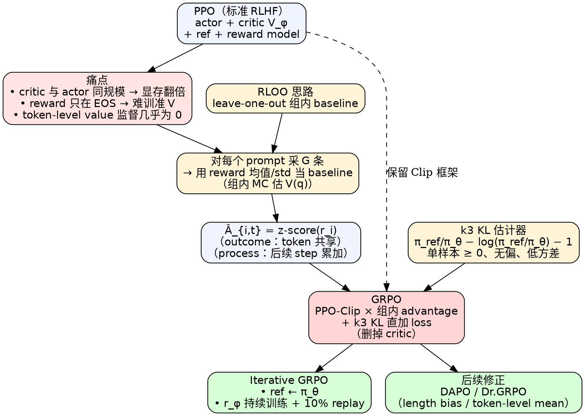

# GRPO（Group Relative Policy Optimization）

> [!abstract] 一句话
> **GRPO** = 把 [[PPO教程|PPO]] 里那个和 actor 同规模的 critic $V_\phi$ **彻底删掉**，改用"对同一个 prompt 采 $G$ 条回答、用这一组回答的 reward 均值/方差做 baseline"得到的 **group-relative advantage**，再套 PPO-Clip 的 ratio 裁剪与 KL 正则。一句口诀：**"组内蒙特卡洛 baseline 替代 critic"**——显存对半砍、推理任务 sparse reward 也照吃，是 DeepSeekMath / DeepSeek-R1 的工业默认 RL 算法。

---

## 1. 背景：LLM 后训练 RL 的特殊性，与 PPO 的痛

### 1.1 LLM RL ≠ 经典控制 RL

| 维度 | 经典 RL（Atari / 控制） | LLM 后训练 RL（RLHF / 推理） |
|---|---|---|
| 状态 $s_t$ | 环境给（像素、joint angles） | prompt $q$ + 已生成 token $o_{<t}$ |
| 动作 $a_t$ | 离散按键 / 连续力矩 | **下一个 token**（词表上的 categorical） |
| 奖励 $r_t$ | 环境每步给 dense scalar | 通常**只在终止 token**给一个 reward（ORM / 规则裁判 / 人偏好分） |
| episode 长度 | 数百~上万步 | 数十~数千 token |
| 环境 | 仿真器或真实世界 | reward model（神经网络）/ 答案校验器 |
| 价值函数 $V$ | 几层 MLP，远小于 actor | **和 actor 同规模**（7B/70B），训练时显存翻倍 |

> [!warning] LLM 场景下 critic 极难训
> 1. **稀疏 reward**：reward 只在 EOS 时给，让 $V_\phi(s_t)$ 在前面所有 token 上都"凭空猜后面的得分"——bootstrap 链很长且监督极弱。
> 2. **规模相当**：LLM RL 里 critic 通常和 policy 同结构（7B vs 7B），整个 RL 训练同时挂 actor + critic + reference + reward 4 个大模型，**显存被 critic 吃掉一半**。
> 3. **token-level value 不准**：reward 只标注最后一个 token，要求 critic 学出每个 token 的细粒度价值——监督信号几乎无从谈起。

### 1.2 PPO 在 LLM 上的显式形式（先把要替换的对象写出来）

为后文方便，PPO 在 LLM 上的目标函数写成：

$$
\mathcal J_{\text{PPO}}(\theta) = \mathbb E_{q\sim P(Q),\,o\sim \pi_{\theta_{\text{old}}}(\cdot|q)}\,
\frac{1}{|o|}\sum_{t=1}^{|o|}
\min\!\Bigl(r_t(\theta)\,A_t,\;\text{clip}(r_t(\theta),1-\varepsilon,1+\varepsilon)\,A_t\Bigr)
\tag{1}
$$

其中
- $r_t(\theta) = \dfrac{\pi_\theta(o_t\mid q,o_{<t})}{\pi_{\theta_{\text{old}}}(o_t\mid q,o_{<t})}$ 是 token 级 ratio；
- $A_t$ 由 **GAE** 基于 $V_\phi$ 估出；
- 标准 RLHF 还会把 KL 罚**加进 reward**（Ouyang et al. 2022）：
$$
r_t = r_\varphi(q,o_{\le t}) - \beta\,\log\frac{\pi_\theta(o_t\mid q,o_{<t})}{\pi_{\text{ref}}(o_t\mid q,o_{<t})}
\tag{2}
$$

### 1.3 GRPO 的破题点

> [!success] 一句话破题
> **既然 reward 只在最后给，前面 token 上 $V_\phi$ 估得很糟；那不如用同一个 prompt 下采 $G$ 条 trajectory，用这组 reward 的"组内均值"当 baseline——它就是 prompt 难度的无偏估计，且不需要任何参数化网络。** Critic 删掉，显存省下，监督还更可靠。

形式上：用同一 prompt $q$ 采 $G$ 条 $\{o_i\}_{i=1}^G$，每条得到 reward $r_i$，把
$$
\hat A_i = \frac{r_i - \mathrm{mean}(\{r_1,\dots,r_G\})}{\mathrm{std}(\{r_1,\dots,r_G\})}
$$
当 advantage（同一回答内所有 token 共享），再套 PPO-Clip 即可。

### 1.4 PPO vs GRPO 一表看穿

| 维度 | PPO | **GRPO** |
|---|---|---|
| critic $V_\phi$ | ✅ 必需，与 actor 同规模 | ❌ **完全删除** |
| advantage 估计 | GAE（基于 $V_\phi$） | **组内 reward 标准化**（$z$-score） |
| 训练时挂载的大模型 | actor + critic + ref + reward（4 个） | actor + ref + reward（3 个） |
| 显存（同等 actor，仅 trainable 部分） | $\approx 2\times$ | $\approx 1\times$ |
| reward 类型 | scalar（dense 或 sparse） | sparse outcome 友好；也支持 process |
| 单 prompt 采样数 | 1 条 trajectory | **$G$ 条**（典型 $G=64$） |
| KL 正则 | 加在 reward 里（per-token） | **直接加在 loss**，用 **k3 无偏估计器** |
| 主流应用 | InstructGPT / ChatGPT RLHF | **DeepSeekMath / DeepSeek-R1** |

> [!info] 显存口径
> 表中"$2\times$ vs $1\times$"仅指 **trainable 模型那一份**：PPO 多挂一个与 actor 同规模的 critic 要训练。两边都还要挂 ref + reward，那两份显存两边一样。具体差距还受 CPU offload、optimizer state、ZeRO 等工程因素影响——论文 Figure 4 仅给定性对比。

---

## 2. 形式化：GRPO 的目标函数

### 2.1 完整 GRPO 目标（论文式 (3)）

$$
\boxed{\;
\begin{aligned}
\mathcal J_{\text{GRPO}}(\theta) =\;& \mathbb E_{q\sim P(Q),\,\{o_i\}_{i=1}^G\sim\pi_{\theta_{\text{old}}}(\cdot|q)} \\
& \frac{1}{G}\sum_{i=1}^{G}\frac{1}{|o_i|}\sum_{t=1}^{|o_i|}\Bigl\{
\min\!\Bigl(r_{i,t}(\theta)\,\hat A_{i,t},\;\text{clip}(r_{i,t}(\theta),1-\varepsilon,1+\varepsilon)\,\hat A_{i,t}\Bigr) \\
& \qquad\qquad\qquad\;\; -\;\beta\,\mathbb D_{\mathrm{KL}}\!\bigl[\pi_\theta\,\|\,\pi_{\text{ref}}\bigr]
\Bigr\}
\end{aligned}
\;}\tag{3}
$$

其中
$$
r_{i,t}(\theta) = \frac{\pi_\theta(o_{i,t}\mid q,o_{i,<t})}{\pi_{\theta_{\text{old}}}(o_{i,t}\mid q,o_{i,<t})}
$$

### 2.2 与 (1) 的逐项对照

| (1) PPO | (3) GRPO | 区别 |
|---|---|---|
| 单条 $o$，对 $t$ 平均 | $G$ 条 $o_i$，先对组平均再对 $t$ 平均 | **多采样平均，方差更低** |
| $A_t$ 由 GAE+$V_\phi$ | $\hat A_{i,t}$ 由组内 reward 标准化 | **去 critic 的核心** |
| KL 加在 reward 里（式 (2)） | KL 直接加在 loss、用 k3 估计器 | **简化 advantage、降梯度方差** |

### 2.3 KL 用的是 **k3 无偏估计器**（不是 PPO 的 k1）

> [!danger] 最容易写错的一处
> 论文式 (4) 用的是 Schulman 博客里的 **k3 估计器**：
> $$
> \boxed{\;
> \mathbb D_{\mathrm{KL}}\!\bigl[\pi_\theta\,\|\,\pi_{\text{ref}}\bigr]
> = \frac{\pi_{\text{ref}}(o_{i,t}\mid \cdot)}{\pi_\theta(o_{i,t}\mid \cdot)}
> - \log\frac{\pi_{\text{ref}}(o_{i,t}\mid \cdot)}{\pi_\theta(o_{i,t}\mid \cdot)}
> - 1
> \;}\tag{4}
> $$
> **不是** PPO 里常见的 $\log\pi_\theta - \log\pi_{\text{ref}}$（k1 估计）。

> [!note] 三种 KL 估计器对照
> 设 $u = \log\pi_\theta(o)/\pi_{\text{ref}}(o)$（这里 $\pi_\theta$ 是采样分布）。
>
> | 估计器 | 公式 | 偏差 | 方差 | 是否恒非负 |
> |---|---|---|---|---|
> | k1 | $u$ | 无偏 | 大 | ❌ 可负 |
> | k2 | $\frac12 u^2$ | 有偏 | 小 | ✅ |
> | **k3**（GRPO 用） | $e^{-u}-1+u$ = $\frac{\pi_{\text{ref}}}{\pi_\theta}-\log\frac{\pi_{\text{ref}}}{\pi_\theta}-1$ | **无偏** | **小** | ✅ |
>
> k3 是 $f(u)=e^{-u}$ 的二阶 Taylor 控制变量，期望 $\mathbb E_{\pi_\theta}[e^{-u}-1+u] = \mathrm{KL}(\pi_\theta\|\pi_{\text{ref}})$，且**单样本就恒 ≥ 0**（用 $e^x\ge x+1$）——完美适合作为 loss 的一项被梯度直接最小化。

---

## 3. Advantage 推导：组内蒙特卡洛 baseline

### Step 1 · 起点：朴素 PG 的 baseline 形式

[[策略梯度教程|策略梯度]] 章节已证：减状态相关 baseline $b(s)$ 不改变期望、可降方差：
$$
\nabla \bar R_\theta = \mathbb E_{\tau}\bigl[(R(\tau)-b(s))\,\nabla\log\pi_\theta(a\mid s)\bigr]
$$
PPO 用 $V_\phi(s)\approx\mathbb E[R\mid s]$ 当 baseline；问题是 $V_\phi$ 在 LLM 里**昂贵且难训**（§1.1）。

### Step 2 · 关键观察：同 prompt 的 reward 同分布

固定 prompt $q$，从 $\pi_{\theta_{\text{old}}}$ 采的 $G$ 条回答 $\{o_i\}$ 相互独立同分布，对应的 reward $\{r_i\}$ 也同分布。**它们的样本均值 $\bar r$ 是 $\mathbb E_{o\sim\pi_{\theta_{\text{old}}}}[r(q,o)]$ 的无偏 MC 估计**——这恰好就是"以 $q$ 为条件的状态价值" $V^{\pi_{\theta_{\text{old}}}}(q)$ 的样本估计。

> [!success] aha moment
> 所谓 critic，本就是 $V(q) = \mathbb E_o[r(q,o)]$ 的参数化估计；既然我们手头已经采了 $G$ 条，**直接用样本均值替代它就好了**——反正它在每次更新时都得**重新 rollout**（PPO 是 on-policy），那索性多采几条做"组内蒙特卡洛"。
> Critic 不是必需的，它只是当年没人愿意一次采 64 条时的工程妥协。

### Step 3 · Outcome supervision 版本（论文 §4.1.2）

每条回答 $o_i$ 走完后由 **ORM**（outcome reward model）给一个 scalar reward $r_i$。组内标准化：
$$
\boxed{\;
\hat A_{i,t} = \tilde r_i = \frac{r_i - \mathrm{mean}(\{r_1,\dots,r_G\})}{\mathrm{std}(\{r_1,\dots,r_G\})}
\;}\tag{5}
$$
**同一回答 $o_i$ 内所有 token 共享同一个 $\hat A_{i,t}$**——因为 reward 只在终止时给，没有 token 级信号。

> [!note] 为什么除以 std 也是必要的
> - 减均值：消除 prompt 难度（hard prompt 平均 reward 0.1、easy prompt 0.9，**绝对值不可比**）。
> - 除标准差：让不同 prompt 的 advantage 处于同一量级，避免 easy prompt（reward 全接近 1，方差大）主导梯度。
> 二者合起来就是 **group-wise z-score normalization**——和 batch normalization 在 supervised 里的位置类似。

### Step 4 · Process supervision 版本（论文 §4.1.3）

如果用 **PRM**（process reward model）给每个推理步打分，对 $o_i$ 在 token index $\text{index}(j)$ 处得到 step reward $r_i^{\text{index}(j)}$。**所有回答的所有 step reward 一起**做标准化：
$$
\tilde r_i^{\text{index}(j)} = \frac{r_i^{\text{index}(j)} - \mathrm{mean}(\mathbf R)}{\mathrm{std}(\mathbf R)},
\qquad
\mathbf R = \{r_i^{\text{index}(j)}: \forall i,j\}
$$
（$i$ 仅遍历**同一 prompt 的 $G$ 条 outputs**，$j$ 遍历各 output 内所有 step——即在该 prompt 的所有 step reward 上做 z-score。）
然后 token $t$ 的 advantage 是**它后面所有 step 的标准化 reward 之和**：
$$
\boxed{\;
\hat A_{i,t} = \sum_{\text{index}(j)\ge t} \tilde r_i^{\text{index}(j)}
\;}\tag{6}
$$

> [!info] 为什么是"后续 step 的累加"
> 这是经典的 **reward-to-go** 思想（[[策略梯度教程|策略梯度]] §6 已讲）：token $t$ 的决策只能影响其**未来**的 reward，不该被过去的 reward "奖惩"。Process 版本只是把"未来"的粒度从 token 改成了 step。

### Step 5 · 把 advantage 接回 (3)，合成完整 GRPO

把 (5) / (6) 代入式 (3)，配合 PPO-Clip 与 k3 KL 正则，就是论文 Algorithm 1 的训练目标。

> [!tip] 优势估计 vs 算法骨架解耦
> Outcome 与 process 只是**两种 advantage 估计方案**——目标函数 (3) 的"PPO-Clip + k3 KL"骨架完全相同。**这意味着 GRPO 是一个 advantage 估计的"框架性替换"，不是新算法骨架。** 只要你愿意，理论上可以把 (5) 换成任何"组内统计量"。

---

## 4. 直观解读

### 4.1 类比：考试组班 + 班级排名

> [!info] 类比：group = 一个考场
> - 每场考试 = 一个 prompt $q$
> - 一个考场里坐了 $G$ 个考生（$G$ 条采样回答）
> - reward = 考分；班级均值 = baseline；班级标准差 = 归一化尺度
> - 排名（z-score）= advantage：**相对于今天这个班的平均水平超出多少**
>
> 为什么不跨场比？因为 prompt 难度天差地别（高考数学 vs 小升初），跨场的绝对分不可比，**只有班级内排名才是公平的教学信号**。Critic 想做的就是"估计每场考试的班级均值"，但既然你每场都摆了 64 个考生，**直接算一下平均值就好了**，不需要养一个"难度预测器"。

### 4.2 与 RLOO 的关系（重要前情）

> [!note] GRPO 不是凭空冒出来的
> "组内 baseline" 早在 **RLOO**（REINFORCE Leave-One-Out, Kool et al. 2019 / Ahmadian et al. 2024）里就在用：第 $i$ 条样本的 baseline 取**其他 $G-1$ 条的均值**（leave-one-out，更无偏）。GRPO 的"全组均值 + std 归一化 + PPO-Clip ratio + k3 KL"是工程上的整套定型版本。可以把 GRPO 看成 **"RLOO baseline + PPO-Clip + KL 直加 loss"** 的合成。

### 4.3 为什么是 PPO 的"减负"而非"翻篇"

GRPO **完整保留**了 PPO 的两大稳定术：
1. **重要性采样 + ratio clip**——允许同一批 rollout 多 epoch 更新，复用样本（论文实操中默认 $\mu=1$ 即不复用，但目标里仍然写 ratio 是为了**与 $\theta_{\text{old}}$ 解耦**）。
2. **KL 罚到 ref policy**——防 RLHF 里常见的 reward hacking / 离题。

**唯一被替换的是 advantage 估计**——critic 删掉，换成组内 MC baseline。

### 4.4 论文 Figure 4 示意
*图 4 · GRPO 用一组样本的 reward 计算 baseline，省掉 value model（来源：[DeepSeekMath §4.1](https://arxiv.org/abs/2402.03300)）*

---

## 5. 实现技巧 / 工程坑

### 技巧 1 · KL 务必用 k3 估计器，不要用 k1

> [!danger] naive 做法的痛点
> 一种常见但欠妥的写法是把 KL 直接估成 `(logp_theta - logp_ref).mean()`——这就是 **k1 估计** $u=\log(\pi_\theta/\pi_{\text{ref}})$。它在期望意义下**仍然无偏**（$\mathbb E_{\pi_\theta}[u]=\mathrm{KL}(\pi_\theta\|\pi_{\text{ref}})$），但**单样本下可正可负**——作为 loss 项时无下界、方差大、单步梯度有非零概率把 $\pi_\theta$ 推离 $\pi_{\text{ref}}$，训练极不稳。
>
> （注意：PPO 里常见的 `logp_new - logp_old` 算的是 importance ratio 的对数，与采样旧策略的差，与 ref 模型无关，**不是这里说的 KL**。GRPO 的 KL 是 $\pi_\theta\|\pi_{\text{ref}}$。）
>
> GRPO 必须用：
> ```python
> # ratio_ref = π_ref / π_θ  (注意分母是 π_θ，分子是 ref)
> ratio_ref = (logp_ref - logp_theta).exp()
> kl_k3 = ratio_ref - (logp_ref - logp_theta) - 1   # 即 e^{-u} + u - 1
> # 单样本恒 ≥ 0
> loss = -surrogate.mean() + beta * kl_k3.mean()
> ```

### 技巧 2 · group size $G$ 的取舍

> [!warning] $G$ 太小 baseline 不准；$G$ 太大显存爆炸
> - 论文 DeepSeekMath: $G = 64$，max_len = 1024，batch = 1024（如果 batch 单位是 prompt——论文未明示——则每个梯度 step 实际跑约 65k 条 sequence）。
> - $G$ 太小（如 4-8）：均值/方差是 4-8 个样本估的，噪声极大，几乎等价于 reward 本身没归一化。
> - $G$ 太大：rollout 阶段时间被采样吃满；显存上一颗卡多 batch 会爆，需要并行环境 / vLLM 分布式推理。
> - 经验上 $G \in [8, 64]$ 是常见区间，社区复现 R1-zero 时常用 $G=16$。

### 技巧 3 · std=0 时务必加 $\varepsilon$

> [!danger] reward 全相同会除零
> 当一组回答全对（reward 全为 1）或全错（reward 全为 0）时，$\mathrm{std}=0$，$\hat A_{i,t}=0/0$。两种做法：
> 1. **加 epsilon**：`adv = (r - r.mean()) / (r.std() + 1e-8)`，此时 $\hat A\equiv 0$，等价于该 batch 不更新。
> 2. **跳过**：直接 drop 掉所有 reward 相同的 group。
>
> Trade-off：跳过会浪费 rollout（容易问题被丢），加 ε 会让"全对/全错"也提供 0 梯度——多数实现选 (1)。

### 技巧 4 · outcome 还是 process，先看 reward model

| 选 outcome 当且仅当 | 选 process 当且仅当 |
|---|---|
| 只有终止裁判（数学题 verifier、code unit test） | 有训练好的 PRM（如 PRM800K） |
| reward 模型只见过完整答案 | 训练 PRM 的成本能 amortize |
| 任务步数短、错误传播弱 | 长链推理、需要中间监督 |

DeepSeekMath 实测 **GRPO+PS > GRPO+OS**（论文图 5），但 PRM 的获取成本高得多。后来 DeepSeek-R1 完全只用 outcome（规则验证），证明 **足够大的 model + 大 G + 长 rollout** 下 outcome 也够。

### 技巧 5 · sequence-level vs token-level 的 mean，不是无关紧要

> [!warning] 公式 (3) 的 $\frac{1}{|o_i|}\sum_t$ 是争议点
> 论文写的是**先在每条回答内做 token 平均，再在组内做 $\frac{1}{G}\sum_i$ 平均**。这意味着：
> - **长回答的每个 token 权重更小**（被 $1/|o_i|$ 拉低）。
> - **短回答的每个 token 权重更大**。
>
> 后续工作（**[[Dr.GRPO]]**, Liu et al., Sea AI Lab 2025）指出这会带来 **length bias**——模型倾向于产出更长但低质量的回答（因为长回答里坏 token 被稀释）。
> **[[DAPO]]**（字节, 2025）和 Dr.GRPO 都改用 **token-level mean across the whole batch**：
> $$
> \frac{1}{\sum_i |o_i|}\sum_i \sum_t (\cdot)
> $$
> 这一点社区争议大，**复现论文请按 (3) 写；想要更稳的训练效果建议看 DAPO/Dr.GRPO 的修正**。

### 技巧 6 · 迭代 RL：reward model 也要持续训练

> [!example] Algorithm 1 的 outer loop（论文 §4.1.4）
> ```
> for iteration = 1..I:
>     ref_model ← current policy        # ❶ ref 跟着 policy 滚
>     for step = 1..M:
>         运行内层 GRPO step
>     用最新 policy 采样产物，配合 10% 历史回放，继续训练 reward model
> ```
> **关键点**：
> - **ref 周期性同步**：每个 outer iteration 把 ref 重新设为当前 policy——与下面 reward model 持续训练配套，避免 ref 离当前 policy 越拉越远导致 KL 罚爆炸（教程解读，论文未明说动机）。
> - **reward model 持续训练**：随着 policy 进步，旧 RM 的判别力下降；用新 policy 采的样本+10% 历史 replay 继续训练 RM。
> 这是 GRPO 真正能"训得动"的工程关键，不要只看式 (3) 不看 Algorithm 1。

### 技巧 7 · log-prob 务必用**采样当下**的 $\pi_{\theta_{\text{old}}}$

和 [[PPO教程|PPO]] 同坑：rollout 时**当场记下** `old_logp`，不要事后再调一次模型重算——会和当时的 $\theta_{\text{old}}$ 对不上，ratio 错位。

---

## 6. 算法流程

### 6.1 GRPO 内层 step（伪代码）

> [!example] Outcome-supervision GRPO 一个 step
> ```
> 输入：当前 policy π_θ，参考 π_ref，旧 policy π_old，prompt batch D_b
> 1. for q in D_b:                     # 每个 prompt 独立处理
>      sample {o_1, ..., o_G} ~ π_old(·|q)
>      r_i = reward_model(q, o_i)              for i = 1..G
>      r̃_i = (r_i - mean(r)) / (std(r) + 1e-8) # 组内 z-score
>      Â_{i,t} = r̃_i                          for all token t in o_i
>
> 2. for inner_step = 1..μ:                    # 论文默认 μ=1
>      for (q, o_i) in batch:
>        ratio_{i,t} = exp(logπ_θ(o_{i,t}) - logπ_old(o_{i,t}))
>        surr1 = ratio_{i,t} * Â_{i,t}
>        surr2 = clip(ratio_{i,t}, 1-ε, 1+ε) * Â_{i,t}
>        L_clip = min(surr1, surr2)
>
>        # k3 KL（注意分子是 ref，分母是 θ，与 ratio 反向）
>        ratio_ref = exp(logπ_ref(o_{i,t}) - logπ_θ(o_{i,t}))
>        kl_k3 = ratio_ref - log(ratio_ref) - 1
>
>        loss = -mean_over_(i,t)(L_clip - β * kl_k3)
>      backward + optimizer.step()
>
> 3. π_old ← π_θ                          # 同步旧策略
> ```

### 6.2 完整迭代框架（论文 Algorithm 1）

> [!example] Iterative GRPO
> ```
> 输入：初始 policy π_init, reward model r_φ, prompts D, 超参 ε, β, μ
> π_θ ← π_init
> for iteration = 1..I:
>   π_ref ← π_θ                          # ref 同步当前 policy
>   for step = 1..M:
>     D_b ~ D
>     π_old ← π_θ
>     运行 §6.1 的内层 step
>   用最新 π_θ 采样 + 10% 历史回放，继续训练 r_φ
> 输出：π_θ
> ```

### 6.3 论文超参（DeepSeekMath-RL 7B）

| 超参 | 值 |
|---|---|
| 起点 | DeepSeekMath-Instruct 7B（已 SFT） |
| RL 训练数据 | GSM8K + MATH，~144K 题 |
| reward model | DeepSeekMath-Base 7B 微调，lr 2e-5 |
| policy lr | 1e-6 |
| KL 系数 $\beta$ | 0.04 |
| group size $G$ | **64** |
| max_len | 1024 |
| batch size | 1024 |
| 内层 epoch $\mu$ | 1（即不做多 epoch 复用） |

---

## 7. 与 PPO 的统一视角（论文 §5.2.1）

论文给出一个非常漂亮的 unified gradient form：
$$
\nabla_\theta \mathcal J_{\mathcal A}(\theta) = \mathbb E_{(q,o)\sim D}\!\left[\frac{1}{|o|}\sum_{t=1}^{|o|} \underbrace{GC_{\mathcal A}(q,o,t,\pi_{rf})}_{\text{gradient coefficient}}\,\nabla_\theta\log\pi_\theta(o_t\mid q,o_{<t})\right]\tag{7}
$$
**所有方法的差异都体现在三处**：data source $D$、reward function $\pi_{rf}$、gradient coefficient $GC$。

| 方法 | data source | reward function | $GC$ |
|---|---|---|---|
| SFT | offline 人标 | 无 | $1$ |
| RFT | offline，filter by rule | rule | $\mathbb 1[\text{correct}]$ |
| DPO | offline pair | rule | DPO 公式 |
| Online RFT | online policy | rule | $\mathbb 1[\text{correct}]$ |
| **PPO** | online policy | model | $A_t$（GAE） |
| **GRPO** | online policy + group | model | $\hat A_{i,t} + \beta\bigl(\frac{\pi_{\text{ref}}}{\pi_\theta}-1\bigr)$ |

> [!success] 关键洞见（论文 §5.2.1）
> - **GRPO 与 Online RFT 的差异**：Online RFT 对所有正确样本无差别地推（$GC=1$），GRPO 用 $\hat A$ 让 reward **大小**也参与梯度调制——能区分"好答案"与"更好答案"。
> - **GRPO 与 PPO 的差异**：advantage 估计方式不同；KL 出现在 $GC$ 而非 reward。
> - **SFT 是最退化的特例**：$GC\equiv 1$，data 是离线人标。

---

## 8. Cheat Sheet

### 8.1 最小可跑 GRPO loss（PyTorch 风格）

```python
import torch
import torch.nn.functional as F

def grpo_loss(
    logp_theta,    # [B*G, T]  current policy log-prob, requires grad
    logp_old,      # [B*G, T]  old policy log-prob, no grad（rollout 时存）
    logp_ref,      # [B*G, T]  ref policy log-prob, no grad
    rewards,       # [B*G]     scalar reward per sample（outcome）
    mask,          # [B*G, T]  1 表示有效 token，PAD/prompt 部分=0
    group_size,    # G
    eps=0.2,       # clip range
    beta=0.04,     # KL coef
    eps_std=1e-8,
):
    B_times_G = rewards.size(0)
    B = B_times_G // group_size

    # 1. 组内标准化（关键步：reshape 到 [B, G] 做 row-wise norm）
    r = rewards.view(B, group_size)
    r_mean = r.mean(dim=1, keepdim=True)
    r_std  = r.std(dim=1, keepdim=True)
    adv = ((r - r_mean) / (r_std + eps_std)).view(B_times_G, 1)  # [B*G, 1]
    adv = adv.expand_as(logp_theta)                              # 广播到每个 token

    # 2. ratio + PPO-Clip
    ratio  = (logp_theta - logp_old).exp()                       # [B*G, T]
    surr1  = ratio * adv
    surr2  = ratio.clamp(1 - eps, 1 + eps) * adv
    pg_loss = -torch.min(surr1, surr2)                           # 注意负号：loss 是 -目标

    # 3. k3 KL（注意分子是 ref，分母是 θ）
    log_ratio_ref = logp_ref - logp_theta                        # u 的相反数: log(π_ref/π_θ)
    kl_k3 = log_ratio_ref.exp() - log_ratio_ref - 1              # ≥ 0 by construction

    # 4. 论文式 (3): 先 token 平均，再 group/batch 平均
    seq_loss = ((pg_loss + beta * kl_k3) * mask).sum(dim=1) / mask.sum(dim=1).clamp(min=1)
    return seq_loss.mean()
```

> [!summary] 常见坑（按踩坑频率排序）
> - **KL 写成 k1（`logp_θ - logp_ref` 直接做 mean）** → 单样本可负，loss 方向错。**必修**。
> - **KL 分子分母搞反** → k3 是 $\frac{\pi_{\text{ref}}}{\pi_\theta}-\log\frac{\pi_{\text{ref}}}{\pi_\theta}-1$，**不要写成 $\pi_\theta/\pi_{\text{ref}}$**。
> - **std=0 没加 eps** → divide by zero / NaN loss。`+1e-8` 必加。
> - **forgot to detach logp_old 和 logp_ref** → 它们是常量，**不应**有梯度，否则 ref 模型会被错误更新。
> - **mask 没乘 prompt 部分** → prompt 的 log-prob 本就是常数（与 $\theta$ 无关），算了等于白噪声混进梯度；**只对 generation 部分计算**。
> - **adv 没广播到 token 维**：outcome supervision 下 token 维所有 advantage 相同，记得 `expand`。
> - **`policy_old` 没同步**：每个 outer step 后必须 `π_old ← π_θ`，否则 ratio 永远是 1。
> - **`G` 选太小**（< 8）→ baseline 噪声主导，训练不稳。
> - **reward 全相同的 group 不处理** → 即使 `+1e-8`，adv 也接近 0；可选 drop。
> - **process 版本 advantage 写成"step reward 自身"** → 必须是"后续 step 的累加"（reward-to-go），不要漏 $\sum_{\text{index}(j)\ge t}$。
> - **token-level vs sequence-level mean** 实现要清楚自己在哪条路线上（论文式 (3) 是 sequence-level；DAPO/Dr.GRPO 是 token-level）。
> - **多 epoch ($\mu>1$) 时**：所有 `logp_old` 必须用最初 rollout 时的版本，不要中途刷新。
> - **rollout 阶段省 vLLM**：$G=64 \times$ batch=1024 = 65k 条采样，用 HF generate 会让训练 idle 大半时间，强烈建议 vLLM。

### 8.2 典型超参（GRPO + LLM）

| 超参 | 典型值 |
|---|---|
| $G$（group size） | 16~64（DeepSeekMath: 64；社区复现 R1-zero 常用 16） |
| $\varepsilon$（clip） | 0.2 |
| $\beta$（KL） | 0.001 ~ 0.04（推理任务可以更小，甚至 0） |
| policy lr | 1e-6 ~ 5e-6 |
| 内层 epoch $\mu$ | 1（论文）；社区常用 1~4 |
| max gen len | 1024 ~ 32768（R1 用了非常长的） |
| ref 同步频率 | 每个 outer iteration 同步一次 |

---

## 9. 一图总览



**配色约定**：浅红=痛点；浅蓝=起点；浅黄=关键 trick；红=本章核心算法；浅绿=下游/迭代框架。

---

## 10. 关联笔记

> [!info] 笔记状态说明
> ✅ 已存在的本地教程；🆕 = 待补的笔记（双链先挂着，等后续单独整理）。

- 上游：
  - ✅ [[PPO教程|PPO]] —— GRPO 直接继承的目标骨架（ratio + clip）
  - ✅ [[策略梯度教程|策略梯度]] —— baseline 的"减常数不改期望"是 GRPO 合法性的根
  - ✅ [[Actor-Critic教程|Actor-Critic]] —— GRPO = "把 critic 替换成组内 MC baseline" 的 actor-critic
  - 🆕 [[REINFORCE]] —— $G=1$、无 clip、无 KL 时 GRPO 退化为 REINFORCE-with-baseline（核心推导已在 [[策略梯度教程|策略梯度]] §3-§4 涵盖，可暂引彼处）
- 平行：
  - 🆕 [[GAE]] —— PPO 的优势估计标配，被 GRPO 用"组内 z-score"替代
  - 🆕 [[KL散度]] —— k1/k2/k3 估计器、为什么 GRPO 选 k3
  - 🆕 [[RLOO]] —— "leave-one-out 组内 baseline"，GRPO 思路前身
  - 🆕 [[RLHF]] —— GRPO 的应用场景（reward model + policy 训练范式）
- 下游 / 变体：
  - 🆕 [[DAPO]] —— 字节 2025，token-level mean、动态 sample 重加权、解决 length bias
  - 🆕 [[Dr.GRPO]] —— Sea AI Lab 2025（外部团队对 GRPO 的批评/修正），主要去掉 length normalization $\frac{1}{|o_i|}$ 与 reward std 归一化造成的 bias
  - ✅ [[DPO教程|DPO]] —— offline preference 学习，GRPO 的离线对照（论文 §5.2.1 unified paradigm）
  - DeepSeek-R1（[arXiv 2501.12948](https://arxiv.org/abs/2501.12948)）—— GRPO 在大规模 reasoning 上的工业实证
- 原文：[DeepSeekMath: Pushing the Limits of Mathematical Reasoning in Open Language Models（arXiv 2402.03300）](https://arxiv.org/abs/2402.03300)
