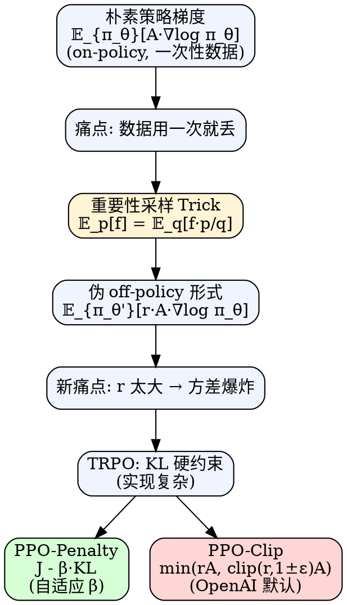

# PPO（Proximal Policy Optimization）

> [!abstract] 一句话
> PPO = **重要性采样**把策略梯度从 on-policy 变成"伪 off-policy"（一批数据多次更新）+ **约束新旧策略别走太远**（KL 惩罚 / clip 裁剪），从而在保持稳定性的同时大幅提高样本效率。它是 OpenAI 的默认 RL 算法。

---

## 1. 背景：为什么要 PPO

### 1.1 同策略 vs 异策略

| 维度 | 同策略 on-policy | 异策略 off-policy |
|---|---|---|
| 定义 | 学习的智能体 = 与环境交互的智能体 | 学习的智能体 ≠ 与环境交互的智能体 |
| 数据复用 | ❌ 用完即弃 | ✅ 可反复用 |
| 代表 | REINFORCE、A2C | DQN、SAC |
| 样本效率 | 低 | 高 |

### 1.2 原始策略梯度的痛点

$$
\nabla \bar R_\theta = \mathbb E_{\tau\sim p_\theta(\tau)}\bigl[R(\tau)\nabla\log p_\theta(\tau)\bigr]\tag{5.1}
$$

> [!danger] On-policy 的诅咒
> 期望是对 $\pi_\theta$ 采样的轨迹求。**只要 $\theta$ 一更新成 $\theta'$，老数据立刻失效**，必须重新跟环境交互采样。深度 RL 里环境交互通常是最慢、最贵的一步——这就是低效根源。

### 1.3 解题思路

让另一个**固定的**策略 $\pi_{\theta'}$ 去采数据，用这些数据反复更新 $\theta$ 很多步 → 把 on-policy 变成"借数据训练"的形式。
**关键工具：重要性采样 + KL/clip 约束。**

---

## 2. 重要性采样（Importance Sampling）

### 2.1 推导

要算 $\mathbb E_{x\sim p}[f(x)]$，但只能从 $q$ 采样：

$$
\int f(x)\,p(x)\,\mathrm dx
= \int f(x)\,\frac{p(x)}{q(x)}\,q(x)\,\mathrm dx
= \mathbb E_{x\sim q}\!\left[f(x)\,\frac{p(x)}{q(x)}\right]
$$

得到核心等式：

$$
\boxed{\;
\mathbb E_{x\sim p}[f(x)] \;=\; \mathbb E_{x\sim q}\!\left[f(x)\,\frac{p(x)}{q(x)}\right]
\;}\tag{5.3}
$$

权重 $\dfrac{p(x)}{q(x)}$ 称为**重要性权重 importance weight / ratio**。

> [!warning] 必要条件
> $q(x)=0$ 时必须 $p(x)=0$（否则 $p/q$ 未定义）。即 $q$ 的支撑集要覆盖 $p$。

### 2.2 期望相等，但方差不等！

$$
\operatorname{Var}_{x\sim p}[f(x)]
= \mathbb E_{x\sim p}[f(x)^2] - \bigl(\mathbb E_{x\sim p}[f(x)]\bigr)^2
$$

$$
\operatorname{Var}_{x\sim q}\!\left[f(x)\frac{p(x)}{q(x)}\right]
= \mathbb E_{x\sim p}\!\left[f(x)^2\, \color{red}{\frac{p(x)}{q(x)}}\right] - \bigl(\mathbb E_{x\sim p}[f(x)]\bigr)^2
$$

> [!danger] 方差爆炸
> 红色项多了一个 $p/q$ 因子。**$p$ 和 $q$ 差距越大，方差越爆炸**。采样数不够时，两个估计可能差到面目全非。
> ↑ 这就是为什么后面 PPO 一定要把 $p_\theta$ 和 $p_{\theta'}$ 约束得"足够接近"。

---

## 3. 把重要性采样套进策略梯度

### 3.1 轨迹级写法（粗粒度）

把式 (5.1) 的采样源换成 $\theta'$：

$$
\nabla \bar R_\theta
= \mathbb E_{\tau\sim p_{\theta'}(\tau)}\!\left[\frac{p_\theta(\tau)}{p_{\theta'}(\tau)}\,R(\tau)\,\nabla\log p_\theta(\tau)\right]\tag{5.4}
$$

这一式**合法**但粒度太粗（要算整条轨迹的比值，方差大）。下一步把它拆到 $(s_t,a_t)$ 粒度，方便实操。

### 3.2 拆到 state-action 对（实操粒度）

策略梯度真正的更新单元是 $(s_t, a_t)$，配上优势函数。先沿用第 4 章的写法 $A^\theta(s_t,a_t)$：

$$
\mathbb E_{(s_t,a_t)\sim\pi_{\theta'}}\!\left[
\frac{p_\theta(s_t,a_t)}{p_{\theta'}(s_t,a_t)}\,
A^{\theta}(s_t,a_t)\,
\nabla\log p_\theta(a_t\mid s_t)\right]
$$

> [!note] 从 $A^\theta$ 到 $A^{\theta'}$ 的替换
> 严格地，优势函数原本是相对**当前策略 $\theta$** 定义的 $A^\theta$；但实操中**我们用 $\theta'$ 采样的轨迹来估计它**，所以在异策略形式下写作 $A^{\theta'}$。这两者**不严格相等**——这是 PPO 的一个近似（与 §3.3 的 $p_\theta(s_t)\approx p_{\theta'}(s_t)$ 同性质），但只要 $\theta$ 和 $\theta'$ 足够接近就可接受，KL/clip 约束正是为此服务。
> （从 $R(\tau)$ 到 $A_t$ 的过渡沿用第 4 章降方差技巧：加 baseline + 按时间步分摊回报。）

拆联合概率：

$$
\frac{p_\theta(s_t,a_t)}{p_{\theta'}(s_t,a_t)}
= \frac{p_\theta(a_t\mid s_t)}{p_{\theta'}(a_t\mid s_t)} \cdot
  \frac{p_\theta(s_t)}{p_{\theta'}(s_t)}
$$

### 3.3 关键假设：$p_\theta(s_t) \approx p_{\theta'}(s_t)$

> [!note] 为什么可以这么近似
> 1. **难算**：状态边际分布 $p_\theta(s_t)$ 几乎无法解析计算（尤其图像输入下同一帧几乎不重复）
> 2. **影响弱**：环境一致时，不同策略到达某状态的概率相似（如不同 Atari 策略看到的画面分布近似）
> 3. **而 $p_\theta(a_t|s_t)$ 易算**：策略网络一前向就有

约掉后：

$$
\boxed{\;
\nabla J(\theta) \approx
\mathbb E_{(s_t,a_t)\sim\pi_{\theta'}}\!\left[
\frac{p_\theta(a_t\mid s_t)}{p_{\theta'}(a_t\mid s_t)}\,
A^{\theta'}(s_t,a_t)\,
\nabla\log p_\theta(a_t\mid s_t)\right]
\;}\tag{5.5}
$$

### 3.4 反推目标函数

用 Log-Derivative Trick 反向 $\nabla f = f\nabla\log f$（此时 $p_{\theta'}$ 和 $A^{\theta'}$ 对 $\theta$ 是常数）：

$$
\boxed{\;
J^{\theta'}(\theta) =
\mathbb E_{(s_t,a_t)\sim\pi_{\theta'}}\!\left[
\frac{p_\theta(a_t\mid s_t)}{p_{\theta'}(a_t\mid s_t)}\,
A^{\theta'}(s_t,a_t)\right]
\;}
$$

- $\theta$：要优化的参数
- $\theta'$：真正采样的策略参数（每轮迭代后才同步）

---

## 4. 加约束：从 TRPO 到 PPO

> [!warning] 不加约束会怎样
> 由 §2.2，若 $\pi_\theta$ 与 $\pi_{\theta'}$ 比值过大，重要性采样的方差爆炸；更新后策略可能跑得很远，性能崩溃。

### 4.1 TRPO（Trust Region Policy Optimization）

**硬约束**写法：

$$
J_{\text{TRPO}}^{\theta'}(\theta) =
\mathbb E_{(s_t,a_t)\sim\pi_{\theta'}}\!\left[
\frac{p_\theta(a_t\mid s_t)}{p_{\theta'}(a_t\mid s_t)}\,
A^{\theta'}(s_t,a_t)\right],
\quad \text{s.t. } \mathrm{KL}(\theta,\theta')<\delta
$$

> [!danger] TRPO 的痛
> KL 在目标函数**外面**作硬约束 → 梯度优化器很难处理（需要共轭梯度 + 自然梯度 + 线搜索），实现复杂。

### 4.2 PPO：把 KL 挪进目标函数

$$
\boxed{\;
J_{\text{PPO}}^{\theta'}(\theta) =
J^{\theta'}(\theta) - \beta\,\mathrm{KL}(\theta,\theta')
\;}\tag{5.6}
$$

性能与 TRPO 相当，但**可直接梯度上升，实现简单 10 倍**。

### 4.3 KL 散度的含义

> [!info] 行为距离，不是参数距离
> $\mathrm{KL}(\theta,\theta')$ 衡量的是：**给定相同状态 $s$，两个策略输出的动作分布的 KL**（对状态求平均）。严格地写应该是：
>
> $$\mathrm{KL}(\theta,\theta') \;\triangleq\; \mathbb E_{s\sim\rho^{\pi_{\theta'}}}\!\bigl[\,\mathrm{KL}\bigl(\pi_{\theta'}(\cdot\mid s)\,\big\|\,\pi_\theta(\cdot\mid s)\bigr)\,\bigr]$$
>
> 注意 KL 是**非对称**的；PPO/TRPO 原论文及主流实现都把**采样策略（旧策略）放在前面**（即 $\pi_{\theta^k}\|\pi_\theta$），因为期望就是对 $\pi_{\theta^k}$ 采样的状态-动作做的，这样估计无偏。教程后文为简洁仍写 $\mathrm{KL}(\theta,\theta^k)$，含义就是上式。
>
> **为什么不用参数 L1/L2 距离**：神经网络里参数的微小变化可能引起动作分布巨变（也可能反之），真正关心的是动作行为差异。

### 4.4 PPO 仍然是"同策略"？

> [!tip] 名义 vs 实质
> PPO 用了重要性采样的"形式"，**但 $\theta'$ 只用上一轮的策略，KL 又把它锁在 $\theta$ 附近** → 两个策略始终很接近 → 整体被视作 **on-policy 算法**。
> 这也是为什么 PPO 不能像 DQN 那样**跨 iteration 复用 buffer** —— 一旦 $\theta^k$ 更新到 $\theta^{k+1}$，原 buffer 立即失效，必须用新策略重新采样。（DQN 的 replay buffer 能跨 iteration 用是因为它是 off-policy，与采样策略分布无关。）

---

## 5. PPO 两大变体

### 5.1 PPO-Penalty（PPO1，自适应 KL）

**目标函数**：

$$
J_{\text{PPO}}^{\theta^k}(\theta) =
J^{\theta^k}(\theta) - \beta\,\mathrm{KL}(\theta,\theta^k)\tag{5.7}
$$

其中

$$
J^{\theta^k}(\theta) \approx
\sum_{(s_t,a_t)}
\frac{p_\theta(a_t\mid s_t)}{p_{\theta^k}(a_t\mid s_t)}\,
A^{\theta^k}(s_t,a_t)
$$

**自适应 $\beta$**：

| 监测 | 调整 |
|---|---|
| $\mathrm{KL}(\theta,\theta^k) > \mathrm{KL}_{\max}$ | $\beta \uparrow$（罚得不够） |
| $\mathrm{KL}(\theta,\theta^k) < \mathrm{KL}_{\min}$ | $\beta \downarrow$（罚得太狠） |

### 5.2 PPO-Clip（PPO2，裁剪比值）—— **更主流**

**目标函数**（**无 KL 项**）：

$$
\boxed{\;
J_{\text{PPO2}}^{\theta^k}(\theta) \approx \sum_{(s_t,a_t)}
\min\!\Bigl(
r_t(\theta)\,A^{\theta^k}_t,\;
\operatorname{clip}\!\bigl(r_t(\theta),\,1-\varepsilon,\,1+\varepsilon\bigr)\,A^{\theta^k}_t
\Bigr)
\;}\tag{5.8}
$$

其中

$$
r_t(\theta) \triangleq \frac{p_\theta(a_t\mid s_t)}{p_{\theta^k}(a_t\mid s_t)},
\qquad \varepsilon \in \{0.1,\,0.2\}\ \text{常用}
$$

#### Clip 的直观逻辑（4 种情况全覆盖）

> [!warning] PPO 的精髓在于"不对称"
> 表里**有刹车**的两行是大家熟知的"封顶/封底"；但真正让 PPO 区别于朴素 clip 的，是**有刹车**与**无刹车**的方向选择 —— 只在"想往策略外远走"时刹车，在"想拉回正轨"时**完全不限制**。这就是 $\min$ 操作的真正作用。

| # | 优势 $A_t$ | ratio $r_t$ | $\min(r_t A,\,\text{clip}(r_t)A)$ | 行为 | 直觉 |
|---|---|---|---|---|---|
| 1 | $A>0$（好动作） | $r > 1+\varepsilon$ | $(1+\varepsilon)A$ **被 clip** | 梯度 $=0$，**封顶** | 好动作，但已被推得太狠 → 刹车 |
| 2 | $A>0$（好动作） | $r < 1-\varepsilon$ | $rA$ **未 clip** | 正常梯度 → 继续 $\uparrow r$ | 好动作却被旧策略压低很多 → **加速拉回** |
| 3 | $A<0$（差动作） | $r < 1-\varepsilon$ | $(1-\varepsilon)A$ **被 clip** | 梯度 $=0$，**封底** | 差动作概率已被压得很低 → 别再压 |
| 4 | $A<0$（差动作） | $r > 1+\varepsilon$ | $rA$ **未 clip** | 正常梯度 → 继续 $\downarrow r$ | 差动作概率反而被推高了 → **使劲拉回** |

> [!success] 为什么用 $\min$ 而不是直接 clip
> 注意 #2 与 #4：在"想纠正回正轨"的方向上，$\min$ 选了**未 clip** 的 $rA$ —— 梯度照旧、没有刹车。
> 反观 #1 与 #3：在"已经按策略意愿走过头"的方向上，$\min$ 选了 **clip 后**的常数项 —— 梯度归零，停止。
> 这种**单边信赖域**比对称的 KL 罚（PPO1）更稳：不阻碍纠错，只防止过冲。

#### 一图看懂 clip（损失曲面 $L^{\text{CLIP}}$ vs $r$）

参考 Schulman 2017 论文 Figure 1：

```
A > 0  (好动作)                          A < 0  (差动作)
L↑                                       L↑
              ┌─────────  (封顶)              ───────┐
             /                                       \
            /                                         \
           /                                           \  (无封底)
          /                                             \
─────────/───────────→ r              ─────────────────────\─→ r
   0    1   1+ε                            1-ε    1
        ↑                                  ↑
   无封底，左段始终是                       右段始终是
   线性 r·A (越小 L 越低,                  线性 r·A (越大 L 越低,
   想拉回时不被限制)                       想拉回时不被限制)
```

- **$A>0$**：$L=\min(rA,\,(1+\varepsilon)A)$。$r\le 1+\varepsilon$ 时取 $rA$（线性上升）；$r>1+\varepsilon$ 时被钳在 $(1+\varepsilon)A$（**水平封顶**，梯度 0）。**左半部分无封底**——因为情况 #2 不需要刹车。
- **$A<0$**：$L=\min(rA,\,(1-\varepsilon)A)$。$r\ge 1-\varepsilon$ 时取 $rA$（线性下降）；$r<1-\varepsilon$ 时被钳在 $(1-\varepsilon)A$（**水平封底**，梯度 0）。**右半部分无封顶**——因为情况 #4 不需要刹车。

---

## 6. PPO 算法流程

> [!example] PPO-Clip 伪代码
> 1. 初始化策略参数 $\theta^0$、价值网络 $V_\phi$
> 2. **for** iteration $k = 0, 1, 2, \dots$ **do**：
>    1. 用 $\pi_{\theta^k}$ 与环境交互，收集一批轨迹 $\mathcal D_k = \{\tau_i\}$
>    2. 估计每步优势 $\hat A_t$（常用 GAE）和回报 $\hat R_t$
>    3. **对同一批数据反复迭代 $K$ 个 epoch**（这是 PPO 的关键提速）：
>       - 计算 ratio $r_t(\theta) = \dfrac{\pi_\theta(a_t\mid s_t)}{\pi_{\theta^k}(a_t\mid s_t)}$
>       - 计算 clip 损失（公式 5.8），价值损失 $(V_\phi(s_t)-\hat R_t)^2$，熵奖励
>       - SGD/Adam 一步更新 $\theta,\phi$
>       - （工程常用）若 approx-KL $> 1.5\cdot \mathrm{KL}_{\text{target}}$，**early stop** 本轮 epoch，防止过冲
>    4. $\theta^{k+1}\leftarrow \theta$
> 3. **end for**

> [!tip] PPO 与 REINFORCE 的根本提效点
> REINFORCE：1 批数据 → **1 次**梯度更新 → 丢弃
> PPO：1 批数据 → **$K$ 次**梯度更新（典型 $K=4\sim10$）→ 丢弃
> 在不破坏 on-policy 假设的前提下，把样本利用率提了一个数量级。

---

## 7. 与原始策略梯度的对比

| 维度 | REINFORCE / 朴素 PG | TRPO | PPO-Penalty | PPO-Clip |
|---|---|---|---|---|
| on/off policy | on | on | on（伪 off 形式） | on（伪 off 形式） |
| 数据复用 | ❌ 1 次 | ❌ 1 次 | ✅ K 次 | ✅ K 次 |
| 约束 | 无 | KL 硬约束 | KL 软惩罚（自适应 β） | ratio clip |
| 实现复杂度 | ⭐ | ⭐⭐⭐⭐⭐ | ⭐⭐⭐ | ⭐⭐ |
| 稳定性 | 差 | 好 | 好 | 好 |
| 主流程度 | 教学 | 历史 | 少用 | ✅ **OpenAI 默认** |

---

## 8. Cheat Sheet

> [!checklist] 最小可用 PPO-Clip 伪代码（PyTorch 风格）
> ```python
> for iteration in range(N):
>     # 1. 采样一批数据（用 θ_old）
>     traj = rollout(env, policy_old, T_horizon)
>     adv  = compute_gae(traj.rewards, traj.values, gamma=0.99, lam=0.95)
>     adv  = (adv - adv.mean()) / (adv.std() + 1e-8)   # 归一化
>     ret  = adv + traj.values                          # 价值目标
>
>     # 2. 同一批数据更新 K 个 epoch
>     for _ in range(K_EPOCHS):
>         for mb in minibatches(traj, batch_size=64):
>             ratio = (policy.log_prob(mb.s, mb.a) - mb.old_logp).exp()
>             surr1 = ratio * mb.adv
>             surr2 = ratio.clamp(1 - eps, 1 + eps) * mb.adv
>             loss_pi = -torch.min(surr1, surr2).mean()
>             loss_v  = ((value_net(mb.s) - mb.ret) ** 2).mean()
>             loss_h  = -policy.entropy(mb.s).mean()     # 熵奖励（鼓励探索）
>             loss = loss_pi + 0.5 * loss_v + 0.01 * loss_h
>             optimizer.zero_grad(); loss.backward()
>             nn.utils.clip_grad_norm_(params, 0.5)      # 梯度裁剪
>             optimizer.step()
>
>     # 3. 同步 θ_old ← θ
>     policy_old.load_state_dict(policy.state_dict())
> ```

> [!summary] 常见坑
> - **忘记同步 `policy_old`** → ratio 永远是 1，clip 失效
> - **优势未归一化** → loss 数值不稳，clip 阈值失去意义
> - **K_EPOCHS 太大** → 后期 $r$ 已被 clip 死，纯空转还可能过拟合这批数据
> - **$\varepsilon$ 选太大**（如 0.5）→ 跟不裁差不多；太小（如 0.01）→ 几乎不更新
> - **共享网络时 value loss 系数失衡** → 价值损失盖过策略损失
> - **采样后又调用一次策略算 log_prob 才存** → 必须存 **采样当下** 的 `old_logp`，否则 ratio 错位
> - **离散动作忘了用 `Categorical.log_prob`**，自己手算 softmax 容易数值不稳

---

## 9. 一图总览



---

## 10. 关联笔记

- [[策略梯度教程|策略梯度]] —— PPO 的起点：朴素 PG / REINFORCE / Log-Derivative Trick
- [[Actor-Critic教程|Actor-Critic]] —— PPO 用 Critic 估计 $A^{\theta'}$
- [[GAE]] —— Generalized Advantage Estimation，PPO 估优势的标配
- [[TRPO]] —— PPO 的前身（KL 硬约束 + 自然梯度）
- [[SAC]] —— 另一类主流（off-policy + 最大熵）
- [[KL散度]] —— 行为距离的数学基础
- 原文：[Easy-RL · 第 5 章 PPO](https://datawhalechina.github.io/easy-rl/#/chapter5/chapter5)
