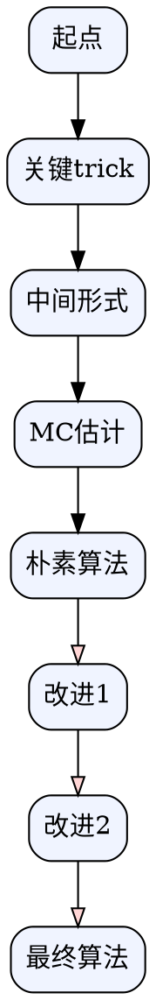

# 教程总结流程与要求

> 这是把"网页/章节/论文"转换为 **Obsidian 可完美渲染的高密度教程** 的标准化工作流。每次接到新链接，按本文件执行。

---

## 0. 触发条件

用户给一个链接 + 要求"整理 / 总结 / 写成教程 / 写成 obsidian md"时，**直接走这个流程**，不要再追问格式。

默认输出位置：**当前文件夹**（`/Users/henry/personal_code/fast_RL_toutorial/`）
默认命名：`<主题中文名>教程.md`（如 `策略梯度教程.md`、`Actor-Critic教程.md`）

---

## 1. 抓取原文（Fetch）

### 1.1 优先抓 raw / markdown 源

很多文档站（datawhale、docsify、mkdocs、docusaurus、vitepress）渲染后的 HTML 经 WebFetch 提取常是空壳。**先尝试 raw 源**：

| 站点形态 | 优先尝试的 raw URL |
|---|---|
| `datawhalechina.github.io/xxx/#/chapterN/chapterN` | `https://raw.githubusercontent.com/datawhalechina/xxx/master/docs/chapterN/chapterN.md` |
| `xxx.github.io/yyy` (docsify) | 仓库 `docs/` 目录下对应 `.md` |
| GitHub blob 链接 | 把 `/blob/` 换成 `raw.githubusercontent.com` |
| arXiv | `https://arxiv.org/abs/xxx` → `pdf/xxx` 或 ar5iv HTML 版 |

### 1.2 WebFetch prompt 模板

```
提取页面全部内容（关于<主题>的章节），尤其是数学公式、推导步骤、算法描述、实现技巧。
请保留原始 LaTeX 公式格式（$...$ 和 $$...$$）。完整返回，不要省略。
```

### 1.3 验收

抓到的内容若 < 1KB 或只有标题，**立即换 raw 源重试**，不要硬着头皮编。

---

## 2. 信息组织原则（高密度）

> 高密度 ≠ 长，而是**每段都在传递新信息**。砍掉客套话、重复定义、与主题无关的铺垫。

### 2.1 结构骨架（按需增删，但顺序保留）

```
0. Frontmatter（YAML）
1. 一句话 abstract（callout，给整个主题的精炼定义）
2. 背景 / 三要素 / 与同类方法对比表
3. 核心对象的形式化定义（轨迹、目标函数等）
4. 完整推导（分 Step、每步 boxed 关键式）
5. 直观解读 + 类比（监督学习、物理直觉）
6. 实现技巧 / 降方差 / 工程坑（分技巧编号）
7. 具体算法（伪代码 + 流程图）
8. Cheat Sheet（最小可跑代码 + 常见坑）
9. 一图总览（graphviz/mermaid）
10. 关联笔记（[[双链]]）+ 原文链接
```

不是每篇都要 10 节，**但每篇都要有**：abstract、推导、直观解读、Cheat Sheet、一图总览、关联笔记。

### 2.2 信息密度规则

- **每个公式都要解释"为什么这一步"**，不能堆公式不说话
- **每个技巧都要先讲"原 naive 做法的痛点"**，再给改进式
- **对比要上表**（vs 监督学习、vs 其他算法）
- **能用图表达的关系绝不用大段文字**

---

## 3. Obsidian 渲染要求（硬性）

### 3.1 Frontmatter（必须）

```yaml
---
title: <主题名>教程
tags: [强化学习, <子领域>, <算法名>]
source: <原文 URL>
created: YYYY-MM-DD
---
```

### 3.2 公式

- 行内：`$...$`
- 块级：`$$...$$`，前后留空行
- 关键结论用 `\boxed{...}` 高亮
- 多行推导用 `\begin{aligned}...\end{aligned}`
- **保留原文公式编号 `\tag{4.2}`**，方便对照

### 3.3 Callout（Obsidian 原生支持）

用对了语义会上色：

| 语法 | 用途 |
|---|---|
| `> [!abstract]` | 一句话定义 |
| `> [!note]` | 数学细节、为什么这样 |
| `> [!tip]` | 工程技巧、实现要点 |
| `> [!warning]` | 易错点、naive 做法的陷阱 |
| `> [!danger]` | 严重坑 |
| `> [!success]` | 关键转化、aha moment |
| `> [!info]` | 类比、补充信息 |
| `> [!example]` | 伪代码 / 具体例子 |
| `> [!summary]` / `> [!checklist]` | 收尾清单 |

### 3.4 图

- 优先 **graphviz**（```` ```dot ````）：流程清晰、Obsidian 装 Graphviz 插件即可渲染
- 退而用 mermaid（Obsidian 原生）
- 节点用 `fillcolor` 区分阶段（同色=同阶段）

#### 引用原文图片（适用情况）

> **核心准则**：**仅对高密度说明有帮助的原文图，才进行引入**。能用一句话/一行公式/一个 graphviz 节点取代的，就不要插图。

如果原文有**对理解某个概念真正必要**���图（示意图、网络结构图、可视化例子如"乒乓球 Q 值对比"等），且自己用 graphviz/文字难以替代，**可以直接引用原文图**：

```markdown

*图 6.1 · 太空侵略者中 $V_\pi$ 的输出（[Easy-RL 第 6 章](原文URL)）*
```

要点：
- **使用绝对 URL**（如 `https://datawhalechina.github.io/easy-rl/img/ch6/6.1.png`），不要写相对路径 `../img/ch6/6.1.png`，否则 Obsidian 渲染不出
- **图片下方加 caption** 注明"原文图 X.Y · 描述（来源链接）"，让读者知道这不是自创的
- 自己画的 graphviz 总览图永远是首选；原文图作为补充
- 标准章节配色与示意（如 Easy-RL 的 6.1 / 6.4 / 6.7 / 6.10 这种关键示意图）尤其值得直引

**判断"是否值得插图"的清单**（每条都要能答"是"才插）：
1. 这张图承载的关键信息，**能否用一段文字或一行公式表达完？** 能 → 不插
2. 图替代的是**论证链路上的某一步**（比如方法结构、关键现象、对比验证），还是仅仅"看起来好看"？只是装饰 → 不插
3. 读者读到此节时，**有没有这张图就会卡在某个抽象概念上**？不会卡 → 不插
4. 论文里 6 张实验样本图、3 张消融柱状图、若干生成示例——**绝大多数不要插**，只挑承载核心论证的 1-3 张

**优先值得引用的图类型**（按价值降序）：
- **整体方法/架构图**（论文 Figure 1/2 类）：把多个公式、组件、数据流一张图说清，几乎一定该插，**放在形式化或方法节的开头**
- **核心机制可视化**（如残差量化的 coarse-to-fine 重建、codebook 利用率曲线、解纠缠语义扫描）：是某个抽象结论的"看得见的证据"，**紧贴对应推导/表格之后**
- **同类方法并排对比**（论文 Figure 1 左右两栏 vs 类）：用最少篇幅让读者抓住范式差异

**应当避免引用的图**：
- 纯生成样本（除非样本本身就是"分类可辨"这种关键论证）
- 已被教程文字表格完整覆盖的实验柱状图
- 装饰性截图、scaling 曲线在表格已说清的情况
- 静态截图无法表达的动态/时序内容（如视频序列）

**插图工作流（多论文批量写作时推荐）**：派一个独立 figure-planning agent 看 ar5iv，按上面清单先列"候选图清单 + 选/不选理由 + 插入位置（精确到章节行号）"落盘到 `.tmp/<topic>_figs.md`，主会话按规划批量插入；图 URL 落盘前用 `curl -sLo /dev/null -w "%{http_code}"` 验 200，避免插死链。

### 3.5 双链

- 关联算法用 `[[Actor-Critic]]`、`[[PPO]]` —— 即使笔记还不存在也写，构成知识网

### 3.6 表格

- 对比类信息必须上表（不要写成项目符号）
- 表头要有"维度"列，方便横向对照

---

## 4. 推导写作的特殊要求

> 这是教程质量的命门。

### 4.1 分 Step 写

每个推导分 `### Step N · <这一步在做什么>`，让读者能跳读、能定位。

### 4.2 每步说清三件事

1. **从哪里来**：上一步式子
2. **关键变换**：用了什么恒等式 / 假设
3. **得到了什么**：新式子的"形式上"意义（如"现在是期望形式了，可以采样")

### 4.3 关键 trick 单独高亮

像 Log-Derivative Trick 这种通用工具：

```
### Step 2 · Log-Derivative Trick

$$
\boxed{\;\nabla f(x) = f(x)\, \nabla \log f(x)\;}
$$

> [!note] 为什么叫 "log-derivative"
> <一句话解释 + 它在这个场景的威力>
```

### 4.4 化简后要标注哪些项被消掉、为什么

如：环境项 $\nabla\log p(s_{t+1}\mid s_t,a_t)=0$ 因为与 $\theta$ 无关 → **这就是 model-free 的根源**。这种"消项→架构意义"的连接最有教学价值。

---

## 5. Cheat Sheet 要求

每篇必有，放在倒数第二节，包含：

1. **最小可跑伪代码**（PyTorch 风格，< 15 行）
2. **常见坑清单**（用 `> [!summary]` callout，每条一行）：
   - 容易写错的符号（如 PG 的负号）
   - 数值稳定性（如归一化、`+1e-8`）
   - on-policy / off-policy 误用
   - 超参数典型范围

---

## 6. 一图总览要求

最后一节 **必须**用 graphviz 画出"从目标到最终算法"的演进链路：



**配色约定**（保持系列一致）：
- 起点 / 目标：`#f0f4ff`（浅蓝）
- 关键 trick：`#fff4d6`（浅黄）
- 朴素算法：默认
- 改进版 / 升级算法：`#d6ffd6`（浅绿）
- 最终 / SOTA：`#ffd6d6`（浅红）

---

## 7. Reviewer 自检流程（必做）

> 这是教程交付前的**最后一道关**。自检清单（§8）是写作者的 to-do list；本节是**派一个独立 reviewer agent 找错**——视角不同，能抓到自检清单看不到的事实/数学/总结错误。

### 7.1 何时触发

每篇教程写完后，**强制走一遍**。不是"如果有时间再做"，是默认流程的一部分。

### 7.2 准备工作

- 确保原文 raw md 已在本地（如 `/tmp/<topic>_raw.md`），方便 reviewer 对照
- 主教程文件已落到目标位置
- 创建 `.tmp/` 子目录用于落盘 review 报告

### 7.3 Reviewer agent 派发

按 [[Multi-Agent 协作规约]] 的**文件落盘模式**派发：

```
任务：审查教程，找出事实错误、总结错误、数学错误。

教程文件：<目标教程绝对路径>
原文：<本地 raw md 绝对路径>

审查维度（逐节核对）：
1. 事实错误
   - 教程中"原文这样说"是否真的是原文这样说？是否曲解？
   - 教程中"领域共识"（行话、典型超参、经典论文设置）是否准确？
   - 双链 [[...]] 的简短描述是否准确？

2. 总结错误
   - 原文有的关键概念是否漏了？（具体列出重点对照点）
   - 教程独立加入的内容（原文没有的）是否合理？
   - 章节顺序是否扭曲了原文的逻辑链？

3. 数学错误
   - 所有公式逐一核对：定义是否带必要项（γ、期望、条件）
   - 推导链中每一步不等式/等式的方向、严格/非严格是否准确
   - 物理量纲、维度、变量索引是否一致
   - 代码中：tensor dtype、shape、gather/max 的 dim 是否正确，是否能跑通

输出规则（严格遵守文件落盘模式）：
1. 完整审查报告写入 .tmp/<topic>_review.md
2. 报告格式：
   # <topic> 教程审查报告
   ## 严重错误（必须改）
   - 位置：第 X 节 / 第 Y 行
   - 原文（教程）：xxx
   - 问题：xxx
   - 建议改为：xxx
   ## 轻微问题（建议改）
   ## 表述可优化（可选）
   ## 审查结论：严重 X 处 / 轻微 Y 处 / 可优化 Z 处

3. 仅在主会话返回 ≤200 字摘要：
   "✓ 完成 <topic> 审查 | 严重 X / 轻微 Y / 可优化 Z | 核心问题：{1-2 句} | 详见 .tmp/<topic>_review.md"
   不要粘贴完整报告。
```

### 7.4 Orchestrator 应用修改

收到 reviewer 摘要后：

1. **Read 报告文件**（不要让 reviewer 把全文塞回主会话）
2. **优先级修复**：严重错误必改 → 轻微问题大多数应改 → 可优化按价值取舍
3. 每修一处，都用具体的 Edit/Write 工具落地，不要批量重写整篇
4. 修完后向用户呈现**修改清单**（哪几条改了、对应原报告的哪一条），不要复述整篇报告
5. 任务完结后**清理 `.tmp/` 目录**

### 7.5 重点关注（reviewer 最容易抓到的几类错）

经验上，reviewer 最容易在以下几处发现实质问题：

| 问题类型 | 典型表现 |
|---|---|
| **严格/非严格不等式** | "严格更好" vs 证明给的是 ≥（最优策略下取等） |
| **以原文之名行修正之实** | 教程加了 γ / 改了符号但仍标 `\tag{原文式号}`，让读者以为原文也这么写 |
| **方法论假设的隐藏** | MC vs TD 不是"假设结果不同"而是"是否做马尔可夫假设"，初学者最易混 |
| **代码 dtype/shape** | `gather` index 必须 long、状态必须 float32，不显式标会跑不通 |
| **类比的物理对应** | 猫鼠/橡皮筋类比里"硬同步 vs 软更新"必须明示，否则读者以为是 Polyak |
| **关联笔记描述** | DDPG 不是"解 argmax"，是"学一个 actor 近似 argmax"，描述偏差影响后续学习 |

---

## 8. 输出后的自检清单

> [!checklist] 提交前过一遍
> - [ ] Frontmatter 四件套齐全（title / tags / source / created）
> - [ ] Abstract callout 在最顶
> - [ ] 所有 `$...$` 配对正确（用编辑器搜 `$` 数量是否偶数）
> - [ ] 关键公式有 `\boxed{}` 高亮
> - [ ] 每个推导步骤都有"为什么这步"的注释
> - [ ] 至少 1 张对比表（vs 同类方法 / vs 监督学习）
> - [ ] 至少 1 个 callout 解释 naive 做法的痛点
> - [ ] 有 Cheat Sheet 含最小代码 + 常见坑
> - [ ] 最后一节有 graphviz 一图总览
> - [ ] 关联笔记用 `[[...]]` 双链
> - [ ] 原文链接挂在末尾
> - [ ] 没有"我会"、"接下来"、"这一节将"等水话
> - [ ] **已派 reviewer agent 走 §7 流程，严重错误全部修复，`.tmp/` 已清理**

---

## 9. 一句话流程

> **抓 raw → 按 10 节骨架填 → 每个公式都讲为什么 → 每个技巧都先讲痛点 → 上表、上图（含必要的原文图引用）、上双链 → 派 reviewer agent 找错 → 修严重错误 → 自检清单走一遍**。

---

## 附：模板文件骨架

新主题可直接复制以下骨架开写：

````markdown
---
title: <主题>教程
tags: [<领域>, <算法>]
source: <URL>
created: YYYY-MM-DD
---

# <主题>

> [!abstract] 一句话
> <主题>是 ... 其核心思想是 ...

---

## 1. 背景

| 维度 | A 方法 | B 方法 |
|---|---|---|
| ... | ... | ... |

## 2. 形式化

$$
<目标函数>
$$

## 3. 推导

### Step 1 · ...
### Step 2 · <关键 Trick>
$$
\boxed{...}
$$
> [!note] 为什么...
### Step N · ...

## 4. 直观解读
## 5. 实现技巧
### 技巧 1 · ...
> [!warning] naive 做法的痛点
### 技巧 2 · ...

## 6. 具体算法
> [!example] 伪代码

## 7. Cheat Sheet
```python
# ...
```
> [!summary] 常见坑

## 8. 一图总览
```dot
digraph G { ... }
```

## 9. 关联笔记
- [[相关概念A]]
- [[相关算法B]]
- 原文：[<标题>](<URL>)
````
