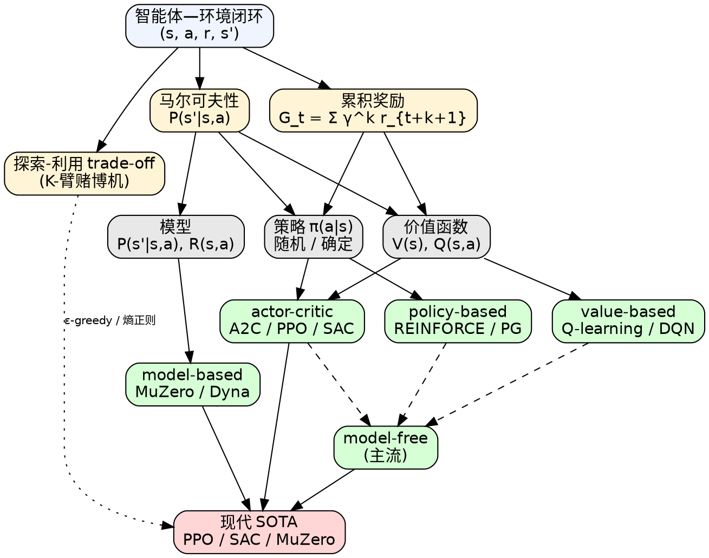

# 强化学习基础

> [!abstract] 一句话
> **强化学习（RL）** 研究**智能体（agent）** 如何在**未知、随机、奖励延迟**的环境中，通过"动作→观测→奖励"的闭环交互，学到一个**最大化期望累积奖励** $\mathbb E\!\left[\sum_{k=0}^{\infty}\gamma^k r_{t+k+1}\right]$ 的策略。与监督学习相比，它没有标签、数据非 i.i.d.、且自己生成训练数据。

---

## 一、什么是强化学习

### 1.1 智能体—环境闭环

RL 把世界拆成两半，每一步反复执行三件事：

```
智能体 ──动作 a_t──▶ 环境
       ◀──观测 o_{t+1}, 奖励 r_{t+1}──
```

智能体只能动，不能看到环境内部；环境只输出**观测**和**标量奖励**。智能体的目标不是"预测对"，而是**让长期累积奖励最大**。

> [!info] 与"控制论"的血缘
> 这套闭环本质就是**最优控制（optimal control）** 的样本驱动版本——经典控制需要 $\dot x = f(x,u)$ 解析模型，RL 假装什么都不知道，只看 $(s_t,a_t,r_t,s_{t+1})$ 这一串四元组。

### 1.2 与监督学习的本质差别

| 维度 | 监督学习（SL） | 强化学习（RL） |
|---|---|---|
| **数据来源** | 人工标注、固定数据集 | 智能体与环境交互产生（policy 自己造数据） |
| **i.i.d. 假设** | 必须 i.i.d.，样本独立 | **强时间相关**，相邻帧高度相关 |
| **监督信号** | 每条样本都有正确标签 | 只有**延迟的标量奖励**，无"正确动作" |
| **反馈时机** | 即时（一次前向就知道对错） | **延迟**（赢/输可能 10s 后才揭晓） |
| **数据分布** | 静态，训练时已知 | **随策略改变而漂移**（policy 一变、$s$ 的分布也变） |
| **性能上限** | 标注者水平（人类） | **可超越人类**（AlphaGo / Atari 超人表现） |
| **失败代价** | 预测错一张图 | 错的动作→坏的数据→更坏的策略，**会发散** |

> [!success] 为什么 RL "可以超越人类"
> SL 的天花板由标注者决定（ImageNet 上限就是人）。RL 没有教师，**只有环境本身的反馈**——只要奖励信号定义对了，智能体可以走出人类没走过的路（AlphaGo 的"神之一手"就是这种产物）。

### 1.3 RL 的三大困难

> [!warning] RL 难在哪儿（按重要性排序）
> 1. **延迟奖励 (delayed reward)**：现在的动作、过几分钟才知道好坏 → **信用分配（credit assignment）** 难。
> 2. **试错探索 (trial-and-error)**：没有标签告诉你正确动作是什么，只能"乱试看反馈"。
> 3. **非独立同分布 (non-i.i.d.)**：连续帧高度相关，普通 SGD 在这种数据上会震荡。
> 4. **自产数据的反馈环**：策略差→采到的轨迹差→学到的策略更差。**不稳定就会发散**，所以 RL 大量篇幅在讲"如何让训练稳定"。

---

## 二、序列决策框架

### 2.1 历史、状态与观测

智能体到 $t$ 时刻为止见过的所有东西，叫**历史（history）**：

$$
H_t = o_1, a_1, r_2, o_2, a_2, r_3, \ldots, o_t, a_t, r_{t+1}
$$

> [!warning] 索引约定（全文统一 Sutton 风格）
> 本教程采用 Sutton & Barto 索引：动作 $a_t$ 执行后，环境在 $t+1$ 步返回奖励 $r_{t+1}$ 和观测 $o_{t+1}$。所以历史中"做完 $a_t$ 后拿到的奖励"记为 $r_{t+1}$（而非 Easy-RL 原文偶尔出现的 $r_t$）；后文 $V_\pi$、$Q_\pi$ 的求和都按这一约定。

"状态"就是历史的一个**充分统计量**——能从中推出未来所需的一切：

$$
S_t = f(H_t)
$$

> [!note] 三个容易混的"状态"
> - **环境状态** $s_t^e = f^e(H_t)$：环境内部真正用来转移的变量（玩家看不到）
> - **智能体状态** $s_t^a = f^a(H_t)$：智能体根据观测推断的状态
> - **观测** $o_t$：环境暴露给智能体的东西（屏幕一帧、传感器读数）

### 2.2 完全可观测 vs 部分可观测

| 设定 | 何时成立 | 数学模型 |
|---|---|---|
| **完全可观测 (fully observed)** | $o_t = s_t^e = s_t^a$，智能体看到了环境全部状态 | **MDP** $\langle S,A,P,R,\gamma\rangle$ |
| **部分可观测 (partially observed)** | 智能体只看到观测，看不见真实状态（牌面/雷达回波/单帧画面） | **POMDP** $\langle S,A,T,R,\Omega,O,\gamma\rangle$ |

POMDP 七元组里多出来的：$\Omega$ 是观测空间，$O(o\mid s,a)$ 是观测概率，$S$ 是**隐变量**。

> [!info] 单帧 Atari 是 POMDP，叠 4 帧后近似 MDP
> 单帧看不出球的速度方向，是 POMDP。DQN 原论文把**最近 4 帧叠成一个张量**作为状态，让"速度、加速度"等动力学量可以从堆叠中读出，**人工把 POMDP 近似成 MDP**——这是 Atari RL 的标配技巧。

### 2.3 马尔可夫性

> [!success] 马尔可夫性 (Markov property)
> "**未来只依赖当前状态，与过去无关**"：
> $$\boxed{\;P(s_{t+1}\mid s_t, a_t, s_{t-1}, a_{t-1},\ldots) = P(s_{t+1}\mid s_t, a_t)\;}$$
> 满足该性质的随机过程是**马尔可夫过程**；在它之上加上动作 $A$、奖励 $R$、折扣 $\gamma$，就构成 **MDP**。这条假设是 RL 大部分算法（Q-learning、Bellman 方程）能成立的根。

实际工作中，如果状态设计不够充分（如只取一帧像素），马尔可夫性不成立，算法会变得不稳定——**好状态表示 = 让任务尽量满足马尔可夫性**。

### 2.4 动作空间

| 类型 | 含义 | 例子 | 适配算法 |
|---|---|---|---|
| **离散 (discrete)** | $a\in\{1,2,\dots,K\}$ 可数 | 围棋落子、Atari 按键、迷宫上下左右 | DQN、Sarsa、PG |
| **连续 (continuous)** | $a\in\mathbb R^d$ 实值向量 | 机器人关节力矩、自动驾驶方向盘 | DDPG、SAC、PPO（高斯策略） |

连续动作空间下，"对所有 $a$ 取 max"变成连续优化问题——所以 [[DQN教程|DQN]] 在连续动作上不能直接用，需要 actor 类方法：[[DDPG]] **用确定性 actor 近似 $\arg\max_a Q$**；[[SAC]] 不走 argmax 路线，而是学**最大熵随机策略**（actor 输出动作分布，目标 = $\mathbb E[Q] + \alpha\,\mathcal H(\pi)$），鼓励"在等价好的动作上保持多样性"。

---

## 三、智能体的内部结构：策略 / 价值 / 模型

一个强化学习智能体由**三个可能存在的部件**构成（不一定都有）：

| 部件 | 学什么 | 形式 | 给我什么 |
|---|---|---|---|
| **策略 policy** | 状态→动作的映射 | $\pi(a\mid s)$ 或 $a=\pi(s)$ | 直接告诉你"现在做什么" |
| **价值函数 value function** | 状态/动作的"未来收益" | $V_\pi(s)$、$Q_\pi(s,a)$ | 衡量状态/动作的好坏，用于推策略 |
| **模型 model** | 环境的动力学 | $P(s'\mid s,a)$、$R(s,a)$ | 让智能体在"脑子里"预演未来 |

### 3.1 策略（policy）

| 类型 | 数学形式 | 优点 | 典型用途 |
|---|---|---|---|
| **随机性策略 stochastic** | $\pi(a\mid s) = P(a_t=a\mid s_t=s)$ | 天然探索；动作多样难以被对手预测 | [[策略梯度教程|策略梯度]]、PPO、SAC |
| **确定性策略 deterministic** | $a^* = \arg\max_a \pi(a\mid s)$ | 推理快、可重复 | DDPG（actor 部分）、最优控制 |

> [!tip] 训练用随机、部署用确定
> 训练时随机策略给探索；部署时常用**贪婪化（greedy decoding）** 把它转成确定性策略——这是几乎所有 actor 类算法的默认做法。

### 3.2 价值函数（value function）

**状态价值**（用策略 $\pi$ 走下去，从 $s$ 出发能拿到的期望折扣回报）：

$$
\boxed{\;V_\pi(s) \doteq \mathbb{E}_\pi\!\left[\sum_{k=0}^{\infty}\gamma^k r_{t+k+1}\;\middle|\;s_t=s\right]\;}
$$

**动作价值**（多了一个"先做 $a$，再按 $\pi$ 走下去"的约束）：

$$
\boxed{\;Q_\pi(s,a) \doteq \mathbb{E}_\pi\!\left[\sum_{k=0}^{\infty}\gamma^k r_{t+k+1}\;\middle|\;s_t=s, a_t=a\right]\;}
$$

> [!note] 为什么需要折扣因子 $\gamma$
> 1. **数学上**：让无穷和收敛（否则 $\sum r$ 可能发散）——对于 **continuing 任务必须 $\gamma\in[0,1)$**；**episodic 任务（有终止状态）可取 $\gamma=1$**（如 CartPole、棋类）
> 2. **金融直觉**：今天的 100 块 > 10 天后的 100 块（有利息/有不确定性）
> 3. **算法上**：$\gamma$ 充当"有效视野长度" $\approx 1/(1-\gamma)$（折扣权重衰减到 $1/e$ 所需步数），$\gamma=0.99$ 意味"约 100 步外的奖励开始显著被压低"——不是"100 步外就完全不算"
> 4. **稳定性**：$\gamma<1$ 让 Bellman 算子成为收缩映射，迭代收敛有保证

**为什么 Q 比 V 实用**：知道 $Q^*(s,a)$ 后，最优动作直接 $a^* = \arg\max_a Q^*(s,a)$，**不需要模型**就能决策——这是 [[Q-learning]] 的根本卖点。

### 3.3 模型（model）

模型把环境的物理刻画成两件东西：

| 部分 | 公式 | 含义 |
|---|---|---|
| **状态转移** | $p^a_{ss'} = P(s_{t+1}=s'\mid s_t=s, a_t=a)$ | 在 $s$ 做 $a$ 后下一状态的概率 |
| **奖励函数** | $R(s,a) = \mathbb{E}[r_{t+1}\mid s_t=s, a_t=a]$ | 在 $s$ 做 $a$ 立刻能拿多少奖励 |

有了 $P,R$ 就能"在脑子里走棋"——这是 model-based 方法（[[Dyna]]、[[AlphaZero]]、MuZero）的根基。

### 3.4 走迷宫例子：策略 vs 价值的两种解法

**任务**：从 start 到 goal，每步 $-1$ 奖励。

| 方法 | 表示 | 在每格存什么 | 怎么选动作 |
|---|---|---|---|
| **基于策略 policy-based** | $\pi(s)\to a$ | 一个箭头（上/下/左/右） | 直接照箭头走 |
| **基于价值 value-based** | $V(s)\in\mathbb R$ | 一个负数（如起点 $-16$ = 还要 16 步到终点） | 选邻居中 $V$ 最大的方向 |

> [!info] 价值表也能"挤"出策略
> 即使只学了 $V$，对四个邻居比一下大小就能得到 greedy 策略。所以**价值函数隐式包含策略**——这也是 value-based 智能体不需要显式 $\pi$ 的原因。

---

## 四、智能体的分类

按"学什么"和"用不用模型"两个维度切，得到两张分类表。

### 4.1 按学习对象：value / policy / actor-critic

| 类型                      | 显式学什么                 | 隐式有什么                 | 代表算法                                     | 优势                     | 劣势                    |
| ----------------------- | --------------------- | --------------------- | ---------------------------------------- | ---------------------- | --------------------- |
| **基于价值 value-based**    | $V$ 或 $Q$             | 策略从 $\arg\max Q$ 隐式推出 | [[Q-learning]]、[[Sarsa]]、[[DQN教程|DQN]]         | 数据可复用（off-policy）；样本高效 | 连续动作难（要解 argmax）；可能震荡 |
| **基于策略 policy-based**   | $\pi_\theta(a\mid s)$ | 不学价值                  | [[REINFORCE]]、[[策略梯度教程|策略梯度]]                   | 连续/高维动作都行；策略天然随机       | 方差大、on-policy 浪费样本    |
| **演员-评论员 actor-critic** | 同时学 $\pi$ 和 $V/Q$     | —                     | [[A2C]]、[[A3C]]、[[PPO教程|PPO]]、[[SAC]]、[[DDPG]] | 兼顾两者优点；可降方差            | 实现复杂、需要平衡两个网络         |

> [!success] 为什么 Actor-Critic 成为主流
> Actor（policy）做决策、Critic（value）当裁判**给低方差的梯度信号**——把 PG 的高方差痛点用 baseline 思想压下去。今天的 SOTA（PPO/SAC）几乎都是 AC 家族。详见 [[Actor-Critic教程|Actor-Critic]]。

### 4.2 按是否学环境模型：model-based / model-free

| 类型 | 学不学 $P, R$ | 数据效率 | 泛化 | 代表算法 |
|---|---|---|---|---|
| **有模型 model-based** | 学（或给定） | **高**：可在脑内 rollout | 受模型偏差限制 | [[AlphaZero]]、[[MuZero]]、[[Dyna-Q]]、[[MBPO]] |
| **免模型 model-free** | 不学 | 低：得在真环境采样 | 通常更鲁棒 | [[DQN教程|DQN]]、[[策略梯度教程|策略梯度]]、[[PPO教程|PPO]]、[[SAC]] |

> [!warning] model-free 为何更主流？
> 1. **建模难**：真实环境的 $P$ 经常没法估准（如 Atari 像素动力学）
> 2. **模型偏差累积**：rollout 越长，预测误差指数放大
> 3. **简单直接**：开源库多、不用工程一套额外的世界模型
>
> 但在**采样昂贵**的场景（真实机械臂、自动驾驶），model-based 不可替代——OpenAI 翻魔方就是**先在仿真里跑 model-based，再 sim-to-real**。

### 4.3 一张图分类所有智能体

按"是否有 policy、value、model"三选项可分八格，常见的几格：

| 类别 | 有 policy | 有 value | 有 model |
|---|---|---|---|
| value-based | ⚪（隐式） | ✅ | ❌ |
| policy-based | ✅ | ❌ | ❌ |
| actor-critic | ✅ | ✅ | ❌ |
| model-based AC | ✅ | ✅ | ✅ |
| pure planning（如 MCTS+完美模型） | ❌ | ⚪ | ✅ |

---

## 五、核心张力：探索 vs 利用

> [!abstract] 探索-利用窘境
> **探索 (exploration)**：试新动作，希望发现更好的——可能拿到更多奖励，也可能"一无所有"。
> **利用 (exploitation)**：重复已知最优动作——稳拿奖励，但永远走不出局部最优。
> 总尝试次数有限，**加强一方必削弱另一方**，这就是 RL 的根本张力。

### 5.1 $K$-臂赌博机：最简形式

把 RL 退化到"无状态、单步"，只剩**多臂赌博机（multi-armed bandit）**：$K$ 个老虎机，每个以未知概率吐币，目标是 $T$ 次按键累积奖励最大。

| 极端策略 | 做法 | 后果 |
|---|---|---|
| **仅探索 exploration-only** | 平均分配尝试机会到每个臂 | 估计准了，但失去太多选最优的机会 |
| **仅利用 exploitation-only** | 始终选当前平均奖励最大的臂 | 选得快，但很可能根本没发现最优臂 |

两者都拿不到累积奖励最大值——**必须折中**。详见 [[多臂赌博机]] 和 [[ε-greedy]]、[[UCB]]、[[Thompson Sampling]]。

### 5.2 日常生活类比

| 场景 | 利用 | 探索 |
|---|---|---|
| 吃饭 | 去常去的那家 | 搜个新店试试 |
| 投广告 | 投点击率最高的素材 | 试一版新文案 |
| 挖油 | 在已知油田继续打 | 新地点勘探（高方差） |
| 街霸 | 蹲角落出脚 | 放大招 |

### 5.3 RL 中如何实现 trade-off（前瞻）

- **ε-greedy**：以**退火的** $\varepsilon$ 概率随机探索（DQN 用：$\varepsilon$ 从 1.0 线性退火到 0.1/0.01；不退火则收敛不到最优）
- **熵正则**：在目标里加 $\mathcal H(\pi)$，奖励"分布平坦"（SAC 用）
- **乐观初始化**：Q 初值给高，自然鼓励试没去过的动作
- **UCB / Thompson**：基于不确定度选臂

---

## 六、学习（learning） vs 规划（planning）

| 范式 | 环境是否已知 | 智能体怎么用它 | 典型场景 |
|---|---|---|---|
| **学习 learning** | 未知 | 实时与环境交互、积累经验 | 大部分 model-free RL |
| **规划 planning** | 已知 | 在"内部模拟器"里搜索/迭代 | 围棋（规则确定）、动态规划 |

实战中常见的 hybrid：**先学一个模型，再用它规划**——这就是 model-based RL 的核心思路（MuZero 学到世界模型后，用 MCTS 在脑内规划）。

---

## 七、强化学习历史：从手工特征到深度 RL

| 时代 | 形态 | 类比 |
|---|---|---|
| **标准 RL** | 手工设计特征 + 价值函数/策略表（如 TD-Gammon） | 传统 CV：HOG/DPM + SVM |
| **深度 RL (Deep RL)** | 端到端神经网络拟合 $\pi$ 或 $Q$ | 深度 CV：CNN 端到端 |

**爆发点**：2013 DeepMind 用 DQN（CNN+Q-learning）直接吃 Atari 像素，**用同一套网络打通 49 个游戏**——这是深度 RL 的"AlexNet 时刻"。

为什么 deep RL 在 2015 后才爆发：

1. **算力**：GPU 让"亿级帧试错"变得可行
2. **端到端训练**：把特征工程和决策合并优化，去掉了人工特征瓶颈
3. **稳定化技巧**：experience replay、target network、PPO 的 clip——一系列让训练**不崩**的工程

---

## 八、Gym 简介（最低限度够用）

Gym 是 OpenAI 出的环境仿真库，**接口极简**，几乎所有 RL 论文/教程都用它。

| 概念 | 类 | 含义 |
|---|---|---|
| `Discrete(n)` | `gym.spaces.Discrete` | 离散空间，n 个可能值 |
| `Box(low, high, shape)` | `gym.spaces.Box` | 连续空间，每维有上下界 |
| `env.observation_space` | — | 观测空间 |
| `env.action_space` | — | 动作空间 |

**关键 5 个 API**：

| 调用 | 作用 |
|---|---|
| `gym.make('Env-v0')` | 取出环境 |
| `env.reset()` | 重置回合，返回初始 obs |
| `env.step(action)` | 走一步，返回 `(obs, reward, done, info)` |
| `env.render()` | 显示图形界面 |
| `env.close()` | 关闭环境（**别手动关窗口**，会内存泄漏） |

> [!warning] 版本陷阱
> Gym 0.26+ **不向后兼容**：`reset` 返回 `(obs, info)`，`step` 返回 `(obs, reward, terminated, truncated, info)`（5 值！）。
> - `terminated = True`：**自然终止**（吸收态，例：CartPole 倒了、棋局结束）→ bootstrap 时 $V(s_{next})$ 应**置 0**
> - `truncated = True`：**时限截断**（仍然能继续，只是被外部强制停止）→ bootstrap 时 $V(s_{next})$ **不应置 0**
>
> 把 `truncated` 当 `done` 处理会让长 horizon 任务的价值估计永远偏低。本教程和大多老代码用 0.25.2 接口。新代码建议直接用 [Gymnasium](https://gymnasium.farama.org/)（社区维护的 fork）。

---

## 九、Cheat Sheet

### 最小可跑：CartPole 随机策略

```python
import gym

env = gym.make('CartPole-v0')
obs = env.reset()

episode_reward = 0
for t in range(1000):
    # env.render()  # 可视化时打开
    action = env.action_space.sample()       # 随机策略
    obs, reward, done, info = env.step(action)
    episode_reward += reward
    if done:
        print(f'Episode finished after {t+1} steps, reward={episode_reward}')
        obs = env.reset()
        episode_reward = 0
env.close()
```

### 标准 play 循环（评估智能体性能）

```python
import numpy as np

def play(env, agent, render=False, train=False):
    """跑一回合，返回总奖励"""
    episode_reward = 0.0
    obs = env.reset()
    while True:
        if render: env.render()
        action = agent.decide(obs)
        next_obs, reward, done, _ = env.step(action)
        episode_reward += reward
        if train:
            agent.learn(obs, action, reward, done)
        if done:
            break
        obs = next_obs
    return episode_reward

# 评估：100 回合平均（学术界惯例）
rewards = [play(env, agent) for _ in range(100)]
print(f'Mean 100-ep reward = {np.mean(rewards):.2f}')
```

### 常见坑

> [!summary] RL 入门最容易踩的雷
> - **维度搞错**：`obs` shape 因环境而异（CartPole 是 4 维向量，Atari 是 `(84,84,4)`），网络输入层要对应
> - **没设种子**：Gym **≤ 0.25** 三件套 `env.seed(k)` + `np.random.seed(k)` + `torch.manual_seed(k)`；Gym **0.26+** / Gymnasium 把 `env.seed()` 移除了，改为 `env.reset(seed=k)`。直接抄旧代码会 `AttributeError`。
> - **0.25 vs 0.26 接口**：`step` 返回 4 元组还是 5 元组，**漏一个 truncated 直接报 unpacking 错误**
> - **`env.close()` 必调**：渲染窗口手动关闭会导致内存不释放，严重时死机
> - **观测连续帧高度相关**：直接喂 SGD 会震荡，需 **experience replay** 打散（见 [[DQN教程|DQN]]）
> - **奖励量级**：原始奖励常常 $\pm 100$ 量级，**clip 到 $[-1,1]$ 或归一化** 是 Atari 标配
> - **延迟奖励 → 信用分配**：分不清"是 10 步前的好动作还是刚才那步的好动作"，靠 $\gamma$ 折扣 + n-step return
> - **POMDP 当 MDP 训**：单帧像素不够马尔可夫——叠 4 帧、或用 RNN（[[DRQN]]）
> - **策略导致数据漂移**：每改一次策略，采到的状态分布就变；on-policy 算法（PG）**旧数据立刻作废**
> - **超参起手式**：$\gamma\in[0.95, 0.99]$、learning rate $\sim 3\times 10^{-4}$（Adam）、batch size 32-256

---

## 十、一图总览：RL 全景



**读图顺序**：
1. **蓝色起点**：所有 RL 都是"交互闭环"
2. **黄色 trick 层**：让闭环 well-defined 的三块基石（马尔可夫性、累积奖励、探索权衡）
3. **灰色三要素**：智能体可能学的三种东西
4. **绿色算法分支**：按"学什么 / 用不用模型"分类的主流算法家族
5. **红色 SOTA**：现代 RL 的工程合流——AC + model-free（或 + model）+ 探索机制

---

## 十一、关联笔记

- [[马尔可夫决策过程教程|马尔可夫决策过程]] —— RL 的形式化基底，$\langle S,A,P,R,\gamma\rangle$ 五元组
- [[POMDP]] —— 状态不可见时的 RL 框架，七元组 $\langle S,A,T,R,\Omega,O,\gamma\rangle$
- [[Bellman方程]] —— 价值函数的递推关系，是几乎所有 value-based 算法的根
- [[Q-learning]] —— 经典 off-policy value-based 算法，DQN 的前身
- [[Sarsa]] —— Q-learning 的 on-policy 兄弟
- [[DQN教程|DQN]] —— Deep Q-Network，深度 RL 的起点（Atari 突破）
- [[策略梯度教程|策略梯度]] —— REINFORCE / PG，直接对 $\pi_\theta$ 求梯度
- [[Actor-Critic教程|Actor-Critic]] —— 把 policy 和 value 缝合起来，方差更低
- [[PPO教程|PPO]] —— 目前最常用的 on-policy 算法
- [[SAC]] —— 连续动作 off-policy 的事实标准，带最大熵正则
- [[DDPG]] —— 连续动作 deterministic policy gradient
- [[多臂赌博机]] —— 探索利用的最简模型
- [[ε-greedy]] —— 最简单的探索策略
- 原文：[Easy-RL 第 1 章 · 强化学习基础](https://datawhalechina.github.io/easy-rl/#/chapter1/chapter1)
