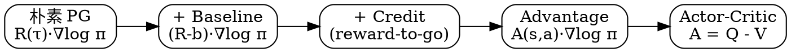
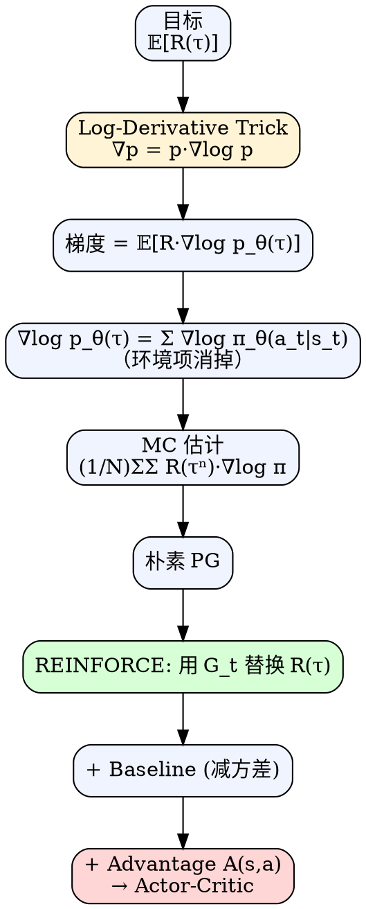

# 策略梯度（Policy Gradient）

> [!abstract] 一句话
> **策略梯度**直接对参数化策略 $\pi_\theta(a\mid s)$ 求梯度、用梯度上升最大化期望回报 $\bar R_\theta=\mathbb E_{\tau\sim p_\theta}[R(\tau)]$。其核心数学工具是 **Log-Derivative Trick**：把 $\nabla p_\theta(\tau)$ 改写成 $p_\theta(\tau)\nabla \log p_\theta(\tau)$，从而把"对概率求梯度"变成"对 log 概率求梯度的期望"，使其可用采样估计。

---

## 1. 背景：RL 三要素与策略

强化学习的三个组成部分：

| 组件 | 含义 | 是否可控 |
|---|---|---|
| **演员 actor** | 输出动作的策略 $\pi_\theta$ | ✅ 唯一可调 |
| **环境 environment** | 状态转移 $p(s_{t+1}\mid s_t,a_t)$ | ❌ 给定 |
| **奖励函数 reward** | 标量回报 $r_t$ | ❌ 给定 |

**策略 $\pi_\theta$** 是一个以 $\theta$ 为参数的神经网络：输入状态 $s$（如游戏画面），输出动作的概率分布，按分布**采样**得到动作 $a$。
> 采样而非取 argmax —— 这给了 PG 天然的探索能力，也是它与 DQN 等基于值方法的根本区别。

### 与值函数方法的对比

| 维度 | 值函数（Q-learning / DQN） | 策略梯度 |
|---|---|---|
| 学什么 | $Q(s,a)$ → 间接得策略 | 直接学 $\pi_\theta(a\mid s)$ |
| 动作空间 | 离散友好 | 离散 / **连续都可** |
| 策略形式 | 通常确定性（$\arg\max Q$） | **天然随机策略** |
| 收敛性 | 局部最优、可能震荡 | 局部最优、方差大 |
| 数据复用 | off-policy，可用 replay | **on-policy，采样数据只用一次** |

---

## 2. 轨迹（Trajectory）与回报

一个回合（episode）产生的状态—动作序列称为**轨迹**：

$$
\tau = \{s_1, a_1, s_2, a_2, \dots, s_T, a_T\}
$$

在参数 $\theta$ 下，轨迹 $\tau$ 出现的概率：

$$
\begin{aligned}
p_\theta(\tau)
&= p(s_1)\,p_\theta(a_1\mid s_1)\,p(s_2\mid s_1,a_1)\,p_\theta(a_2\mid s_2)\cdots\\[4pt]
&= p(s_1)\prod_{t=1}^{T} \underbrace{p_\theta(a_t\mid s_t)}_{\text{策略，可控}}\;\underbrace{p(s_{t+1}\mid s_t,a_t)}_{\text{环境，不可控}}
\end{aligned}
$$

轨迹总回报：$R(\tau)=\sum_{t=1}^{T} r_t$（**注意 $R$ 不需要可微，甚至可以是黑盒/不可导的**——这是 PG 相对于"端到端可微"方法的关键优势）。

> [!note] 奖励时间约定（全文统一）
> 本教程统一采用：**$r_t$ 是在状态 $s_t$ 执行 $a_t$ 后立刻得到的奖励**（与 $a_t$ 同步下标）。所以 $R(\tau)=\sum_{t=1}^T r_t$，reward-to-go 从 $t'=t$ 起累加。**部分经典教材（如 Sutton & Barto）用 $r_{t+1}$ 标记"$a_t$ 后才得到的奖励"**，两种约定本质等价、只是下标错一位——见 §6 末尾的换算说明。

**优化目标**：期望回报

$$
\bar R_\theta = \sum_\tau R(\tau)\, p_\theta(\tau) = \mathbb E_{\tau\sim p_\theta(\tau)}[R(\tau)]
$$

---

## 3. 策略梯度推导（含 Log-Derivative Trick）

### Step 1 · 对目标求梯度

$$
\nabla_\theta \bar R_\theta
= \sum_\tau R(\tau)\, \nabla_\theta\, p_\theta(\tau)
$$

> [!warning] 直接采样估计的障碍
> 上式不是期望形式，无法直接用 $\tau\sim p_\theta$ 采样估计 —— 梯度算子里的 $\nabla p_\theta(\tau)$ 不再是概率分布。

### Step 2 · Log-Derivative Trick（对数导数技巧）

利用恒等式（对任意可微正函数 $f$）：

$$
\boxed{\;\nabla f(x) = f(x)\, \nabla \log f(x)\;}
\quad\Longleftrightarrow\quad
\nabla \log f(x) = \frac{\nabla f(x)}{f(x)}
$$

> [!note] 为什么叫 "log-derivative"
> $\dfrac{\partial}{\partial \theta}\log f(\theta) = \dfrac{1}{f(\theta)}\dfrac{\partial f(\theta)}{\partial \theta}$，移项即得上式。它的威力：把"概率本身的梯度"换成"概率乘上 log 概率的梯度"，从而**重建期望结构**。

### Step 3 · 换回期望形式

$$
\begin{aligned}
\nabla_\theta \bar R_\theta
&= \sum_\tau R(\tau)\, \nabla p_\theta(\tau) \\
&= \sum_\tau R(\tau)\, p_\theta(\tau)\, \frac{\nabla p_\theta(\tau)}{p_\theta(\tau)} \\
&= \sum_\tau R(\tau)\, p_\theta(\tau)\, \nabla \log p_\theta(\tau) \\
&= \mathbb E_{\tau\sim p_\theta(\tau)}\!\bigl[\, R(\tau)\, \nabla \log p_\theta(\tau)\,\bigr]
\end{aligned}
$$

> [!success] 关键转化
> $\nabla$ 现在作用在 $\log p_\theta(\tau)$ 上，而**外层是期望**——可用蒙特卡洛采样无偏估计。

### Step 4 · 拆开 $\nabla \log p_\theta(\tau)$

$$
\begin{aligned}
\nabla \log p_\theta(\tau)
&= \nabla\!\left[\log p(s_1) + \sum_{t=1}^{T}\log p_\theta(a_t\mid s_t) + \sum_{t=1}^{T}\log p(s_{t+1}\mid s_t,a_t)\right]\\
&= \underbrace{\nabla \log p(s_1)}_{=\,0} + \sum_{t=1}^{T}\nabla\log p_\theta(a_t\mid s_t) + \underbrace{\sum_{t=1}^{T}\nabla\log p(s_{t+1}\mid s_t,a_t)}_{=\,0}\\
&= \sum_{t=1}^{T}\nabla\log p_\theta(a_t\mid s_t)
\end{aligned}
$$

> [!tip] 这一步消掉了环境
> 初始分布 $p(s_1)$ 和转移 $p(s_{t+1}\mid s_t,a_t)$ 与 $\theta$ 无关，梯度全为 0。**这就是为什么 PG 不需要知道环境模型（model-free）。**

### Step 5 · 蒙特卡洛估计

采样 $N$ 条轨迹 $\{\tau^n\}_{n=1}^{N}$ 后：

$$
\boxed{\;
\nabla_\theta \bar R_\theta
\approx \frac{1}{N}\sum_{n=1}^{N}\sum_{t=1}^{T_n}
R(\tau^n)\, \nabla_\theta \log p_\theta(a_t^n\mid s_t^n)
\;}\tag{PG}
$$

### Step 6 · 参数更新

梯度上升：

$$
\theta \leftarrow \theta + \eta\, \nabla_\theta \bar R_\theta
$$

学习率 $\eta$ 通常用 Adam / RMSProp 自适应。

---

## 4. 直观解读

公式 (PG) 的物理含义：

- 若 $R(\tau^n)>0$ → 增大状态 $s_t^n$ 下采取 $a_t^n$ 的概率
- 若 $R(\tau^n)<0$ → 减小该概率
- **权重就是整条轨迹的回报**

### 与监督分类的类比

监督学习最大化对数似然：

$$
\frac{1}{N}\sum_n\sum_t \log p_\theta(a_t^n\mid s_t^n)
$$

策略梯度只是在每项前加权 $R(\tau^n)$：

$$
\frac{1}{N}\sum_n\sum_t R(\tau^n)\, \log p_\theta(a_t^n\mid s_t^n)
$$

> [!info] 实现视角
> PG 可写成"加权交叉熵"：用 one-hot 动作 vs 网络输出概率算交叉熵，再乘上权重 $R$（或后文的 $G_t$、$A_t$）。框架中直接 `loss = -(weight * log_prob).mean()`。

---

## 5. 实现技巧（降方差三板斧）

朴素 PG 估计无偏但**方差极大**。三类技巧针对方差与有效性优化。

### 技巧 1 · 添加基线 Baseline

> [!danger] 全正回报陷阱
> 许多任务奖励恒为正（如打砖块得分 0~21）。所有 $R(\tau^n)$ 都为正 → **所有采过的动作概率都被推高**，未采样到的动作概率被相对压低。这在采样不充分时严重失真。

减去一个**不依赖动作 $a_t$ 的基线 $b$**（可以是常数，也可以是只依赖状态的函数 $b(s_t)$）：

$$
\nabla \bar R_\theta \approx \frac{1}{N}\sum_n\sum_t \bigl(R(\tau^n)-b\bigr)\nabla\log p_\theta(a_t^n\mid s_t^n)
$$

- 常用 $b \approx \mathbb E[R(\tau)]$（训练时的滑动均值）；进阶版本用 $b(s_t)=V^{\pi_\theta}(s_t)$
- **方差显著降低**：把奖励信号"居中化"

> [!success] 为什么减去 baseline 仍然无偏（关键推导）
> 只要 $b$ 不依赖将被求梯度的动作 $a_t$（即 $b$ 是常数或仅是 $s_t$ 的函数），那么它额外贡献的那一项严格为零：
>
> $$\mathbb E_{\tau\sim p_\theta}\!\bigl[b\,\nabla_\theta\log p_\theta(\tau)\bigr]
> = b\sum_\tau p_\theta(\tau)\,\nabla_\theta\log p_\theta(\tau)
> = b\sum_\tau \nabla_\theta p_\theta(\tau)
> = b\,\nabla_\theta\!\underbrace{\sum_\tau p_\theta(\tau)}_{=\,1}
> = b\cdot\nabla_\theta 1 = 0$$
>
> 关键两步：① $p\,\nabla\log p = \nabla p$（log-derivative trick 反向用）；② 概率求和恒为 $1$，对 $\theta$ 求梯度自然为 0。
> 把 $b$ 换成 $b(s_t)$ 时，只需把期望按 $\tau$ 分解到对 $a_t$ 求条件期望，结论同样成立：$\sum_{a_t}\pi_\theta(a_t\mid s_t)\nabla\log\pi_\theta(a_t\mid s_t)=\nabla\sum_{a_t}\pi_\theta(a_t\mid s_t)=\nabla 1=0$。

### 技巧 2 · 合理分配信用（Credit Assignment）

> [!warning] 同回合内权重相同不合理
> 朴素 PG 给同一轨迹中**每一步**都乘上**整条轨迹的总回报** $R(\tau^n)$。但若 $t$ 时刻的动作发生在某次大失误**之前**，它不该被那次失误的负分惩罚。

#### 改进 A：只用从 $t$ 之后的奖励（reward-to-go）

$$
\nabla \bar R_\theta \approx
\frac{1}{N}\sum_n\sum_{t=1}^{T_n}
\Bigl(\underbrace{\textstyle\sum_{t'=t}^{T_n} r_{t'}^n}_{\text{未来累积回报}} - b\Bigr)
\nabla\log p_\theta(a_t^n\mid s_t^n)
$$

#### 改进 B：加折扣因子 $\gamma$

$$
\nabla \bar R_\theta \approx
\frac{1}{N}\sum_n\sum_{t=1}^{T_n}
\Bigl(\sum_{t'=t}^{T_n} \gamma^{\,t'-t}\, r_{t'}^n - b\Bigr)
\nabla\log p_\theta(a_t^n\mid s_t^n)
$$

- $\gamma\in[0,1]$，常用 $0.9$ / $0.99$
- $\gamma=0$ 只看即时回报；$\gamma=1$ 未来与当下等权
- 直觉：动作 $a_t$ 对越远的未来影响越弱

**示例**：若 $a_t,a_{t+1},a_{t+2}$ 各得 $+1,+3,-5$，则 $a_t$ 的折扣回报为
$1 + \gamma\cdot 3 + \gamma^2\cdot(-5)$。

### 技巧 3 · 优势函数 Advantage

把"reward-to-go − baseline"整体记为**优势函数的一个蒙特卡洛估计**：

$$
\hat A^{\theta}(s_t,a_t) \;\triangleq\; \underbrace{\Bigl(\sum_{t'=t}^{T}\gamma^{t'-t}r_{t'}\Bigr)}_{\text{未来折扣回报 (用整条轨迹估 }Q(s_t,a_t)\text{)}} \;-\; \underbrace{b(s_t)}_{\text{基线 (估 }V(s_t)\text{)}}
$$

严格意义上的**优势函数**定义为 $A^\pi(s,a)=Q^\pi(s,a)-V^\pi(s)$；上式只是它的一个采样估计。

> [!info] 从常数 baseline 到状态依赖 baseline
> - 技巧 1 用的是**常数 baseline** $b\approx \mathbb E[R(\tau)]$ —— 简单、无偏（由上节论证）。
> - 这里升级为**状态依赖 baseline** $b(s_t)$ —— 同样无偏（关键：$b$ 不依赖 $a_t$），但**方差更低**：不同状态本身回报水平不同，按状态居中化更精细。
> - 最佳选择是 $b(s_t)=V^{\pi_\theta}(s_t)$，于是 $\hat A\approx Q-V$，正好对齐优势函数定义。

含义：在 $s_t$ 选 $a_t$ 比"该状态平均水平"好多少（**相对优势**）。
当 $b(s_t)$ 用一个网络 $V_\phi(s_t)$ 来估计时，估计这个值函数的网络就叫 **Critic** —— 这是通向 **Actor-Critic / A2C / PPO** 的桥梁。



---

## 6. REINFORCE：蒙特卡洛策略梯度

**定义**：用一条完整回合的采样数据，把每步的"未来折扣回报" $G_t$ 代进 (PG)：

$$
\nabla \bar R_\theta \approx
\frac{1}{N}\sum_{n=1}^{N}\sum_{t=1}^{T_n}
G_t^n\, \nabla\log \pi_\theta(a_t^n\mid s_t^n)
$$

其中（沿用 §2 的约定 $r_t$ 与 $a_t$ 同步）：

$$
G_t \;=\; \sum_{k=t}^{T}\gamma^{\,k-t}\, r_k
\;=\; r_t + \gamma\, G_{t+1}
$$

验证递推：$r_t+\gamma G_{t+1}=r_t+\gamma\sum_{k=t+1}^T\gamma^{k-t-1}r_k=r_t+\sum_{k=t+1}^T\gamma^{k-t}r_k=\sum_{k=t}^T\gamma^{k-t}r_k=G_t$ ✓

> [!tip] 实现细节
> 用递推式 $G_t = r_t+\gamma G_{t+1}$，**从后往前**计算更高效：先算 $G_T=r_T$，回溯到 $G_1$。

> [!info] 换算到 Sutton & Barto 约定
> 若把奖励标记成 $r_{t+1}$（"$a_t$ 后才得到"），则 $G_t=\sum_{k=t+1}^T\gamma^{k-t-1}r_k=r_{t+1}+\gamma G_{t+1}$ —— 与本教程的形式只是下标整体平移一位。**两种约定本质相同**。

### 算法流程

> [!example] REINFORCE 伪代码
> 1. 初始化策略 $\pi_\theta$
> 2. **repeat**：
>    1. 用 $\pi_\theta$ 与环境交互，采一条完整轨迹 $\{(s_t,a_t,r_t)\}_{t=1}^{T}$
>    2. 从后往前计算 $G_t$
>    3. （可选）对 $G_t$ 做归一化（减均值除标准差）作为基线
>    4. 构造损失 $\mathcal L(\theta) = -\dfrac{1}{T}\sum_t G_t\,\log \pi_\theta(a_t\mid s_t)$
>    5. 反向传播一步：$\theta\leftarrow\theta - \eta\nabla_\theta\mathcal L$
> 3. **until** 收敛

> [!warning] On-policy
> 采样得到的轨迹 **只能用于一次更新**，更新完就丢弃，必须用新策略重新采样。这是 PG 类方法的样本效率瓶颈，也是 PPO/TRPO 提出 importance sampling 的动机。

### One-hot 实现要点

`log_prob` 的实际计算：

1. 网络输出 logits → softmax → 概率向量 $\mathbf p = [0.2, 0.5, 0.3]$
2. 实际动作 $a_t=1$ → one-hot $[0,1,0]$
3. $\log \pi_\theta(a_t|s_t) = \text{onehot}\cdot \log\mathbf p$（PyTorch 用 `Categorical(logits).log_prob(action)` 一步搞定）

### 与监督学习的对比

| | 监督分类（CE） | REINFORCE |
|---|---|---|
| 损失 | $-\sum y_i\log p_i$ | $-\sum G_t \log \pi_\theta(a_t\mid s_t)$ |
| 标签 | 真值 $y$，**已知正确** | 实际采样的 $a_t$，**对错未知** |
| 权重 | 1 | $G_t$（越大→越该模仿这次动作） |

---

## 7. 实操清单 / Cheat Sheet

> [!checklist] 一段最小可用伪代码
> ```python
> for episode in range(N):
>     states, actions, rewards = rollout(env, policy)        # on-policy 采一回合
>     G = discounted_returns(rewards, gamma=0.99)            # 后向累加
>     G = (G - G.mean()) / (G.std() + 1e-8)                  # baseline + 归一化
>     logp = policy.log_prob(states, actions)                # 神经网络前向
>     loss = -(G * logp).mean()                              # 加权交叉熵
>     optimizer.zero_grad(); loss.backward(); optimizer.step()
> ```

> [!summary] 常见坑
> - **忘记负号**：PyTorch 默认 minimize，PG 是 maximize → `loss = -(...)`
> - **$G_t$ 未归一化** → 梯度方差爆炸
> - **复用旧数据** → 偏离 on-policy 假设，必须丢弃
> - **熵塌缩**：分布过早 deterministic → 加 **entropy bonus** `+ β·H(π)`
> - **学习率过大**：策略一步跳得太远 → 用 PPO 的 clip 或 KL 约束

---

## 8. 一图总览



---

## 9. 进一步阅读 / 关联笔记

- [[Actor-Critic教程|Actor-Critic]] —— 用 Critic 网络给出 baseline / advantage
- [[PPO教程|PPO]] —— 用 clipped importance ratio 让"采到的数据"能多次复用
- [[TRPO]] —— 加 KL 约束的策略更新
- [[GAE]]（Generalized Advantage Estimation）—— 用 $\lambda$ 在 bias-variance 之间权衡
- 原文：[Easy-RL · 第 4 章 策略梯度](https://datawhalechina.github.io/easy-rl/#/chapter4/chapter4)
