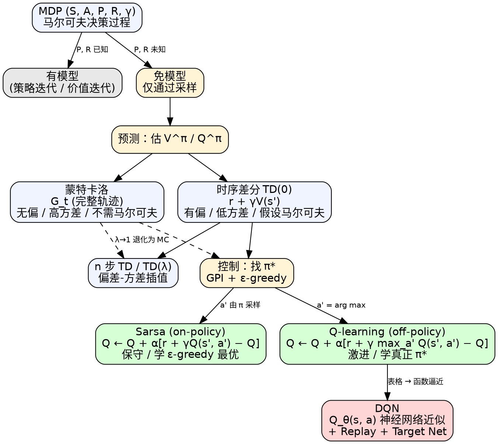

# 表格型方法（Tabular Methods）

> [!abstract] 一句话
> **表格型方法**用一张 $|\mathcal S|\times|\mathcal A|$ 的查找表 $Q(s,a)$ 显式存放每个状态-动作对的价值，通过**采样**（MC）或**自举**（TD）反复更新表项，再用 $\varepsilon$-greedy 改进策略。它是值函数方法的"原型"——当状态空间爆炸时，把这张表换成神经网络近似，就得到了 [[DQN教程|DQN]] 这类**函数逼近**方法。

---

## 1. 背景：MDP、模型与表格策略

### 1.1 马尔可夫决策过程（MDP）

强化学习是**带决策的序列预测**。环境用四元组 $(\mathcal S, \mathcal A, P, R)$ 描述（加 $\gamma$ 即五元组）：

| 符号 | 含义 | 关键性质 |
|---|---|---|
| $\mathcal S$ | 状态空间 | 表格行 |
| $\mathcal A$ | 动作空间 | 表格列 |
| $P(s'\mid s,a)$ | 状态转移概率 | **马尔可夫性**：下一状态只依赖当前 $(s,a)$ |
| $R(s,a)$ | 即时奖励函数 | 可以是随机变量 |
| $\gamma\in[0,1]$ | 折扣因子 | 控制远期奖励权重 |

> [!note] 马尔可夫性是 TD 类方法的底层假设
> "下一状态只取决于当前状态与动作"——这一点决定了后面 TD 能用 $V(s_{t+1})$ 替代未来所有回报，**这是 MC 与 TD 的核心方法论分歧的根**（详见 §2.3）。

### 1.2 有模型 vs 免模型

| 维度 | 有模型（model-based） | 免模型（model-free） |
|---|---|---|
| 是否已知 $P,R$ | ✅ 已知或可估计 | ❌ 仅能与环境交互采样 |
| 典型算法 | 策略迭代、价值迭代（DP） | MC、TD、Sarsa、Q-learning |
| 计算方式 | 解贝尔曼方程的迭代不动点 | 从轨迹**采样**估计 |
| 状态空间扩展性 | 大状态空间灾难 | 采样数随轨迹线性增长 |
| 现实场景 | 雅达利、机器人控制、股票等**高维或未知动态**的场景几乎都不可用（围棋反例：规则已知，AlphaGo 系用 MCTS 走 model-based 路线） | 主流选择 |

> [!warning] 现实里的 $P$ 大多虚构
> "熊发怒时装死成功率 0.8" 这种数字在第一次遇到熊时根本不存在。免模型方法不假装自己知道 $P$，**让 agent 自己试错估出来**。

### 1.3 Q 表格与"未来总奖励"

表格型方法的核心数据结构就是一张 Q 表：

|   | $a_1$ | $a_2$ | $\dots$ |
|---|---|---|---|
| $s_1$ | $Q(s_1,a_1)$ | $Q(s_1,a_2)$ | … |
| $s_2$ | … | … | … |

每一格存放 **"在 $s$ 选 $a$ 之后能拿到的未来总奖励"** 的估计：

$$
Q^\pi(s,a) = \mathbb E_\pi\!\left[\sum_{k=0}^{\infty}\gamma^k r_{t+k+1}\,\Big|\, s_t=s, a_t=a\right]
$$

> [!info] 为什么是"未来总奖励"而不是"即时奖励"
> 救护车闯红灯：单步奖励 $-100$，但把病人送到的远期奖励 $+10^6$。**奖励是延迟的，所以必须把目光放远；但又不能无限远**——10 年后股票涨跌不该影响今天的开盘决策——于是用 $\gamma$ 折扣。
>
> 悬崖行走的回溯（$\gamma=0.6$）演示了这一点：
>
> $$G_{12}=-1,\; G_{11}=-1+0.6\!\times\!(-1)=-1.6,\; G_{10}=-1.96,\; G_9\approx-2.18,\dots$$

---

## 2. 免模型预测：估计 $V^\pi$ 的两条路线

策略已给定的前提下，如何估出每个状态的价值？**MC 与 TD 是仅有的两条主流路线**。

### 2.1 蒙特卡洛（MC）：等一条轨迹结束、用真实回报算平均

给定策略 $\pi$，跑出一条完整轨迹 $(s_1,a_1,r_1,\dots,s_T)$，对每个被访问的状态 $s_t$ 算出实际回报：

$$
G_t = r_{t+1} + \gamma r_{t+2} + \gamma^2 r_{t+3} + \dots
$$

然后用经验平均估计：

$$
V(s) \approx \frac{1}{N(s)}\sum_{i=1}^{N(s)} G_t^{(i)}
$$

#### 增量更新形式

直接存所有 $G_t$ 算平均太费内存。用如下恒等式把"批平均"改成"增量更新"：

$$
\begin{aligned}
\mu_t &= \frac{1}{t}\sum_{j=1}^t x_j = \frac{1}{t}\big(x_t + (t-1)\mu_{t-1}\big) \\
&= \mu_{t-1} + \frac{1}{t}(x_t - \mu_{t-1})
\end{aligned}
$$

应用到状态价值：

$$
\boxed{\; V(s_t) \leftarrow V(s_t) + \alpha\big(G_t - V(s_t)\big) \;}
$$

> [!note] 为什么这步关键
> 把"全部样本均值"改写成"上一估计 + 残差 × 学习率"的形式——这是**所有在线值函数更新的统一模板**，后续 TD、Sarsa、Q-learning 都是这个壳，只是把 $G_t$ 换成不同的目标。$\alpha$ 既可以取 $1/N(s)$（无偏），也可以固定为小常数（适合非平稳环境，遗忘旧经验）。

> [!warning] naive MC 的两大痛点
> 1. **必须等到 episode 结束**才能更新——持续任务（continuing task）根本没有"结束"。
> 2. **回报方差极大**——$G_t$ 是一整条轨迹上所有随机奖励的累积和，方差随时间步线性甚至指数增长。

### 2.2 时序差分（TD）：往前走一步就更新，bootstrap

TD 的关键操作是**用估计的下一状态价值替换未来全部奖励之和**：

$$
G_t = r_{t+1} + \gamma G_{t+1} \;\xrightarrow{\text{bootstrap}}\; r_{t+1} + \gamma V(s_{t+1})
$$

代入 §2.1 的更新模板，得到 **TD(0)** 更新：

$$
\boxed{\; V(s_t) \leftarrow V(s_t) + \alpha\,\big[\,\underbrace{r_{t+1} + \gamma V(s_{t+1})}_{\text{TD target}} - V(s_t)\,\big] \;}\tag{3.1}
$$

其中 TD 目标 $r_{t+1}+\gamma V(s_{t+1})$ 之所以是"估计"，有两个原因：

1. $r_{t+1}$ 是从一次**采样**中得到（期望意义上的采样）；
2. $V(s_{t+1})$ 是**当前估计**而非真实 $V^\pi(s_{t+1})$（自举/bootstrap）。

差量 $\delta = r_{t+1}+\gamma V(s_{t+1}) - V(s_t)$ 称为**TD error**——巴甫洛夫条件反射的数学化：下一状态的价值"反过来"强化上一状态。

> [!success] aha：单步更新解锁了"在线学习"
> MC 必须等到 episode 终止；TD 只要走一步就能更新。开车上班遇到路口 A 堵车：MC 要等到到公司才会更新对 A 的预测，TD 在 A 堵的当下就已经把估计调过来了。

### 2.3 MC vs TD 对比（重点）

| 维度 | 蒙特卡洛（MC） | 时序差分（TD） |
|---|---|---|
| 目标值 | 实际回报 $G_t$ | $r_{t+1}+\gamma V(s_{t+1})$ |
| 是否 bootstrap | ❌ | ✅ |
| 是否采样 | ✅（整条轨迹） | ✅（单步） |
| 更新时机 | episode 结束后 | 每一步都能更新 |
| 在线学习 | ❌ | ✅ |
| 是否需要终止 | ✅（仅限 episodic 任务） | ❌（continuing 也行） |
| 偏差 | **无偏（first-visit）** / 渐近无偏（every-visit）：$G_t$ 是 $V^\pi$ 的样本 | 有偏（$V(s_{t+1})$ 是估计） |
| 方差 | **高**（整条轨迹的累积随机性） | 低（只含 $r_{t+1}$ 的随机性） |
| **是否假设马尔可夫性** | ❌ **不依赖马尔可夫假设** | ✅ **依赖马尔可夫假设**（用 $V(s_{t+1})$ 概括未来 = 假设下一状态足以决定未来分布） |
| 非马尔可夫环境表现 | 更稳健 | 可能偏差大 |
| 马尔可夫环境表现 | 浪费信息 | 学习更高效 |

> [!warning] 易错点：MC vs TD 的区别**不是"假设结果不同"，而是"是否做马尔可夫假设"**
> 初学者常把 MC 描述成"采样多所以更准"——这是错的。真正的方法论差别在于：TD 用 $V(s_{t+1})$ 概括未来，等价于断言"未来只依赖 $s_{t+1}$"，即**显式诉诸马尔可夫性**；MC 不做这个假设，只看实际跑出来的总回报，所以在部分可观测/非马尔可夫场景下反而更可靠。

### 2.4 $n$ 步 TD 与 TD($\lambda$)：在 MC 与 TD 之间插值

把 TD(0) 的"一步前看"推广到 $n$ 步：

$$
\begin{aligned}
n=1 \;(\text{TD}(0)) &: \quad G_t^{(1)} = r_{t+1} + \gamma V(s_{t+1}) \\
n=2 &: \quad G_t^{(2)} = r_{t+1} + \gamma r_{t+2} + \gamma^2 V(s_{t+2}) \\
&\;\;\vdots \\
n=\infty \;(\text{MC}) &: \quad G_t^{(\infty)} = r_{t+1} + \gamma r_{t+2} + \dots + \gamma^{T-t-1} r_T
\end{aligned}\tag{3.2}
$$

更新仍是 $V(s_t)\leftarrow V(s_t)+\alpha(G_t^{(n)}-V(s_t))$。

**TD($\lambda$)** 用衰减权重 $\lambda^{n-1}$ 对所有 $n$ 步回报加权求和：

$$
G_t^\lambda = (1-\lambda)\sum_{n=1}^\infty \lambda^{n-1} G_t^{(n)}
$$

- $\lambda=0$ → 退化为 TD(0)
- $\lambda=1$ → 退化为 MC
- 中间 $\lambda$：**偏差-方差权衡**的连续旋钮

> [!info] 统一视角（Sutton & Barto 经典图）
> - **DP**：广度大、深度浅（一步备份、扫所有后继 $s'$）
> - **MC**：广度小、深度大（一条轨迹到底）
> - **TD**：广度小、深度小（一条轨迹的一步）
> - **穷举搜索**：广度大、深度大（昂贵到不可行）

---

## 3. 免模型控制：从评估到改进

预测解决了"给定 $\pi$ 估 $V^\pi$"。**控制**问题是"找最优 $\pi^*$"。

### 3.1 GPI：广义策略迭代

经典策略迭代两步走：

$$
\underbrace{\pi\;\xrightarrow{\text{评估}}\; V^\pi}_{\text{policy evaluation}} \quad \underbrace{V^\pi \;\xrightarrow{\text{贪心}}\; \pi'}_{\text{policy improvement}}
$$

广义策略迭代（GPI）放宽两点：

1. 评估不需要做到收敛——一两步就更新策略也行；
2. 评估方法可以是 DP、MC 或 TD 中任一种。

但免模型情况下有个**结构性麻烦**：直接拿 $V$ 无法做贪心改进——

$$
\pi'(s) = \arg\max_a \big[R(s,a) + \gamma\sum_{s'}P(s'\mid s,a)V(s')\big]
$$

需要 $P,R$！**于是改估 $Q(s,a)$ 而非 $V(s)$**：直接

$$
\pi'(s) = \arg\max_a Q(s,a)
$$

不需要模型。这就是表格型控制都走 Q 而非 V 的根本原因。

### 3.2 $\varepsilon$-greedy 探索

如果一直 $\arg\max$，初始随机化的 Q 表会把 agent 锁在最早撞出 0 奖励的那条路径上——**探索不足**。$\varepsilon$-greedy 在每一步以小概率 $\varepsilon$ 随机选动作：

$$
\pi(a\mid s) = \begin{cases}
1-\varepsilon+\dfrac{\varepsilon}{|\mathcal A|} & a=\arg\max_{a'}Q(s,a') \\[6pt]
\dfrac{\varepsilon}{|\mathcal A|} & \text{otherwise}
\end{cases}
$$

> [!success] $\varepsilon$-greedy 的两个性质
> 1. **覆盖性**：所有 $(s,a)$ 在无限时间内被访问的概率为正——保证 Q 表所有格子可更新。
> 2. **单调改进**（即使带探索，策略也变好）：对任意 $\varepsilon$-greedy 策略 $\pi$，关于 $Q^\pi$ 的 $\varepsilon$-greedy 策略 $\pi'$ 满足 $V^{\pi'}(s)\geq V^\pi(s)$。证明：
> $$
> \begin{aligned}
> Q^\pi(s,\pi'(s)) &= \sum_a \pi'(a\mid s)\, Q^\pi(s,a)  && \leftarrow\ \text{Q 与策略的定义}\\
> &= \tfrac{\varepsilon}{|\mathcal A|}\sum_a Q^\pi(s,a) + (1-\varepsilon)\max_a Q^\pi(s,a) && \leftarrow\ \text{代入 ε-greedy 概率}\\
> &\geq \tfrac{\varepsilon}{|\mathcal A|}\sum_a Q^\pi(s,a) + (1-\varepsilon)\sum_a \tfrac{\pi(a\mid s)-\varepsilon/|\mathcal A|}{1-\varepsilon}Q^\pi(s,a) && \leftarrow\ \max \geq\text{ 凸组合}\\
> &= \sum_a \pi(a\mid s) Q^\pi(s,a) = V^\pi(s)
> \end{aligned}
> $$
> 关键不等号：把 $\max$ 换成"按某概率分布加权和"——后者不大于前者。
> 由此得到 $Q^\pi(s,\pi'(s))\geq V^\pi(s)$，再由[[马尔可夫决策过程教程|策略改进定理（policy improvement theorem）]]推开后继状态，即可得 $V^{\pi'}(s)\geq V^\pi(s)$。

#### $\varepsilon$ 退火（annealing）

**$\varepsilon$ 必须随训练衰减**，否则即使收敛后仍保留固定比例随机动作，性能受限。典型形式：

- 线性：$\varepsilon_k = \max(\varepsilon_{\min},\, 1 - k/K)$
- 指数：$\varepsilon_k = \varepsilon_{\min} + (\varepsilon_0-\varepsilon_{\min})\exp(-k/\tau)$

> [!warning] $\varepsilon$ 不退火 → 无法收敛到确定性最优策略 $\pi^*$
> 固定 $\varepsilon$ 的 ε-greedy 仍会收敛，但收敛目标是"$\varepsilon$-soft 类策略中的最优"（始终保留 $\varepsilon$ 比例随机），性能严格劣于真正的 $\pi^*$。
> 想收敛到 $\pi^*$ 需满足 **GLIE 条件**（Greedy in the Limit with Infinite Exploration）：极限处贪心 + 每个 $(s,a)$ 探索次数无穷大——这就是 $\varepsilon$ 退火（且足够慢，如 $\varepsilon_k=1/k$）的理论根据。

---

## 4. Sarsa：on-policy TD 控制

Sarsa 把 TD(0) 的 $V$-估计搬到 $Q$-估计上：

$$
\boxed{\; Q(s_t,a_t) \leftarrow Q(s_t,a_t) + \alpha\big[\,r_{t+1} + \gamma Q(s_{t+1}, a_{t+1}) - Q(s_t,a_t)\,\big] \;}\tag{3.4}
$$

> [!note] 名字的由来：(**S**,**A**,**R**,**S'**,**A'**) 五元组
> 一次更新需要五个量——当前 $s_t,a_t$、奖励 $r_{t+1}$、下一状态 $s_{t+1}$、**以及由当前策略 $\pi$ 实际采样得到的下一动作 $a_{t+1}$**。最后这个 $a_{t+1}$ 是 Sarsa 与 Q-learning 的分水岭。

### 4.1 为什么是 on-policy

更新目标里的 $Q(s_{t+1}, a_{t+1})$ 中，$a_{t+1}$ 由**当前执行的同一策略** $\pi$ 采样产生（即 $\varepsilon$-greedy 自己选的）。这意味着：

- **学的策略 = 用的策略**。
- 如果 $\pi$ 会以 $\varepsilon$ 概率随机走到悬崖，Sarsa 在 $Q$ 表更新时就**把这种"探索掉下去"的风险计入价值**，从而学到一条"远离悬崖、留有缓冲"的保守路径。

### 4.2 算法伪代码

> [!example] Sarsa 算法
> ```
> 初始化 Q(s,a) 任意值，终止状态置 0
> 循环每个 episode:
>     初始化 s
>     用 ε-greedy(Q, s) 采样动作 a
>     循环每一步：
>         执行 a，观察 r, s'
>         用 ε-greedy(Q, s') 采样下一动作 a'
>         Q(s,a) ← Q(s,a) + α[r + γ Q(s',a') - Q(s,a)]
>         s, a ← s', a'
>     until s 是终止状态
> ```

可推广到 $n$ 步 Sarsa：把 $r_{t+1}+\gamma Q(s_{t+1},a_{t+1})$ 换成 $n$ 步 Q 回报；进一步用 $\lambda$ 加权所有 $n$ 步即得 **Sarsa($\lambda$)**：

$$
Q_t^\lambda = (1-\lambda)\sum_{n=1}^\infty \lambda^{n-1} Q_t^{(n)},\quad Q(s_t,a_t)\leftarrow Q(s_t,a_t)+\alpha\big(Q_t^\lambda - Q(s_t,a_t)\big)
$$

---

## 5. Q-learning：off-policy TD 控制

Q-learning 的更新长得几乎一样——**只把 $Q(s_{t+1},a_{t+1})$ 换成 $\max_{a'} Q(s_{t+1}, a')$**：

$$
\boxed{\; Q(s_t,a_t) \leftarrow Q(s_t,a_t) + \alpha\big[\,r_{t+1} + \gamma \max_{a'} Q(s_{t+1}, a') - Q(s_t, a_t)\,\big] \;}
$$

### 5.1 行为策略 vs 目标策略

| 角色 | 符号 | 用途 | Q-learning 具体形式 |
|---|---|---|---|
| **行为策略 $\mu$** | behavior | 与环境交互、采集数据 | $\varepsilon$-greedy（含探索） |
| **目标策略 $\pi$** | target | 被学习/被优化 | 纯贪心 $\arg\max_a Q$ |

行为策略像"激进的海盗"出海采数据，目标策略是"后方的军师"靠这些数据学最优兵法——**两个策略不必相同，这就是 off-policy**。

> [!note] 为什么 Q-learning 是 off-policy：$\max$ 不依赖于 behavior policy
> Sarsa 目标里的 $a_{t+1}$ 由当前 $\pi$ 采样得到——下一步是什么、目标就用什么，二者绑定。
>
> Q-learning 目标里的 $\max_{a'}Q(s_{t+1},a')$ **只看 Q 表**，与实际下一步执行的动作无关。哪怕 behavior 此刻随机乱走，目标值算的依然是"假设接下来按贪心走能拿多少"。学的就是 $\pi=\arg\max Q$ 这条**目标策略**，与采数据的 $\mu$ 解耦。
>
> 这也解释了"为什么 Q-learning 更新公式里没有 $a_{t+1}$"——它根本不需要知道实际下一动作。

### 5.2 算法伪代码

> [!example] Q-learning 算法
> ```
> 初始化 Q(s,a) 任意值，终止状态置 0
> 循环每个 episode:
>     初始化 s
>     循环每一步：
>         用 ε-greedy(Q, s) 采样动作 a       ← 行为策略
>         执行 a，观察 r, s'
>         Q(s,a) ← Q(s,a) + α[r + γ max_a' Q(s',a') - Q(s,a)]   ← max 用目标策略
>         s ← s'
>     until s 是终止状态
> ```

与 Sarsa 的差别只有一处：更新公式里的 $Q(s',a')$ 替换为 $\max_{a'}Q(s',a')$，**且不需要在执行前确定 $a'$**。

### 5.3 异策略学习的三大好处

1. **样本复用**：旧策略采集的轨迹可以用来更新新的目标策略（这正是 [[DQN教程|DQN]] 的 Replay Buffer 能成立的根本原因）。
2. **可学习他者轨迹**：人类示范、其他智能体的经验都能"喂"进来 → 模仿学习。
3. **探索/学习解耦**：行为策略可以激进探索，目标策略稳定优化。

---

## 6. Sarsa vs Q-learning：本质对比（重磅章节）

### 6.1 对比表

| 维度 | **Sarsa**（on-policy） | **Q-learning**（off-policy） |
|---|---|---|
| 更新目标 | $r_{t+1}+\gamma Q(s_{t+1}, \mathbf{a_{t+1}})$ | $r_{t+1}+\gamma \max_{a'} Q(s_{t+1}, a')$ |
| 下一动作来源 | 当前 $\pi$（$\varepsilon$-greedy）**采样**得到 | 由 $\max$ 直接选出（不实际执行） |
| 行为策略 vs 目标策略 | **同一个**（都是 $\varepsilon$-greedy） | **分离**（行为=$\varepsilon$-greedy；目标=贪心） |
| 收敛策略 | $\varepsilon$-greedy 最优 | **真正最优** $\pi^*$ |
| 学习的 Q 值 | $Q^{\varepsilon\text{-greedy}}$（把探索风险计入） | $Q^*$（不考虑探索风险） |
| 风格 | 保守、求稳 | 激进、求最优 |
| 是否需要 $a_{t+1}$ | ✅ | ❌ |
| 数据复用（replay） | ❌（旧数据已不符合当前 $\pi$） | ✅ |
| 著名后裔 | Expected Sarsa、Sarsa($\lambda$) | [[DQN教程|DQN]]、Double DQN、Rainbow |

### 6.2 Cliff Walking：Sarsa 保守、Q-learning 激进


*图 3.9 · 悬崖行走问题（[Easy-RL 第 3 章](https://datawhalechina.github.io/easy-rl/#/chapter3/chapter3)）。S 出发、G 终点，下方一整排格子是悬崖，每步 $-1$、掉下悬崖 $-100$ 并被弹回 S。*

> [!info] 类比：两条路的选择
> - **红线**：沿悬崖边走最短路径，每步紧贴危险——Q-learning 喜欢这条，因为它假设下一步按 $\max$ 贪心走、不会失误。
> - **蓝线**：先上去一格、远离悬崖再走——Sarsa 喜欢这条，因为它知道自己以 $\varepsilon$ 概率会"手抖"随机一步，紧贴悬崖时这一抖就是 $-100$，提前把这个风险吸收进 Q 值。
>
> 训练阶段（含探索），Sarsa 的实际收益往往**反而高于** Q-learning，因为它走的路在自己的探索行为下更安全。但若部署时关掉探索，Q-learning 收敛到的策略才是真正最短路径。

> [!warning] "Q-learning 学得更好" ≠ "Q-learning 用起来效果更好"
> 评价语境很重要：
> - **离线学到的最优策略**：Q-learning 胜（学到 $\pi^*$）。
> - **训练过程中的累积回报**：Sarsa 经常更高（因为 Sarsa 自己跑出来的轨迹更稳）。
> 这一点在 Sutton & Barto 6.5 节 cliff walking 实验里有著名的对照曲线。

---

## 7. Cheat Sheet

### 7.1 Sarsa 最小实现（numpy 风格）

```python
import numpy as np
Q = np.zeros((nS, nA))               # Q 表，行=状态、列=动作
def eps_greedy(s, eps):
    return np.random.randint(nA) if np.random.rand() < eps else int(np.argmax(Q[s]))

for ep in range(N):
    s = env.reset(); a = eps_greedy(s, eps)
    done = False
    while not done:
        s2, r, done, _ = env.step(a)                       # Gym ≤ 0.25 旧 API
        # Gym 0.26+ / Gymnasium:
        # s2, r, terminated, truncated, _ = env.step(a); done = terminated or truncated
        a2 = eps_greedy(s2, eps)                           # ← 由 π 采样的下一动作
        target = r + gamma * Q[s2, a2] * (1 - done)        # done 时切断 bootstrap
        Q[s, a] += alpha * (target - Q[s, a])
        s, a = s2, a2
    eps = max(eps_min, eps * eps_decay)                    # ε 退火
```

### 7.2 Q-learning 最小实现

```python
import numpy as np
Q = np.zeros((nS, nA))
def eps_greedy(s, eps):
    return np.random.randint(nA) if np.random.rand() < eps else int(np.argmax(Q[s]))

for ep in range(N):
    s = env.reset(); done = False
    while not done:
        a = eps_greedy(s, eps)                             # 行为策略 ε-greedy
        s2, r, done, _ = env.step(a)                       # Gym ≤ 0.25 旧 API
        target = r + gamma * Q[s2].max() * (1 - done)      # max 不依赖 a'；done 时切断 bootstrap
        Q[s, a] += alpha * (target - Q[s, a])
        s = s2
    eps = max(eps_min, eps * eps_decay)
```

唯一差别就是更新目标：`Q[s2, a2]` vs `Q[s2].max()`。两段代码都用 `* (1 - done)` 显式 mask 终止状态——否则只有"终止状态格子永远不被覆盖"才能碰巧正确，更脆弱。

### 7.3 常见坑

> [!summary] 表格型方法的工程陷阱
> - **$\alpha$ 太大**：Q 值震荡甚至发散；典型范围 $0.01\sim 0.5$，环境噪声大就压小。
> - **$\varepsilon$ 不退火**：永远保留固定比例随机动作，无法收敛到最优；至少线性衰减到 $0.01\sim 0.05$。
> - **Q 表初始化全 0 vs 乐观初始化**：乐观初始化（如全设为 $r_{\max}/(1-\gamma)$）会主动驱动 agent 尝试未访问过的动作——一种隐式探索机制。
> - **$\gamma$ 取错**：$\gamma=1$ 在无终止任务里 $G_t$ 发散；$\gamma$ 太小 agent 看不到远期奖励。常用 $0.9\sim 0.99$。
> - **状态-动作维度灾难**：$|\mathcal S|\times|\mathcal A|$ 表格在围棋（$10^{170}$ 状态）、Atari（像素状态）上**根本无法分配内存** → 必须改用函数逼近，即 [[DQN教程|DQN]]。
> - **奖励标度**：所有 $r$ 集中在 $[-1,1]$ 学得更稳；稀疏奖励要 reward shaping 或好奇心驱动。
> - **Sarsa 训练曲线 > Q-learning 不等于 Sarsa 更优**：评估时必须关掉 $\varepsilon$（greedy 评估）才能比目标策略质量。
> - **Q-learning 的 maximization bias**：$\max_a$ 引入正向偏差（noisy Q 的最大值期望 > 真实最大值的期望）→ Double Q-learning 是经典修正。

---

## 8. 一图总览



**配色说明**：浅蓝=起点定义；浅黄=问题阶段；浅绿=表格型算法；浅红=函数逼近后裔（[[DQN教程|DQN]]）。

---

## 9. 关联笔记

- [[马尔可夫决策过程教程|马尔可夫决策过程]]：本章的形式化基础。
- [[策略梯度教程|策略梯度]]：另一条主路线——不学 Q 而直接学策略；与表格型的"先评估再贪心"形成方法论对照。
- [[DQN教程|DQN]]：把这张表换成神经网络 $Q_\theta(s,a)$，加 Replay Buffer 与 Target Network——本质上是**表格型 Q-learning 在大状态空间下的函数逼近版**。
- [[Actor-Critic教程|Actor-Critic]]：把 §2 的 TD 评估（critic）和 [[策略梯度教程|策略梯度]] 的策略学习（actor）拼起来。
- [[PPO教程|PPO]]：在 Actor-Critic 上加 clip ratio，是当今最广泛使用的策略优化方法。

**原文**：[Easy-RL 第 3 章 · 表格型方法](https://datawhalechina.github.io/easy-rl/#/chapter3/chapter3)
