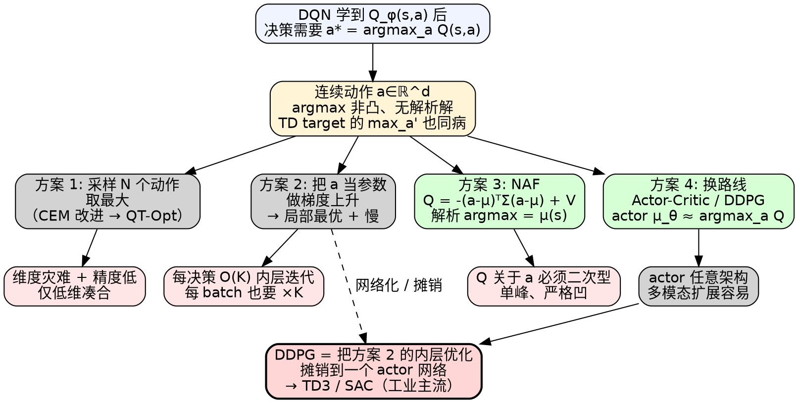

# 连续动作下的深度 Q 网络

> [!abstract] 一句话
> [[DQN教程|DQN]] 在连续动作上的根本难题是 $a^* = \arg\max_a Q_\phi(s,a)$ **不可解**——动作不再是有限集，无法枚举。本章给出 4 条出路：**(1) 采样近似 argmax**、**(2) 梯度上升求 $a^*$**、**(3) 把 Q 网络设计成解析可解的二次型（[[NAF]]）**、**(4) 干脆放弃 DQN 换 [[Actor-Critic教程|Actor-Critic]] / [[DDPG]]**。前三条是"在 DQN 框架内打补丁"，第四条是"换路线"——也是工业界的最终选择。

---

## 1. 背景：为什么连续动作让 DQN 失效

### 1.1 DQN 的"决策步"必须解一个 argmax

[[DQN教程|DQN]] 学到 $Q_\phi(s,a)$ 之后，**贪心策略**就是

$$
\pi_\phi(s) = \underset{a}{\arg\max}\; Q_\phi(s,a) \tag{8.1}
$$

离散动作下这步几乎免费——网络结构 (b) 直接输出 $|\mathcal A|$ 维向量，一次 `argmax` 取下标即可。但**连续动作**下：

- $\mathcal A \subseteq \mathbb R^d$ 是连续空间（$d$ 维方向盘角度、$d=50$ 个机器人关节角度…）
- $\arg\max_a Q_\phi(s,a)$ 是个**非凸优化问题**，没有解析解
- 每次决策都要解一次——而决策频率可能是 50Hz、100Hz

### 1.2 "评估容易、决策难" 的不对称

> [!warning] DQN 在连续动作下的尴尬
> 训练目标 $y = r + \gamma \max_{a'} Q_{\hat\phi}(s', a')$ 里那个 $\max_{a'}$，**离散时是查表，连续时也是 argmax**。也就是说连续动作下 DQN 的痛点是双倍的：**选动作要解 argmax，构造 TD 目标也要解 argmax**——每个 batch、每个样本都要解。

### 1.3 离散 vs 连续动作场景

| 场景 | 动作空间 | 例子 |
|---|---|---|
| 离散 | 有限集 $\mathcal A=\{a_1,\dots,a_K\}$ | 雅达利（上/下/左/右/开火）、围棋落子 |
| 连续低维 | $\mathcal A\subseteq\mathbb R^{1\sim 6}$ | 方向盘角度、油门、二轮平衡车 |
| 连续高维 | $\mathcal A\subseteq\mathbb R^{20\sim 100}$ | 人形机器人 50 关节、机械臂 7-DoF |

> [!info] 经验法则
> $d \le 3$ 时，4 个方案中**任何一个**都能凑合用；$d \ge 10$ 时，方案 1（采样）和方案 2（梯度上升）的成本/精度比迅速恶化，工业界基本只剩方案 3（NAF）和方案 4（DDPG/SAC）。

---

## 2. 形式化问题

设状态 $s\in\mathcal S$，连续动作 $a\in\mathcal A\subseteq\mathbb R^d$，神经网络 $Q_\phi:\mathcal S\times\mathcal A\to\mathbb R$。每次决策需要

$$
a^*(s) = \underset{a\in\mathcal A}{\arg\max}\; Q_\phi(s, a) \tag{8.2}
$$

> [!note] 这不是一个新问题，是 DQN 框架的"未实现部分"
> 注意 $(8.2)$ 在 tabular 时代根本不存在——表格的 argmax 是 $O(|\mathcal A|)$ 的查表。是**函数近似 + 连续动作**联手催生了这个 argmax 难题。

下面 4 节分别给一个解法。

---

## 3. 方案 1：采样 N 个动作取最大（Sampled argmax）

### 3.1 思路

在动作空间上**均匀（或某分布上）采样 $N$ 个候选**：

$$
\{a_1, a_2, \dots, a_N\} \overset{\text{iid}}{\sim} U(\mathcal A)
$$

把它们一次性塞进 GPU，得到 $N$ 个 Q 值，取最大：

$$
\hat a^*(s) = \underset{a_i,\, i=1..N}{\arg\max}\; Q_\phi(s, a_i) \tag{8.3}
$$

> [!info] 为什么"采样近似"在工程上还能用
> GPU 的批处理特性使得对 $N$ 个候选动作的 Q 值评估可以在**单次 forward** 中完成——把状态 $s$ 复制 $N$ 份与 $\{a_i\}$ 拼接成一个 $(N, s\text{-dim}+a\text{-dim})$ 的 batch，一次推理拿到 $N$ 个 Q 值。所以采样方案的代价是 1 次 forward + $N$ 个候选评估，在 $N \le 10^4$ 时几乎和单次 forward 同量级。这是原文 8.1"不会太低效"那句话背后的工程依据。

### 3.2 优缺点

| 维度 | 评价 |
|---|---|
| 实现 | 极简——一次 batch forward |
| 速度 | GPU 并行下不算慢，但 $N$ 越大越慢 |
| 精度 | **次优**——$N$ 不够大时漏掉最优区域 |
| 维度灾难 | $d$ 维空间均匀采样 $N$ 个点，**覆盖率随 $d$ 指数衰减**——这是致命问题 |

> [!warning] 维度灾难（curse of dimensionality）
> 想用同样的"密度"覆盖 $d$ 维空间，所需采样数随 $d$ 指数增长。$d=2,N=100$ 还能用；$d\ge 6$ 后朴素均匀采样很快就不够分辨率，必须借助 CEM 等智能采样方案。**所以方案 1 单独用只在低维（$d\le 3$）凑合**。

### 3.3 改进：用 CEM / CMA-ES 智能采样

> [!tip] 进阶
> [[QT-Opt]]（Google 2018，机器人抓取）就是用 **Cross-Entropy Method** 迭代式地缩小采样分布范围——先粗采样、把 top-K 拟合成新高斯、再细采样，2~3 轮就收敛。这是"采样近似 argmax"在工业上能用起来的关键 trick。

---

## 4. 方案 2：梯度上升求 $a^*$

### 4.1 思路

既然 $a\mapsto Q_\phi(s,a)$ 可微（神经网络对输入可导），就**把 $a$ 当参数，对 Q 做梯度上升**：

$$
a^{(k+1)} = a^{(k)} + \eta\, \nabla_a Q_\phi(s, a)\big|_{a=a^{(k)}} \tag{8.4}
$$

迭代到收敛即得 $a^*$。

### 4.2 优缺点

| 维度 | 评价 |
|---|---|
| 精度 | 比采样高（沿梯度走，不是盲撒点） |
| 速度 | **慢**——每次决策要内层迭代 $K$ 步 |
| 全局性 | $Q_\phi$ 关于 $a$ **非凸**——只能找到局部极值 |
| 可微性 | 要求 $Q_\phi$ 对 $a$ 可导（神经网络天然满足） |

> [!warning] naive 做法的痛点
> "决策一次 = 跑一次内层优化"——对 50Hz 控制频率（每 20ms 决一次），内层即使只迭代 10 步也吃不消。而且 TD 目标里的 $\max_{a'}$ 也要这么算，**训练时每个 batch 都要在 $a'$ 上跑一轮内层梯度上升**——训练时间瞬间膨胀。

> [!info] 历史地位
> 方案 2 的思路最终演化成 [[DDPG]]：与其每次决策都做一次内层梯度上升，**不如训练一个"近似 argmax 的网络" $\mu_\theta(s) \approx \arg\max_a Q_\phi(s,a)$**——这就是 actor。决策时直接 $a = \mu_\theta(s)$，是常数时间。**DDPG = 把方案 2 的内层优化"摊销"到一个 actor 网络里**。

---

## 5. 方案 3：设计 Q 网络让 argmax 解析可解（NAF）

### 5.1 核心思路：把 Q 写成关于 $a$ 的二次型

如图 8.1（原文图），输入状态 $s$ 后，网络输出**三件套**：

- $\boldsymbol\mu(s)\in\mathbb R^d$：动作均值向量
- $\boldsymbol\Sigma(s)\in\mathbb R^{d\times d}$：正定的"形状/曲率"矩阵（即 NAF 论文里的 $P(s)$，控制 Q 在 $a$ 维度上的下凹程度，本质不是协方差也不是精度矩阵）
- $V(s)\in\mathbb R$：状态价值

Q 函数定义为：

$$
\boxed{\;Q_\phi(s,a) \;=\; -\big(a-\boldsymbol\mu(s)\big)^{\!\top}\boldsymbol\Sigma(s)\big(a-\boldsymbol\mu(s)\big) \;+\; V(s)\;} \tag{8.5}
$$

> [!note] 与 NAF 论文的小差别
> NAF 原论文 (Gu et al. 2016) 写的是 $-\frac12(a-\mu)^\top P(a-\mu)+V$，多一个 $\frac12$ 系数。这个系数可以吸收进 $\boldsymbol\Sigma$ 内部，不影响最优解 $a^*=\mu(s)$ 的形式，所以 easyrl 原文与本教程都省略——读论文时注意一致即可。


*图 8.1 · NAF 网络结构示意：输入 $s$，输出 $\mu(s),\Sigma(s),V(s)$ 三件套（[Easy-RL 第 8 章](https://datawhalechina.github.io/easy-rl/#/chapter8/chapter8)）*

### 5.2 为什么 argmax 立刻可解

$\boldsymbol\Sigma(s)$ 是正定矩阵 $\Rightarrow$ 二次型 $(a-\mu)^\top\Sigma(a-\mu)\ge 0$，前面带负号，所以这一项**最大值为 0**，且取最大值时

$$
a-\boldsymbol\mu(s) = \mathbf 0 \;\Longleftrightarrow\; \boxed{\;a^*(s) = \boldsymbol\mu(s)\;} \tag{8.6}
$$

代入 $(8.5)$ 立得 $Q_\phi(s, a^*) = V(s)$——这正是状态价值的语义。

> [!success] aha moment
> 这个设计把"求 argmax"直接绑到了网络的输出上：**$\mu(s)$ 既是参数，又是 argmax 的解**。决策时一次前向，读 $\mu$ 即可；构造 TD 目标的 $\max_{a'} Q(s',a')$ 也变成一次前向读 $V(s')$——和离散 DQN 一样快。

### 5.3 正定性如何保证：Cholesky 参数化

$\boldsymbol\Sigma(s)$ 不能让网络"裸输出"——非对称、非正定都不行。NAF 的工程做法：

1. 网络输出一个 $d(d+1)/2$ 维向量，组装成**下三角矩阵** $\boldsymbol L(s)$
2. 强制对角线为正（用 `softplus` 或 `exp`）
3. 令

$$
\boldsymbol\Sigma(s) = \boldsymbol L(s)\,\boldsymbol L(s)^{\!\top} \tag{8.7}
$$

$\boldsymbol L\boldsymbol L^\top$ 永远半正定；对角正 $\Rightarrow$ 严格正定。这就是 **Cholesky 分解参数化**。

> [!note] 为什么不直接输出 $\Sigma$
> 直接输出 $d^2$ 个元素 + 对称化 + 加单位阵保证正定，**约束太复杂、训练不稳定**。Cholesky 用 $d(d+1)/2$ 个无约束实数就能描述任意正定矩阵，是天然参数化。

### 5.4 Dueling 视角

$(8.5)$ 可改写为 $Q(s,a) = A(s,a) + V(s)$，其中 $A(s,a) = -(a-\mu)^\top\Sigma(a-\mu) \le 0$ 是**优势函数**——这正是 [[Dueling DQN]] 的 $Q = A + V$ 分解，只是 NAF 用解析的二次型表达 $A$。

### 5.5 优缺点

| 维度 | 评价 |
|---|---|
| argmax | **解析可解**——$O(1)$ 取 $\mu(s)$ |
| 速度 | 决策、训练目标都和离散 DQN 同速 |
| 表达力 | **受限**——Q 关于 $a$ 必须是二次型，单峰、严格凹 |
| 多模态最优 | 表达不了（真实 Q 可能有多个局部极值） |
| 高维动作 | $\Sigma$ 是 $d\times d$，$d$ 大时参数膨胀，但仍可控 |

> [!warning] 表达力是天花板
> NAF 假设最优 Q 在每个 $s$ 下关于 $a$ **单峰、二次**——这是很强的假设。比如机械臂"绕障"任务，绕左和绕右两条路径 Q 值都很高，是双峰；NAF 强行拟合成单峰，就会找出一个折中的"穿障"动作，明显次优。**这是 NAF 在 SOTA 排行榜上输给 DDPG/SAC 的根本原因**。

> [!info] 论文出处
> NAF（Normalized Advantage Functions）由 Gu, Lillicrap et al. 2016 提出（[Continuous Deep Q-Learning with Model-based Acceleration](https://arxiv.org/abs/1603.00748)）。

---

## 6. 方案 4：放弃 DQN，改走 Actor-Critic / DDPG

### 6.1 核心承认：DQN 不适合连续动作

前三个方案都在试图"修补 DQN"，但每一种都付了代价（精度、速度、表达力）。最干脆的选择是：**改换一条路线**。

### 6.2 [[Actor-Critic教程|Actor-Critic]]：基于价值 + 基于策略 的融合

引入**两个网络**：

| 网络 | 角色 | 输出 |
|---|---|---|
| Actor $\pi_\theta(a\mid s)$ | 演员，决定动作 | 动作（连续/离散都可） |
| Critic $Q_\phi(s,a)$ 或 $V_\phi(s)$ | 评论员，评估动作 | 标量价值 |

**Actor 直接输出动作 → 跳过 argmax**。Critic 提供低方差的策略梯度信号（替代 [[策略梯度教程|策略梯度]] 中的 MC 回报 $G_t$）。

### 6.3 [[DDPG]]：DQN 的连续动作版

DDPG = **Deep Deterministic Policy Gradient**。本质：**DPG 定理（Silver 2014）提供确定性策略的梯度计算方式 + DQN 的工程稳定化方案（replay buffer + target network）**——两者融合用于连续动作：

| 组件 | DQN | DDPG |
|---|---|---|
| 网络 | $Q_\phi$ 一个 | $\mu_\theta$（actor） + $Q_\phi$（critic） 两个 |
| 决策 | $\arg\max_a Q$ | $a = \mu_\theta(s)$（**actor 近似 argmax**） |
| 目标网络 | $Q_{\hat\phi}$ | $\mu_{\hat\theta}, Q_{\hat\phi}$ 各一份 |
| 经验回放 | 是 | 是 |
| 探索 | $\varepsilon$-greedy | 动作上加噪声（OU / Gaussian） |
| 软更新 | 硬同步（每 C 步） | **Polyak 软更新** $\hat\phi\leftarrow\tau\phi+(1-\tau)\hat\phi$ |

> [!success] DDPG 的本质
> **训练一个 actor 网络去近似 $\arg\max_a Q_\phi(s,a)$**——这正是方案 2"梯度上升"的网络化、摊销化版本。Actor 的训练目标是

$$
\nabla_\theta J(\theta) = \mathbb E_{s\sim\rho^\mu}\big[\nabla_\theta\, Q_\phi(s, \mu_\theta(s))\big]
= \mathbb E_{s\sim\rho^\mu}\big[\nabla_a Q_\phi(s,a)\big|_{a=\mu_\theta(s)}\cdot \nabla_\theta \mu_\theta(s)\big]
\tag{8.8}
$$

这就是 **deterministic policy gradient** 定理（Silver et al. 2014）：actor 沿着"提升 Q 的方向"更新。其中 $\rho^\mu$ 是 actor 自身策略下的状态分布；DDPG off-policy 实现里实际用 replay buffer 的状态近似（$\rho^\beta$），这一近似偏差也是后续 [[TD3]] / [[SAC]] 反复讨论的点。

### 6.4 后续演化

[[DDPG]] → [[TD3]]（Twin Delayed DDPG，双 critic 缓解 Q 高估）→ [[SAC]]（Soft Actor-Critic，加最大熵正则提升探索 / 鲁棒性）。这条线是**连续动作 RL 的工业主流**。


*图 8.2 · 基于策略（PPO）+ 基于价值（DQN）= 演员-评论员（[Easy-RL 第 8 章](https://datawhalechina.github.io/easy-rl/#/chapter8/chapter8)）*

---

## 7. 四方案对比

| 维度 | 方案 1 采样 | 方案 2 梯度上升 | 方案 3 NAF | 方案 4 DDPG/AC |
|---|---|---|---|---|
| 决策时复杂度 | $O(N)$ 一次 batch | $O(K)$ 内层迭代 | $O(1)$ 读 $\mu(s)$ | $O(1)$ 读 $\mu_\theta(s)$ |
| 训练目标 argmax | 同采样 | 同梯度上升 | 解析（读 $V$） | 通过 actor 近似 |
| 精度 | 低（次优） | 中（局部极值） | 中（受二次型限制） | 高（actor 可拟合复杂多峰） |
| 高维动作 ($d\ge 10$) | 维度灾难 | 慢 | 参数 $d^2$，可控 | 可扩展（actor 任意架构） |
| 多模态最优 | 可（采到就行） | 不行（单点收敛） | **不行**（强单峰） | 单 actor 也是单峰，但可扩展到多 actor |
| 工程稳定性 | 简单 | 较难调 | 中（Cholesky 实现细节） | 中（target + soft update + 噪声） |
| 工业落地 | 玩具 / 低维 | 罕见 | 学术 / 简单连续控制 | **工业主流**（机器人、自动驾驶） |
| 算法代表 | 采样 + CEM ([[QT-Opt]]) | iLQR-style 内层优化 | [[NAF]] | [[DDPG]] / [[TD3]] / [[SAC]] |

> [!summary] 选型法则
> - **离散 + 中维**：DQN
> - **连续 + 低维 + 单峰**：NAF
> - **连续 + 任意维 + 多模态**：DDPG / TD3 / SAC（首选）
> - **采样 / 梯度上升**这两条路在现代 RL 里基本只作为"理解 DQN→DDPG 演化的中间形态"出现，单独使用几乎绝迹

---

## 8. Cheat Sheet

### 8.1 NAF 最小代码（PyTorch 风格）

```python
import torch, torch.nn as nn, torch.nn.functional as F

class NAFNet(nn.Module):
    def __init__(self, s_dim, a_dim, h=256):
        super().__init__()
        self.a_dim = a_dim
        self.body = nn.Sequential(nn.Linear(s_dim, h), nn.ReLU(),
                                  nn.Linear(h, h), nn.ReLU())
        self.mu_head = nn.Linear(h, a_dim)               # μ(s)
        self.V_head  = nn.Linear(h, 1)                   # V(s)
        self.L_head  = nn.Linear(h, a_dim*(a_dim+1)//2)  # 下三角的 d(d+1)/2 个元素

    def decide(self, s):
        """决策路径：只前向到 μ(s) 即可，跳过 Σ 的组装，省时间。"""
        h = self.body(s)
        return self.mu_head(h)                            # (B, d)

    def forward(self, s, a):
        """训练路径：返回 (Q, mu, V) 三件套。"""
        h  = self.body(s)
        mu = self.mu_head(h)                              # (B, d)
        V  = self.V_head(h)                               # (B, 1)

        # 组装下三角 L，对角线 softplus 保证正（device 必须跟随 s，否则 GPU 会崩）
        B, d = mu.shape
        L = torch.zeros(B, d, d, device=s.device, dtype=s.dtype)
        tril_idx = torch.tril_indices(d, d, device=s.device)
        L[:, tril_idx[0], tril_idx[1]] = self.L_head(h)
        diag = torch.arange(d, device=s.device)
        L[:, diag, diag] = F.softplus(L[:, diag, diag])   # 对角线 > 0
        Sigma = L @ L.transpose(-1, -2)                   # (B, d, d) 严格正定

        # Q = -(a-μ)ᵀ Σ (a-μ) + V
        diff = (a - mu).unsqueeze(-1)                     # (B, d, 1)
        adv  = -diff.transpose(-1, -2) @ Sigma @ diff     # (B, 1, 1)
        Q    = adv.squeeze(-1) + V                        # (B, 1)
        return Q, mu, V

# 训练目标（离散 DQN 的 max_a' Q(s',a') 直接换成 V(s')）：
# y = r + γ * (1 - done) * V_target(s')
```

### 8.2 常见坑

> [!summary] 提交前自查
> - **正定性**：$\Sigma$ 必须严格正定。**NAF 原论文用 `exp` 处理对角线**，工程实践常换成更稳的 `softplus`（exp 易爆炸 / 梯度消失）；想更稳就加 $\Sigma\leftarrow\Sigma+\epsilon I$（$\epsilon\sim 10^{-3}$）兜底
> - **下三角索引**：`torch.tril_indices(d,d)` 给出 $(2, d(d+1)/2)$，按这个顺序填 `L_head` 的输出，行列别填反
> - **决策 vs 训练两条路径**：决策只前向到 $\mu$，不要算 $\Sigma$（省时间）；只有训练算 Q 时才需要装 $\Sigma$
> - **TD 目标的 $\max$ 直接读 $V_\text{target}(s')$**——这是 NAF 最大的便利，**别再去采样或梯度上升求 max**
> - **方案 1（采样）的 $N$ 要随 $d$ 涨**：$d=1$ 用 $N=64$，$d=6$ 至少 $N=10^4$，否则形同盲猜
> - **方案 2（梯度上升）每个 batch 都要做**——构造 TD target 时 $\max_{a'}$ 也要内层优化，训练时间 × $K$ 倍
> - **NAF 单峰限制**：如果发现训练曲线在某些任务上 plateau 远低于 DDPG/SAC，先怀疑是不是任务最优策略多模态——不是的话再调超参
> - **DDPG 探索**：actor 是确定性的，**不加噪声完全不探索**——常用 OU 噪声 ($\sigma\sim 0.2$) 或 Gaussian ($\sigma\sim 0.1$)；评估时关噪声。注意：这里的 $\sigma$ 是相对于动作满量程的相对值，**前提是动作已归一化到 $[-1,1]$**——未归一化时（如方向盘 $[-30^\circ, 30^\circ]$）需要按比例缩放
> - **DDPG 软更新系数**：$\tau\sim 0.005$ 是经典值，不要用 DQN 那种硬同步（连续动作下硬同步训练极不稳）
> - **概念混淆**：DDPG **不是**"在 DQN 里解 argmax"——它是"训练 actor $\mu_\theta$ 去**近似** argmax"。这两个描述差一个网络，差很远

---

## 9. 一图总览



---

## 10. 关联笔记

- [[DQN教程|DQN]]：本章的起点——离散动作下的标准做法
- [[Dueling DQN]]：$Q = A + V$ 的分解，NAF 的二次型 advantage 是其连续动作版
- [[NAF]]（Normalized Advantage Function）：方案 3 的论文名（Gu et al. 2016）
- [[Actor-Critic教程|Actor-Critic]]：方案 4 的总框架——价值 + 策略两条腿走路
- [[DDPG]]：连续动作的"DQN 替身"——用 actor 网络 $\mu_\theta(s)$ **近似**（不是解析求解）$\arg\max_a Q_\phi(s,a)$
- [[TD3]]：DDPG + 双 critic + 延迟更新 + 目标策略平滑，缓解 Q 过估计
- [[SAC]]：最大熵 actor-critic，连续动作 RL 的当前 SOTA
- [[策略梯度教程|策略梯度]]：方案 4 的"基于策略"那条腿
- [[PPO教程|PPO]]：on-policy 的策略梯度代表，连续动作下的另一主流
- [[QT-Opt]]：方案 1 + CEM 的工业实例（Google 机器人抓取）

**原文**：[Easy-RL · Chapter 8 针对连续动作的深度Q网络](https://datawhalechina.github.io/easy-rl/#/chapter8/chapter8)
