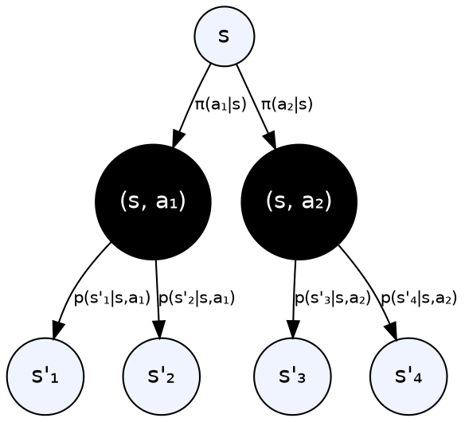
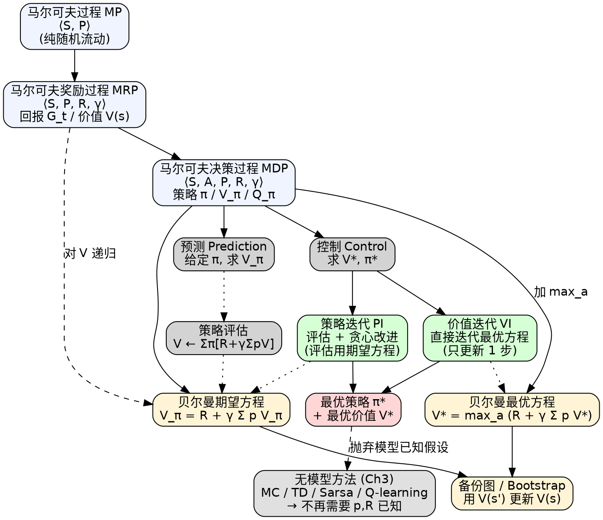

# 马尔可夫决策过程（Markov Decision Process, MDP）

> [!abstract] 一句话
> **MDP 是强化学习的基本框架**：用 $\langle S,A,P,R,\gamma\rangle$ 五元组描述"智能体—环境"交互，把"未来只依赖现在"的**马尔可夫性**与"动作影响转移"的**决策性**捏在一起；其灵魂是**贝尔曼方程**——把"现在的价值"递归地写成"即时奖励 + 折扣后的未来价值"——并据此衍生出**策略评估**（预测）与**策略迭代 / 价值迭代**（控制）两条求解路径。

---

## 1. 三层抽象：MP → MRP → MDP

强化学习里"环境的形式化模型"是按"加东西"逐层堆叠的：

| 维度 | 马尔可夫过程 MP | 马尔可夫奖励过程 MRP | 马尔可夫决策过程 MDP |
|---|---|---|---|
| 元组 | $\langle S, P\rangle$ | $\langle S, P, R, \gamma\rangle$ | $\langle S, A, P, R, \gamma\rangle$ |
| 状态转移 | $p(s'\mid s)$ | $p(s'\mid s)$ | $p(s'\mid s,a)$ |
| 奖励 | — | $R(s)$ | $R(s,a)$ |
| 动作 | — | — | $A$（智能体可选） |
| 直观类比 | 纸船随波逐流 | 纸船随波逐流 + 沿途捡硬币 | **摆渡人掌舵** + 沿途捡硬币 |
| 求解对象 | 轨迹分布 | 价值函数 $V(s)$ | 价值 $V_\pi/Q_\pi$ + 最优策略 $\pi^*$ |

> [!info] 直觉串联
> MP 只关心"状态如何流动"；MRP 加入奖励 → 可以谈"价值"；MDP 加入动作 → 可以谈"决策"，从评估变为控制。**MDP 给定策略 $\pi$ 即退化为 MRP**（动作维度被 $\pi(a\mid s)$ 加权求和"边缘化"掉）——这是后续推导的关键技巧。

---

## 2. 马尔可夫过程（MP）

### 2.1 马尔可夫性质

给定历史 $h_t=\{s_1,\dots,s_t\}$，未来只依赖当前：

$$
\boxed{\;p(s_{t+1}\mid s_t)=p(s_{t+1}\mid h_t)\;}\tag{2.1}
$$

> [!note] 为什么这一步是"基础公设"
> 马尔可夫性把"无限长历史"压缩为"有限长状态"，让动态规划/贝尔曼方程可以**只对状态 $s$ 做递归**。一旦真实问题不满足，工程上要么把更长的历史塞进状态（堆叠帧、RNN 隐状态），要么承认"部分可观测"走 POMDP。

### 2.2 状态转移矩阵

对有限状态集 $\{s_1,\dots,s_N\}$，转移概率排成矩阵：

$$
\boldsymbol P=\begin{pmatrix}
p(s_1\mid s_1) & p(s_2\mid s_1) & \cdots & p(s_N\mid s_1) \\
p(s_1\mid s_2) & p(s_2\mid s_2) & \cdots & p(s_N\mid s_2) \\
\vdots & \vdots & \ddots & \vdots \\
p(s_1\mid s_N) & p(s_2\mid s_N) & \cdots & p(s_N\mid s_N)
\end{pmatrix}
$$

每一行表示"从 $s_i$ 出发到所有状态"的概率分布（**行和为 1**）。

> [!tip] 行 vs 列
> 教材约定 $\boldsymbol P_{ij}=p(s_j\mid s_i)$（**from i to j**）。读论文/代码时务必确认转置约定，否则迭代会算反。

采样马尔可夫链 → 得到一串**轨迹** $s_3, s_4, s_5, s_6, s_6,\dots$。

---

## 3. 马尔可夫奖励过程（MRP）

MRP $=$ MP $+$ 奖励函数 $R(s)$ $+$ 折扣因子 $\gamma\in[0,1]$。

### 3.1 回报与价值函数

**回报（return）** = 时刻 $t$ 之后所有奖励的折扣和：

$$
G_t = r_{t+1} + \gamma r_{t+2} + \gamma^2 r_{t+3} + \cdots + \gamma^{T-t-1} r_T
$$

**状态价值函数（state-value function）** = 从 $s$ 出发的期望回报：

$$
V(s) = \mathbb E[G_t\mid s_t = s]
$$

### 3.2 为什么需要折扣因子 $\gamma$？（核心问题）

> [!note] 折扣因子 $\gamma$ 的四个动机
> 1. **避免无穷回报**：MRP 可能带环、不终结，$\gamma<1$ 让 $\sum \gamma^k r$ 几何收敛。
> 2. **不确定性贴现**：我们对未来环境的建模并不精确，越远的预测越不可信 → 打折相当于"自我怀疑"。
> 3. **金融贴现**：现在 1 块钱比一年后 1 块钱更值钱（机会成本/通胀）。
> 4. **行为偏好**：让智能体倾向"早拿奖励"，避免无意义拖延。
>
> 极端：$\gamma=0$ → 短视（只看即时）；$\gamma=1$ → 远视（要求有终止状态，否则发散）。$\gamma$ 是 RL 里最重要的**超参数**之一，调它就是在调"耐心程度"。

### 3.3 一个具体例子

七状态 MRP（图 2.4），奖励向量 $\boldsymbol R=[5,0,0,0,0,0,10]$，$\gamma=0.5$。对 4 步轨迹采样回报：

| 轨迹 | 计算 | $G$ |
|---|---|---|
| $s_4\to s_5\to s_6\to s_7$ | $0+0.5\cdot 0 + 0.25\cdot 0 + 0.125\cdot 10$ | **1.25** |
| $s_4\to s_3\to s_2\to s_1$ | $0+0.5\cdot 0 + 0.25\cdot 0 + 0.125\cdot 5$ | **0.625** |
| $s_4\to s_5\to s_6\to s_6$ | $0+0.5\cdot 0 + 0.25\cdot 0 + 0.125\cdot 0$ | **0** |

> [!warning] 蒙特卡洛估值的局限
> 想得到 $V(s_4)$，可以采样很多轨迹取平均（**MC 估计**）。但 MC 必须**等回合结束**才能更新一次，方差大、样本效率低——这正是后面要用贝尔曼方程做"自举"的动机。

---

## 4. 贝尔曼方程（核心！）

### 4.1 形式

$$
\boxed{\;V(s) = \underbrace{R(s)}_{\text{即时奖励}} + \underbrace{\gamma\sum_{s'\in S} p(s'\mid s)\,V(s')}_{\text{未来折扣价值}}\;}
$$

含义：**当前状态的价值 = 即时拿到的奖励 + 按转移概率加权的"邻居价值"再打折**。

### 4.2 推导（分 Step）

**前置工具**：全期望公式 $\mathbb E[\mathbb E[G_{t+1}\mid s_{t+1}]\mid s_t] = \mathbb E[G_{t+1}\mid s_t]$。

#### Step 1 · 拆开 $G_t$ 的定义

$$
V(s)=\mathbb E[G_t\mid s_t=s]=\mathbb E\!\left[r_{t+1}+\gamma r_{t+2}+\gamma^2 r_{t+3}+\cdots\;\middle|\;s_t=s\right]
$$

#### Step 2 · 提取第一项 + 提公因子 $\gamma$

$$
V(s) = \mathbb E[r_{t+1}\mid s_t=s] + \gamma\,\mathbb E\!\left[r_{t+2}+\gamma r_{t+3}+\cdots\;\middle|\;s_t=s\right]
$$

后一项的括号内正好是 $G_{t+1}$，所以：

$$
V(s) = R(s) + \gamma\,\mathbb E[G_{t+1}\mid s_t=s]
$$

#### Step 3 · 用全期望"穿过" $s_{t+1}$

$$
\mathbb E[G_{t+1}\mid s_t=s]=\mathbb E\!\big[\mathbb E[G_{t+1}\mid s_{t+1}]\;\big|\;s_t=s\big]=\mathbb E[V(s_{t+1})\mid s_t=s]
$$

> [!success] 关键转折点
> 这一步把"对未来所有 reward 的期望"折叠回"对下一状态价值的期望"——**回报变量 $G$ 消失了，只剩下 $V$ 自己的递归**。这就是动态规划的根，也是后续所有自举方法的母体。

#### Step 4 · 写成 sum 形式

$$
\mathbb E[V(s_{t+1})\mid s_t=s]=\sum_{s'\in S} p(s'\mid s)\,V(s')
$$

代回 Step 2 即得贝尔曼方程。 $\square$

### 4.3 矩阵形式与解析解

把所有状态堆成向量 $\boldsymbol V, \boldsymbol R\in\mathbb R^N$：

$$
\boldsymbol V = \boldsymbol R + \gamma \boldsymbol P\boldsymbol V
\quad\Longrightarrow\quad (\boldsymbol I-\gamma\boldsymbol P)\boldsymbol V = \boldsymbol R
$$

$$
\boxed{\;\boldsymbol V = (\boldsymbol I-\gamma\boldsymbol P)^{-1}\boldsymbol R\;}\tag{解析解}
$$

> [!warning] 解析解的代价
> 矩阵求逆复杂度 $O(N^3)$。状态空间一旦上到 $10^4$ 量级（不要说百万），求逆既慢又数值不稳。**实际几乎不用解析解**，而走以下三类迭代法。

### 4.4 三类迭代解法（为后续章节铺垫）

| 方法 | 是否需要环境模型 | 是否自举 bootstrap | 何时更新 |
|---|---|---|---|
| **动态规划 DP** | 需要 $P,R$ 已知 | ✅ | 每步 |
| **蒙特卡洛 MC** | 不需要 | ❌（用完整 $G_t$） | 回合结束 |
| **时序差分 TD** | 不需要 | ✅ | 每步 |

> [!tip] 自举（bootstrapping）
> "用对其它状态的估计值，来更新当前状态的估计值"——典型 DP / TD 思路。它让你**不必等回合结束**就能更新（VS MC），代价是引入"估计的估计"带来的偏差。本章只用 DP（环境已知），TD/MC 是第 3、4 章的故事。

---

## 5. 从 MRP 到 MDP：加入动作

MDP 在 MRP 基础上加入**动作空间** $A$，状态转移和奖励都"附带动作"：

$$
p(s'\mid s,a),\qquad R(s,a)=\mathbb E[r_t\mid s_t=s, a_t=a]
$$

### 5.1 策略 $\pi$

策略给定"在状态 $s$ 选动作 $a$ 的概率"：

$$
\pi(a\mid s) = p(a_t=a\mid s_t=s)
$$

- **随机策略**：$\pi(\cdot\mid s)$ 是概率分布
- **确定性策略**：$\pi(s)$ 直接输出一个动作（等价于 one-hot 分布）

### 5.2 MDP $+$ $\pi$ $=$ MRP（关键退化）

给定策略后，把 $a$ 用 $\pi(a\mid s)$ 边缘化掉，转移和奖励就只跟 $s$ 有关：

$$
P_\pi(s'\mid s) = \sum_{a\in A}\pi(a\mid s)\,p(s'\mid s,a)
$$

$$
r_\pi(s) = \sum_{a\in A}\pi(a\mid s)\,R(s,a)
$$

> [!success] 一句话总结
> 这个退化让我们可以**复用 MRP 的所有结论**——策略评估的时候直接套贝尔曼方程；只有在"控制"问题（搜索最优 $\pi$）里，动作维度才真正活起来。

---

## 6. MDP 的两类价值函数

| 维度 | 状态价值 $V_\pi(s)$ | 动作价值 $Q_\pi(s,a)$ |
|---|---|---|
| 定义 | $\mathbb E_\pi[G_t\mid s_t=s]$ | $\mathbb E_\pi[G_t\mid s_t=s, a_t=a]$ |
| 直觉 | "处于 $s$、按 $\pi$ 走，未来值多少" | "在 $s$ 强制做 $a$ 一次，再按 $\pi$ 走，未来值多少" |
| 维度 | $\|S\|$ | $\|S\|\cdot\|A\|$（Q 表） |
| 用途 | 评估、比较状态好坏 | 直接读出"该选哪个动作"——是控制问题的主角 |

**互相转换**（铁律，背下来）：

$$
\boxed{\;V_\pi(s) = \sum_{a\in A}\pi(a\mid s)\,Q_\pi(s,a)\;}\tag{2.8}
$$

$$
\boxed{\;Q_\pi(s,a) = R(s,a) + \gamma\sum_{s'\in S} p(s'\mid s,a)\,V_\pi(s')\;}\tag{2.9}
$$

> [!info] V 和 Q 谁更基础？
> 从信息量看 **Q ≥ V**（Q 多了动作维度，能直接做决策）；从存储看 V 更省（少一维）。**有 Q 一定能反推 V**（式 2.8 加权求和），**有 V 不能直接得到 $\pi^*$**（你不知道选哪个动作能达到 $V^*$，除非还知道 $p,R$ 才能算 $Q^*=R+\gamma P V^*$）。所以无模型控制几乎都学 $Q$（DQN / Sarsa / Q-learning）。

---

## 7. 贝尔曼期望方程

把 $G_t$ 拆成"即时奖励 + 折扣后续"的递归形式：

$$
\boxed{\;V_\pi(s) = \mathbb E_\pi[r_{t+1} + \gamma V_\pi(s_{t+1})\mid s_t=s]\;}\tag{2.6}
$$

$$
\boxed{\;Q_\pi(s,a) = \mathbb E_\pi[r_{t+1} + \gamma Q_\pi(s_{t+1}, a_{t+1})\mid s_t=s, a_t=a]\;}\tag{2.7}
$$

把 (2.8)(2.9) 互相代入，展开成"纯 $V$"和"纯 $Q$"两个版本：

**纯 $V$ 版（最常用的一行）**：

$$
\boxed{\;V_\pi(s) = \sum_{a\in A}\pi(a\mid s)\!\left[R(s,a) + \gamma\sum_{s'\in S}p(s'\mid s,a)\,V_\pi(s')\right]\;}\tag{2.10}
$$

**纯 $Q$ 版**：

$$
\boxed{\;Q_\pi(s,a) = R(s,a) + \gamma\sum_{s'\in S}p(s'\mid s,a)\sum_{a'\in A}\pi(a'\mid s')\,Q_\pi(s',a')\;}\tag{2.11}
$$

> [!note] 怎么读这两个式子
> 式 (2.10) 是两层求和：**外层对动作 $a$ 用 $\pi$ 加权**（选谁），**内层对下个状态 $s'$ 用 $p$ 加权**（环境会送你去哪）。这正是下一节"备份图"的两层结构。

---

## 8. 备份图（backup diagram）

**备份**：把后继节点的价值信息"反向传播"到当前节点；这是所有自举类算法的核心动作。

- 空心圆 $\bigcirc$：状态节点
- 实心圆 $\bullet$：状态-动作对节点

### $V_\pi$ 的备份图



**读法**：从叶子（下一状态 $V_\pi(s')$）往上备份 → 经过黑节点（拿到即时奖励 + 折扣未来）→ 再按 $\pi$ 加权回到根节点 $V_\pi(s)$。

$$
V_\pi(s) = \sum_a \pi(a\mid s)\Big[R(s,a) + \gamma\sum_{s'} p(s'\mid s,a)\,V_\pi(s')\Big]\tag{2.12}
$$

---

## 9. 策略评估（Policy Evaluation）

> 给定 MDP 和 $\pi$，算出 $V_\pi$。也叫**预测问题（prediction）**。

把贝尔曼期望方程当成**迭代更新**：

$$
\boxed{\;V^{t+1}(s) = \sum_{a\in A}\pi(a\mid s)\!\left[R(s,a)+\gamma\sum_{s'\in S}p(s'\mid s,a)\,V^{t}(s')\right]\;}\tag{2.18}
$$

或等价的 MRP 简化形式（吸收了 $\pi$ 之后）：

$$
V^{t+1}(s) = r_\pi(s) + \gamma\sum_{s'} P_\pi(s'\mid s)\,V^{t}(s')\tag{2.19}
$$

> [!example] 策略评估算法（同步备份）
> ```
> 输入: MDP <S,A,P,R,γ>, 策略 π, 阈值 ε
> 初始化: V(s) = 0  ∀s
> repeat:
>     Δ = 0
>     for each s in S:
>         v_old = V(s)
>         V(s) = Σ_a π(a|s) [R(s,a) + γ Σ_s' p(s'|s,a) V(s')]
>         Δ = max(Δ, |v_old - V(s)|)
> until Δ < ε
> 输出: V_π
> ```

> [!tip] 同步 vs 异步备份
> **同步**：每轮全量扫描所有状态，老 $V$ 算新 $V$（用两份内存）；**异步**：原地更新，谁先算谁用新值。异步收敛通常更快，因为价值能"传播"得更远（如 Gauss-Seidel 思想）。

---

## 10. 最优价值与最优策略

定义：

$$
V^*(s) = \max_\pi V_\pi(s),\qquad \pi^*(s) = \arg\max_\pi V_\pi(s)
$$

> [!info] $V^*$ 唯一，$\pi^*$ 不一定唯一
> 一个 MDP 的最优值函数是**唯一**的——它由 MDP 本身完全决定（贝尔曼最优算子在 $\gamma<1$ 时是 $\gamma$-压缩映射，Banach 不动点定理保证唯一不动点 $V^*$）。但能达到这个最优值的策略**可能多个**：若在某状态 $s$ 下有两个动作 $a_1, a_2$ 满足 $Q^*(s,a_1)=Q^*(s,a_2)=\max$，那么任意混合都是最优策略。"有限 MDP 一定存在**确定性平稳**最优策略"是 Howard / Puterman 的经典结果——所以只看 $\arg\max_a Q^*(s,a)$ 不会损失任何最优性。

### 从 $Q^*$ 提取 $\pi^*$

$$
\pi^*(a\mid s) = \begin{cases} 1, & a=\arg\max_{a'\in A} Q^*(s,a')\\ 0, & \text{其他}\end{cases}
$$

### 贝尔曼最优方程

把 (2.8) 的"对 $a$ 按 $\pi$ 加权"换成"对 $a$ 取 $\max$"——这是从"评估"到"控制"的灵魂改动：

$$
\boxed{\;V^*(s) = \max_{a\in A} Q^*(s,a)\;}\tag{2.20}
$$

$$
\boxed{\;Q^*(s,a) = R(s,a) + \gamma\sum_{s'\in S} p(s'\mid s,a)\,V^*(s')\;}\tag{2.21}
$$

互相代入得到两个"纯版本"：

$$
\boxed{\;V^*(s) = \max_{a}\Big(R(s,a) + \gamma\sum_{s'} p(s'\mid s,a)\,V^*(s')\Big)\;}
$$

$$
\boxed{\;Q^*(s,a) = R(s,a) + \gamma\sum_{s'} p(s'\mid s,a)\max_{a'} Q^*(s',a')\;}\tag{Q-learning 的根}
$$

> [!warning] $\sum_a\pi(a\mid s)$ vs $\max_a$ 的对照
> 期望方程对动作做**加权平均**——评估"任意给定策略"； 最优方程对动作做 **$\max$**——表达"如果我能自由选择动作能多好"。把它们混淆会写出根本不存在的方程。$\max$ 让方程是**分段线性**（不再是线性算子），所以**没有像 MRP 那样一次性矩阵求逆**的闭式解——必须先知道每个状态的最优动作才能化为线性方程。这正是策略迭代"评估—改进"循环存在的根本原因。

---

## 11. 控制问题（一）：策略迭代

**两步循环**：

1. **策略评估（Evaluation）**：当前 $\pi_i$ 固定，迭代式 (2.18) 算到 $V_{\pi_i}$ 收敛
2. **策略改进（Improvement）**：贪心地从 $Q_{\pi_i}$ 提取新策略
$$
\pi_{i+1}(s) = \arg\max_{a} Q_{\pi_i}(s,a),\quad Q_{\pi_i}(s,a)=R(s,a)+\gamma\sum_{s'} p(s'\mid s,a) V_{\pi_i}(s')
$$

### 策略改进定理（policy improvement theorem）

> [!success] 单调改进保证
> 若新策略 $\pi'$ 在**每个状态**都按 $\pi'(s)=\arg\max_a Q_\pi(s,a)$ 取动作，则对所有 $s$ 有
> $$Q_\pi(s,\pi'(s)) = \max_a Q_\pi(s,a) \ge Q_\pi(s,\pi(s)) = V_\pi(s)$$
> 反复推开后继状态可得 $V_{\pi'}(s)\ge V_\pi(s)$，即 **$\pi'$ 在每个状态都不差于 $\pi$**。注意是**非严格 ≥**：达到最优时所有状态都取等（此时新策略=旧策略=最优），这正是"何时停止改进"的判据。
>
> **何时停止改进**：当 $\max_a Q_\pi(s,a)=Q_\pi(s,\pi(s))=V_\pi(s)$ 对所有 $s$ 成立——这正是**贝尔曼最优方程**！收敛点就是 $\pi^*$。

> [!example] 策略迭代伪代码
> ```
> 初始化: V(s) = 0, π(s) 任意
> repeat:
>     # ---- Policy Evaluation ----
>     repeat:
>         for each s:
>             V(s) = Σ_a π(a|s) [R(s,a) + γ Σ_s' p(s'|s,a) V(s')]
>     until ΔV < ε
>     # ---- Policy Improvement ----
>     policy_stable = True
>     for each s:
>         a_old = π(s)
>         π(s) = argmax_a [R(s,a) + γ Σ_s' p(s'|s,a) V(s')]
>         if a_old != π(s): policy_stable = False
> until policy_stable
> 输出: π*, V*
> ```

---

## 12. 控制问题（二）：价值迭代

**最优性原理（principle of optimality）**：$\pi$ 在 $s$ 达到最优 $\Leftrightarrow$ 对所有 $s$ 能到达的后继 $s'$，$\pi$ 也都在 $s'$ 达到最优。

→ 子问题最优 $V^*(s')$ 已知 → 直接套贝尔曼最优方程算出 $V^*(s)$。这就是把最优方程当**更新规则**：

$$
\boxed{\;V(s) \leftarrow \max_{a}\Big(R(s,a) + \gamma\sum_{s'} p(s'\mid s,a)\,V(s')\Big)\;}\tag{2.22}
$$

> [!example] 价值迭代伪代码
> ```
> 初始化: V_0(s) = 0  ∀s
> for k = 1 to H:
>     for each s:
>         Q_k(s, a) = R(s,a) + γ Σ_s' p(s'|s,a) V_{k-1}(s')
>         V_k(s)    = max_a Q_k(s, a)
> 提取策略:
>     π*(s) = argmax_a [R(s,a) + γ Σ_s' p(s'|s,a) V_H(s')]
> 输出: π*, V*
> ```

> [!info] 直觉：价值的反向传播
> 价值迭代每轮只让信息"传一格"——离终点 $k$ 步的状态，要经过 $k$ 次迭代才能拿到"终点的味道"。所以**未收敛时中间策略没意义**——它只是半成品，不能拿去用。

---

## 13. 策略迭代 vs 价值迭代 对比

| 维度 | 策略迭代 PI | 价值迭代 VI |
|---|---|---|
| 用哪个方程 | **贝尔曼期望方程**（评估时） + 贪心改进 | **贝尔曼最优方程**直接当更新 |
| 内层循环 | 评估要跑到 $V_{\pi_i}$ 收敛（多次） | 没有内层；每轮只更新一次 $V$ |
| 每轮代价 | 高（一次评估 = 多步 DP） | 低（一次 $\max$） |
| 收敛轮数 | **少**（策略空间有限，往往很快） | **多**（要传播到所有状态） |
| 中间产物意义 | 每轮的 $\pi_i$ 是**完整且单调改进**的策略 | 未收敛的 $V_k$ 没有对应的有意义策略 |
| 适用场景 | 策略易表示、评估可重用 | 状态规模大、想最简循环 |

> [!success] 二者其实是同一族
> PI 把"评估"做到极致（精确 $V_\pi$）再改进；VI 把评估只做 **1 步** 就改进——介于两者之间的 **modified policy iteration** 做 $k$ 步评估再改进。三者都属于"**广义策略迭代（Generalized Policy Iteration, GPI）**"——评估和改进两个轮子的相互拉扯，这是后续几乎所有 RL 算法（Sarsa / Q-learning / Actor-Critic）的共同骨架。

---

## 14. 预测 vs 控制：方法对照总表

| 问题 | 输入 | 输出 | 用到的贝尔曼方程 | 算法 |
|---|---|---|---|---|
| **预测**（评估） | $\langle S,A,P,R,\gamma\rangle$ + $\pi$ | $V_\pi$ | 期望方程（迭代） | 策略评估 |
| **控制** | $\langle S,A,P,R,\gamma\rangle$ | $V^*, \pi^*$ | **评估用期望方程 + 改进用最优方程（贪心一步）** | 策略迭代 |
| **控制** | $\langle S,A,P,R,\gamma\rangle$ | $V^*, \pi^*$ | **最优方程当迭代规则** | 价值迭代 |

> [!note] 为什么本章只讲 DP 而不讲 MC/TD
> 本章解的是**规划（planning）问题**——环境模型 $p,R$ 已知。下一章 Q-learning / Sarsa 才解**学习（learning）问题**——只能与环境交互、采样轨迹，必须放弃 $\sum_{s'} p(s'\mid s,a)$ 这种"全枚举"操作，改用样本期望来代替。

---

## 15. Cheat Sheet

### 15.1 三句话总结

1. **MDP 五元组** $\langle S,A,P,R,\gamma\rangle$ + 策略 $\pi$。
2. **贝尔曼方程是灵魂**：期望版用 $\sum_a\pi$（评估），最优版用 $\max_a$（控制）。
3. **求解两条路**：策略迭代 = 评估 + 改进双循环；价值迭代 = 直接迭代最优方程，最后提策略。

### 15.2 最小可跑伪代码（NumPy 风格）

```python
import numpy as np

# 约定（与 §3-§4 的 MRP 矩阵形式 V = R + γ P V 不同！）：
#   P shape = [S, A, S']    状态转移张量
#   R shape = [S, A]        即 R(s,a)，MDP 完整版
#   pi shape = [S, A]       策略 π(a|s)
# np.einsum 每个字符是单独的下标——必须用单字符（如 t 代表 s'）
# 终止状态需调用方保证 V[terminal]=0，下面代码未显式处理

def policy_evaluation(P, R, pi, gamma=0.9, eps=1e-6):
    """P[s, a, t], R[s, a], pi[s, a] -> V[s]"""
    nS = P.shape[0]
    V = np.zeros(nS)
    while True:
        # 用 pi 把 (s,a,t) 边缘化掉 a -> (s, t)
        P_pi = np.einsum('sa,sat->st', pi, P)   # [S, S]
        R_pi = np.einsum('sa,sa->s', pi, R)     # [S]
        V_new = R_pi + gamma * P_pi @ V
        if np.max(np.abs(V_new - V)) < eps:
            return V_new
        V = V_new

def value_iteration(P, R, gamma=0.9, eps=1e-6):
    nS, nA = R.shape
    V = np.zeros(nS)
    while True:
        Q = R + gamma * np.einsum('sat,t->sa', P, V)   # [S, A]
        V_new = Q.max(axis=1)
        if np.max(np.abs(V_new - V)) < eps:
            pi_star = np.eye(nA)[Q.argmax(axis=1)]      # 确定性策略 one-hot
            return V_new, pi_star
        V = V_new

def policy_iteration(P, R, gamma=0.9):
    nS, nA = R.shape
    pi = np.ones((nS, nA)) / nA                         # 均匀初始化
    while True:
        V = policy_evaluation(P, R, pi, gamma)
        Q = R + gamma * np.einsum('sat,t->sa', P, V)
        pi_new = np.eye(nA)[Q.argmax(axis=1)]
        if np.allclose(pi, pi_new):
            return V, pi_new
        pi = pi_new
```

> [!summary] 常见坑（debug 必查）
> - **$\gamma=1$ 且无终止状态** → $G_t$ 发散，价值迭代不收敛。务必保证有吸收态或 $\gamma<1$。
> - **终止状态的价值必须显式设为 0**——很多 bug 来自"忘了把吸收态从更新里剔除"。
> - **收敛阈值 $\varepsilon$**：相对量级要看 $R/(1-\gamma)$ 的尺度，机械地取 $10^{-6}$ 在大奖励问题上其实很松。
> - **奖励下标错位**：本教程 §3.1 公式用 Sutton 风格 $G_t=r_{t+1}+\gamma r_{t+2}+\cdots$（"做完 $a_t$ 拿到 $r_{t+1}$"），但 §3.3 的 $s_4\to s_5\to\cdots$ 数值例子是按"起步奖励 = $R(s_t)$"算的（$G=R(s_4)+\gamma R(s_5)+\cdots$），两套约定差一个 $\gamma$ 因子——例子保留原文结果便于对照，**自写代码请固定一套**别两套混着用。
> - **`np.einsum` 维度索引**：每个字符是单独的下标，多字符（如 `s1`）会被解析成两个独立下标——必须用单字符（教程改用 `t` 表示 $s'$）。维度搞错会得到诡异的负价值。
> - **行/列约定**：$\boldsymbol P_{ij}=p(s_j\mid s_i)$ 还是 $p(s_i\mid s_j)$？写错会 $\boldsymbol V$ 反着收敛。
> - **策略迭代的"评估收敛到多严"**：根本不需要 $\varepsilon=10^{-9}$，跑几步就改进，这正是 modified PI / 价值迭代的优势。
> - **`np.einsum` 维度索引**：上面 `P[s,a,t]` 约定下，`'sat,t->sa'` 表示对 $s'$ 求和——务必用**单字符**下标，写成 `'sas1,s1->sa'` 会被 einsum 解析成多个独立下标而出错。

---

## 16. 一图总览



**配色约定**：浅蓝=基础对象 / 浅黄=数学工具 / 浅绿=核心算法 / 浅红=最终目标 / 灰=下一章。

---

## 17. 关联笔记

- [[表格型方法教程|表格型方法]]：本章 MDP 离散版本的具体求解——Sarsa / Q-learning 是表格版的免模型 TD 控制
- [[DQN教程|DQN]]：把表格 Q-learning 扩展到函数逼近——MDP 最优方程的深度学习实现
- [[Q-learning]]：把贝尔曼最优方程的 $Q^*$ 版本变成无模型 TD 更新——本章最优方程的直接继承者
- [[Sarsa]]：把贝尔曼期望方程变成 on-policy TD 更新——本章期望方程的直接继承者
- [[策略梯度教程|策略梯度]]：完全绕开 $V/Q$，直接对 $\pi_\theta$ 求梯度——与本章"先评估再贪心"的间接路线相反
- [[Actor-Critic教程|Actor-Critic]]：Critic 走本章贝尔曼路线评估 $V/Q$，Actor 走策略梯度路线——两条路的合流
- [[POMDP]]：本章假设全可观测；状态不可观测时退化为 POMDP（部分可观测 MDP），用置信状态 belief state 重新满足马尔可夫性
- [[动态规划]]：本章所有算法都是 DP 在 MDP 上的具体化（最优子结构 + 重叠子问题）
- 原文：[Easy-RL 第 2 章 马尔可夫决策过程](https://datawhalechina.github.io/easy-rl/#/chapter2/chapter2)
